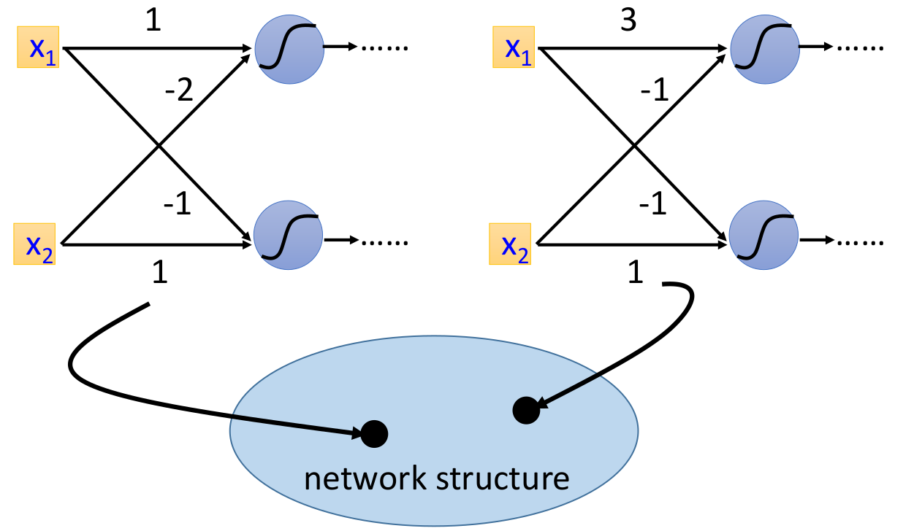
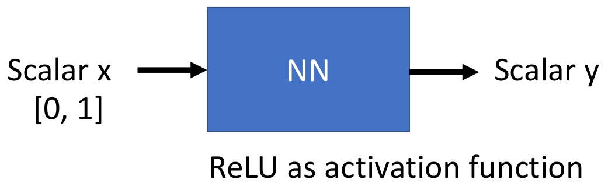

# ch1. Why Deep Structure

## 预备知识

给定一个**网络架构**，其实相当于定义了一个函数空间(function space或称为function set)，而对于给定的网络参数$w$和$b$则可以视为此函数空间中的一个函数。如下图代表给定函数空间中的两个函数：

## 本章内容

主要围绕为什么要采用"深的"网络架构呢？（先给出结论：针对同样的任务(比如拟合某个函数等)，①相同参数数量的前提下，越深的网络效果越好  ②相同性能的情况下，"深的"网络所需的参数数量更少）

本章主要围绕下述三个子模块

- ch1_1. Can shallow network fit any function？
- ch1_2. How to use deep to fit functions?
- ch1_3. Is deep better than shallow?

---

后续的结论都是基于下述实验进行证明的：

1. 输入和输出均为标量，且输入范围为0到1
2. shallow网络结构指的是只包含一个隐藏层的神经网络模型
3. 激活函数为ReLU

> 一些"更宽泛"的证明见参考论文