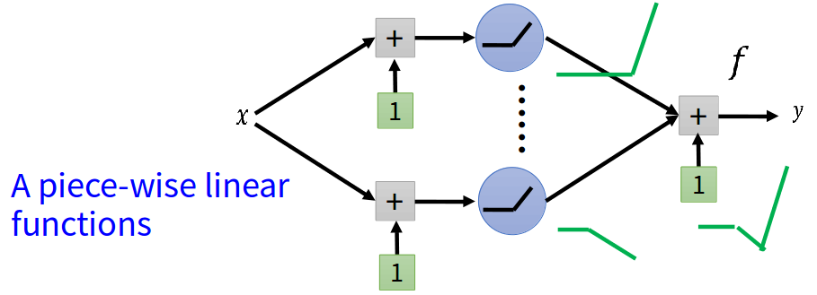
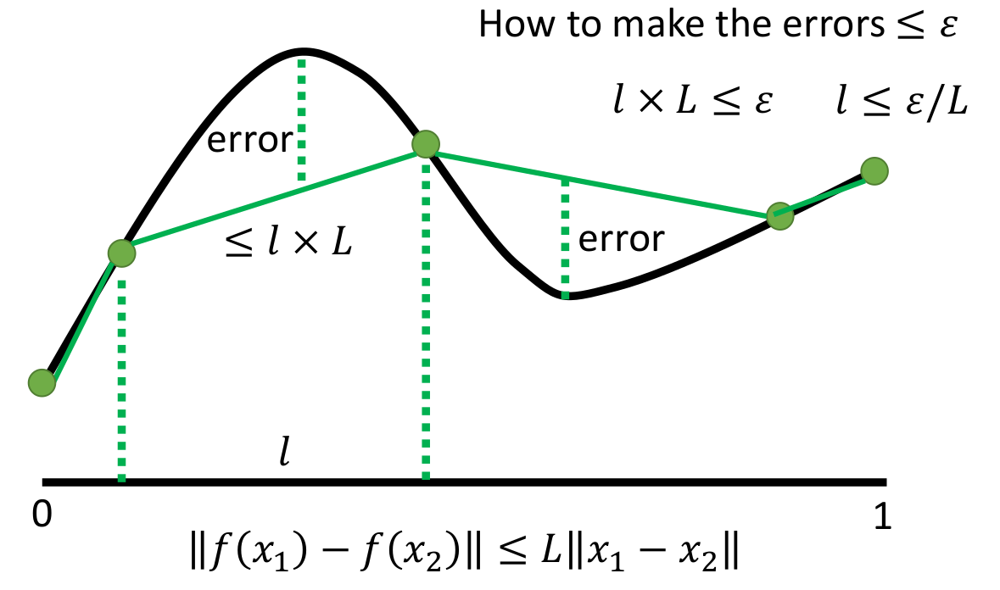
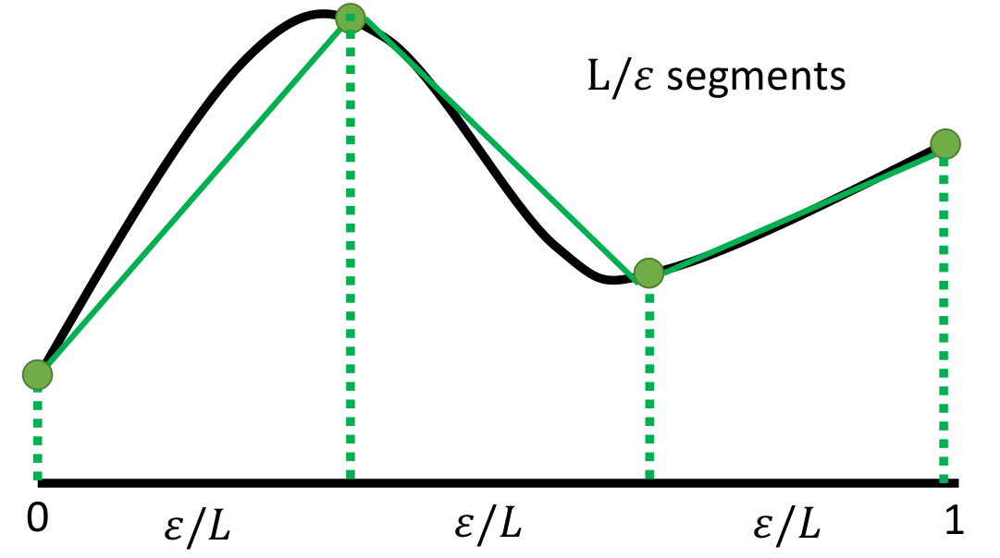
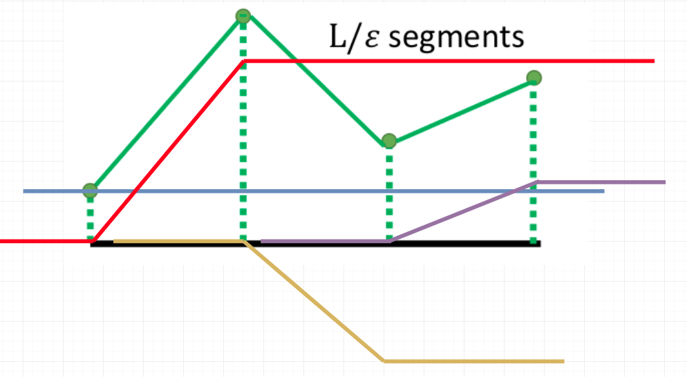
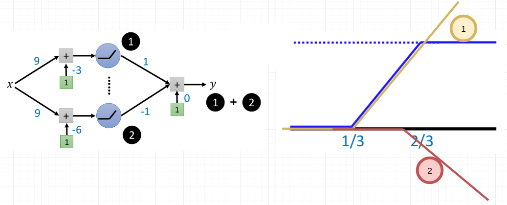

# Can shallow network fit any function？

首先给出结论：只包含一个隐藏层的神经网络结构具备拟合任何函数的能力

## 1. 预备知识

### L-Lipschitz函数

L-Lipschitz满足下述关系式：
$$
\Vert f(x_1)-f(x_2)\Vert\le L\Vert x_1-x_2\Vert
$$
蕴含的信息：输出不能变化太过剧烈，即函数具有一定的平滑性；且L越大，往往代表函数越复杂（变化越剧烈）

> 关于L-Lipschitz更多的内容可以参考：[参考1](http://www.math.jyu.fi/research/reports/rep100.pdf)

### 单层神经网络可以视为分段线性函数

下述图片就能说明这个情况（记住参数可正可负，所有ReLU的结果可以被"翻转"）

## 2. 推导过程

 "已知"条件：

1. 假设潜在的目标函数为$f^{\star}$（且为L-Lipschitz函数）

需要证明：对于给定的允许误差$\varepsilon\gt0$，神经元的数目K需要多大时，才能满足下面情况
$$
\exist f\in N(K)\quad max_{0\le x\le1}|f(x)-f^{\star}(x)|\le\varepsilon
$$

> 即$f(x)$与$f^{\star}(x)$之间的最大误差小于$\varepsilon$

### 证明步骤

① 将问题转化为$l\times L\le\varepsilon$

由于$N(K)$函数空间内的函数为分段函数，因此用分段函数来拟合$f^\star(x)$，如下图所示

问题转化为$error_{max}\le\varepsilon$，而$error\le l\times L$，所以只需证明$l\times L\le\varepsilon$

> 假设在区间$l$里面最大值为$f(x_{max})$，最小值为$f(x_{min})$，根据L-Lipschitz函数的性质可知：
> $$
> error\le \Vert f(x_{max})-f(x_{min})\Vert\le L\Vert x_{max}-x_{min}\Vert\le L\times l
> $$
>

所以只需保证$l\le \varepsilon/L$即可，所以我们可以令每段$l= \varepsilon/L$

② 将区间划分成$L/\varepsilon$段，每段长度为$\varepsilon/L$（平均划分）

③ 分段函数可以划分为多段"Z"字形的组合

我们可以发现，绿色的分段函数可以由**黄色，红色，紫色的Z字形+蓝色的bias**组合而成（不难证明M段分段函数均可由M段Z字形组合而成）

④ 可以证明每个Z字形可以由两个神经元构成

 ⑤ 根据上述分析，我们可以得出下述结论

对于允许误差为$\varepsilon$，且目标函数为L-Lipschitz函数时，可以将目标函数划分为$L/\varepsilon$段，此时所需的神经元个数为$2L/\varepsilon$个（注：这未必是最优的神经元个数，此处只是为了证明达到这个数量的神经元具备拟合**满足约束条件的函数**的能力）

