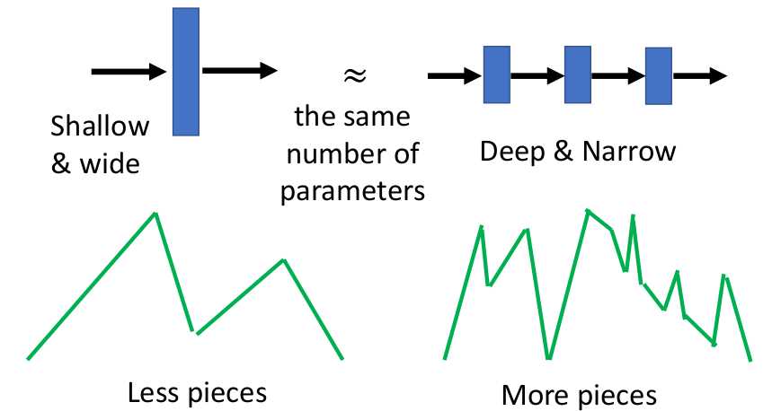
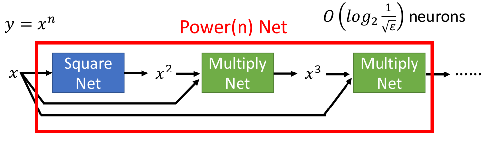

# Potential of deep

> 结论：
>
> ① 虽然"浅的"网络能够拟合任何函数，但是"深的"网络更高效（可以理解为所需参数量更少）
>
> ② 如果K代表宽度，H代表深度，我们可以获得$K^H$个线性片段 --- 与宽度相比，深度的影响更大

激活函数为**ReLU**的网络对应线性分段函数，存在下述关系（证明后续会给出）：

## 1. 网络结构对应的线性片段数目

### ① 网络结构对应的线性片段数目的理论上界

解释：输入$x$是一个范围内的值，每个不同的$x$值可能进入(或者称为对应)不同的"activation pattern"，而总共有$2^N$种不同的"activation pattern"。所有站在输入输出的角度，$x$可能进入$2^N$段不同的片段（此处的$x$是指所有可能的取值，而不是指单个值）

### ② 为什么上界只是理论存在

有些"activation pattern"在实际情况中并不能取到，以两个神经元的情况为例说明：

下面证明该函数只能够最多拟合3段线性片段，而非"理论"上的4段。

假设两个ReLU的输出分别为：
$$
f_1=\begin{cases}k_1x\quad x\gt a\\ 0\quad \quad x\le a\end{cases}\quad f_2=\begin{cases}k_2x\quad x\gt b\\ 0\quad \quad x\le b\end{cases}
$$
假设$a>b$（反过来证明也是类似的），则输出为：
$$
f=f_1+f_2=\begin{cases}k_2x\quad b\lt x\le a\\ 0\quad \quad x\le b\\ k_1 x+k_2x\ \ x>a\end{cases}
$$
可以看到，仅仅只是3段线性片段，而非4段

## 2. 深的网络能够表示更多线性片段

> 友情提示：初次接触可能感觉这段证明有什么用呢？后续会给出其实用性说明

### ① 预备知识

绝对值激活函数（abs activation function）：引入该项为了后续方便解释，而绝对值激活函数很容易通过两个ReLU函数构成（左边等价于右边）：

### ② 深度能够指数增长线性片段

（这部分仔细想想就能知道这图的含义哦☺）

可以发现深度每增加一层，线性片段数目增长一倍！！！

### ③ Shallow vs Deep

不难发现，每增加两个**神经元**，shallow网络只增加一个线性片段（根据1_1的推导---但仅仅给出估计），而deep网络会翻倍原有线性片段！！！

> 如果K代表宽度，H代表深度，我们可以获得$K^H$个线性片段 --- 与宽度相比，深度的影响更大！！！

## 3. Deep网络拟合实例

### ① $f(x)=x^2$

我们利用等距的线性片段来拟合该函数，并假设$f_m(x)$代表包含$2^m$段线性片段的分段函数。下图分别为$f_1(x)$和$f_2(x)$的"拟合"情况：

根据1_1中的分析，要满足$max_{0\le x\le 1}|f(x)-f_m(x)|\le\varepsilon$，不难发现最大的"差距"出现在第一个片段，而第一个片段的可以表示为$y=1/2^m\cdot x$，所以"差距"可以表示成下面式子：
$$
D=\frac{1}{2^m}x-x^2\\ \frac{dD}{dx}=\frac{1}{2^m}-2x\to x=\frac{1}{2^{m+1}}\\
max\ D=\frac{1}{2^{m+1}}\frac{1}{2^{m}}-\frac{1}{2^{m+1}}\frac{1}{2^{m+1}}=\frac{1}{2^{m+2}}\\
\frac{1}{2^{m+2}}\le \varepsilon\to m\ge \frac{1}{2}log_2\varepsilon-1
$$
所以有：$2^m\ge \frac{1}{2}\frac{1}{\sqrt{\varepsilon}}$

因此如果想要表示$f_m(x)$，对应**shallow网络**需要$O(\frac{1}{\sqrt{\varepsilon}})$个神经元

**Deep网络**表示$f_m(x)$则如下所示：可以发现只需$O(m)\to O(log_2\frac{1}{\sqrt{\varepsilon}})$个神经元

> **此处你可能对之前分析Deep网络中的线性片段采用的方式释然了！**

### ② 从$f=x^2$扩展到其他函数

**扩展到$y=x_1x_2$**

1. 其中的Square Net是①中的结构
2. $O(log_2{\frac{1}{\sqrt{\varepsilon}}}=O(3log_2{\frac{1}{\sqrt{\varepsilon}}})$

**扩展到$y=x^n$**

**扩展到$y=a_nx^n+a_{n-1}x^{n-1}+...+a_0$**

## 4. Deep vs Shallow

从上面的分析（加上1_1），我们知道给定对应的$\varepsilon$：

- Shallow网络需要神经元数目：$O(\frac{1}{\sqrt{\varepsilon}})$
- Deep网络需要神经元数目：$O(log_2\frac{1}{\sqrt{\varepsilon}})$

乍一看，显然Deep网络远胜于Shallow网络。可是真的是这样吗？我们前面在分析Shallow的时候并没有证明这种线性分段拟合方式是最优情况，可能还有好的多的情况呢！（因此此处的证明并不充分---见1_3的上界证明）

## 5. 推荐阅读

1. [On the number of response regions of deep feed forward networks with piece-wise linear activations](https://arxiv.org/abs/1312.6098)
2. [On the Number of Linear Regions of Deep Neural Networks](https://arxiv.org/abs/1402.1869)
3. [Understanding Deep Neural Networks with Rectified Linear Units](https://arxiv.org/abs/1611.01491)
4. [Bounding and Counting Linear Regions of Deep Neural Networks](https://arxiv.org/abs/1711.02114)
5. [On the Expressive Power of Deep Neural Networks](https://arxiv.org/abs/1606.05336)

