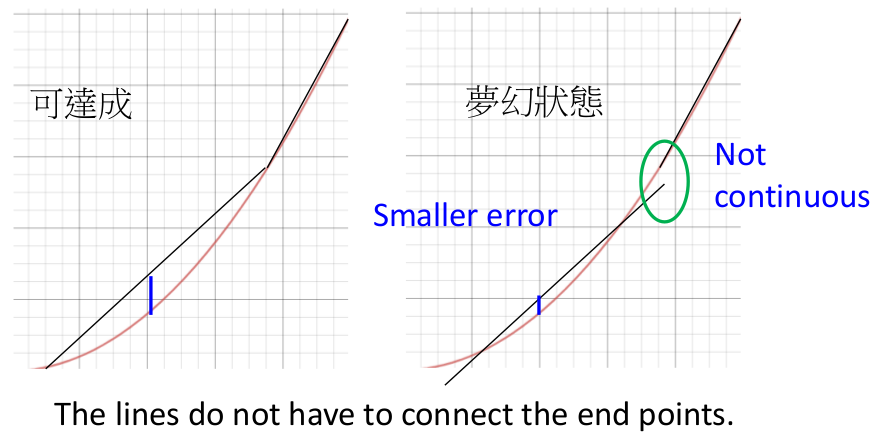
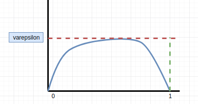
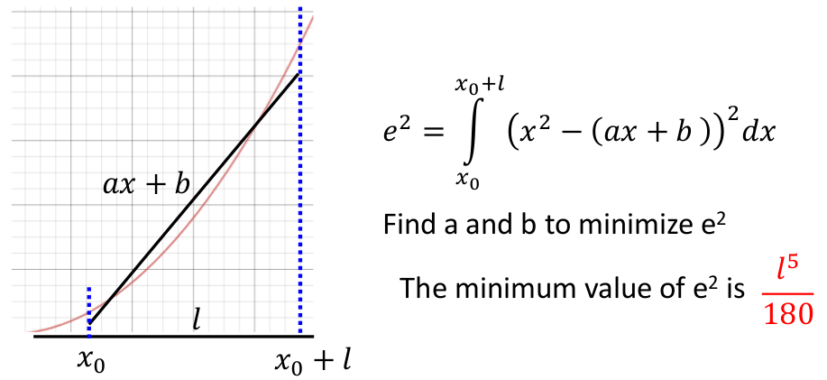
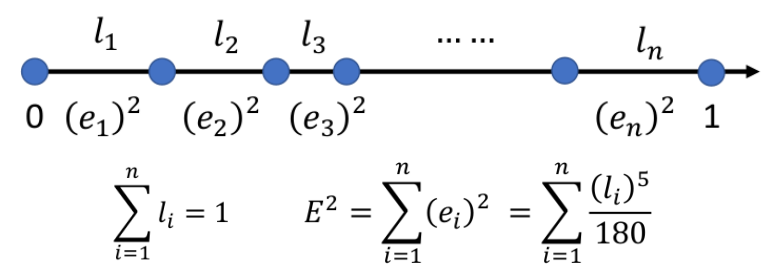
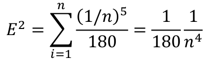
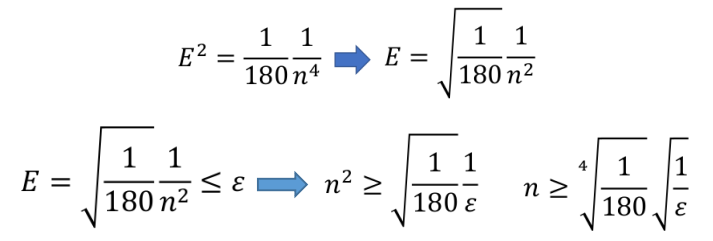
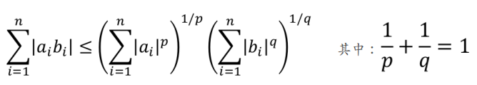
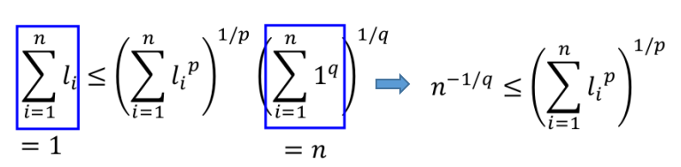
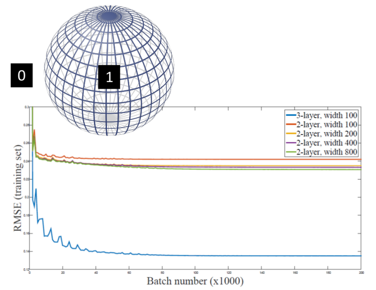

# Is Deep better than Shallow?

> 结论：拟合某个目标函数，Deep的结构确实比Shallow的好，且这种好的"差异"程度是指数级别的（当然并不是任意的目标函数Deep都比Shallow好，但是基本上只要比$y=x^2$复杂的函数，Deep均比Shallow好）

这一部分主要证明shallow的**最佳性能**到底如何～在证明之前相对1_1和1_2的分析条件进行放宽（更宽松的条件下"还烂"的话，更紧的条件下只会"更烂"）：

- 允许分段函数的各片段之间不连续，如下图所示（ReLU做为激活函数是无法创造出此类函数的，但是你就当放宽这个限制）
  

- 将原本的寻找最大的的差异小于等于$\varepsilon$放宽到欧几里得距离小于等于$\varepsilon$，即：
  $$
  max_{0\le x\le 1}|f(x)-f^\star(x)|\le \varepsilon\to \sqrt{\int_0^1|f(x)-f^\star(x)|^2dx}\le\varepsilon
  $$
  （如果满足左边的式子，必然满足右边式子；反之不成立）

> 如果将右边的二次方暂时先忽略，则左边等于下图红虚线下面的面积，而右边等于蓝色下面的面积（显然左边成立必然能推出右边成立）--- 又因为平方只会使得结果更小！
>
> 

**Note：下面的证明也以$f=x^2$为例**

## 1. 证明Shallow的最佳性能

**① 每一片段的"误差"**

首先让我们分析分段函数中任一一个片段的"误差"，不妨先考虑$[x_0,x_0+l]$这区间的片段，其误差情况如下所示：

> $e^2=l^5/180$证明：未完成～

**② 累加每段的"误差"：求欧几里得距离（放宽的第二个条件）**

**"猜测"**当$l_i=1/n$时（等间距划分）时，误差最小：此时的误差大小为：

从而可以得出：

所有我们可以发现：Shallow结构的"最优情况"为$O(1/\sqrt{\varepsilon})$！（远差于Deep的情况哦～）

> 证明**"猜测"**成立：
>
> ① 由Holder's 不等式可知：
>
> 
>
> ② 不妨令$a=\{l_1,l_2,...,l_n\}$和$b=\{1,1,...,1\}$，则对应的不等式为：
>
> 
>
> ③ 再两边同时p次方：（用到了$1/p+1/q=1\to 1-p=-p/q$）
> $$
> n^{-p/q}\le\sum_{i=1}^{n}l_i^p\to n^{1-p}\le \sum_{i=1}^{n}l_i^p
> $$
> ④ 将$p=5$，就可以推导出：$n^{-4}\le \sum_{i=1}^n l_i^5$

## 2. 结论

通过上面分析，我们可以发现：

- Shallow的最优情况为：$O(1/\sqrt{\varepsilon})$
- Deep的可能情况为：$O(log_2(1/\sqrt{\varepsilon}))$

显然Deep更胜一筹！且好的很多哦！

## 3. 更多理论分析

① [The Power of Depth for Feedforward Neural Networks](https://arxiv.org/abs/1512.03965)

存在一个能够被3层网络"逼近"的函数，但采用2层网络无法逼近，除非2层网络**非常非常的大**！（此结论并不局限于ReLU作为激活函数）

② [Benefits of depth in neural networks](https://arxiv.org/abs/1602.04485)

1. 存在一个能够被Deep网络"逼近"的函数，但采用Shallow网络无法逼近，除非Shallow网络**非常非常的大**！（此结论并不局限于ReLU作为激活函数）
2. Deep网络采用$\Theta(k^3)$层，每层$\Theta(1)$个神经元，$\Theta(1)$个不同的参数（可能存在参数共享情况）；而采用$\Theta(k)$层的Shallow网络则需要$\Omega(2^k)$个结点(神经元)

③ [Depth-Width Tradeoffs in Approximating Natural Functions with Neural Networks](https://arxiv.org/abs/1610.09887)

无法被浅层网络拟合的函数并没有那么特殊，如下面这种情况：

- 其中球里面的为1，球外面为0；我们可以发现两层网络基本不能能学好这个函数！

④ 其他更多的文章

1. [Error bounds for approximations with deep ReLU networks](https://arxiv.org/abs/1610.01145)
2. [Optimal approximation of continuous functions by very deep ReLU networks](https://arxiv.org/abs/1802.03620)
3. [Why Deep Neural Networks for Function Approximation?](https://arxiv.org/abs/1610.04161)
4. [Depth-Width Tradeoffs in Approximating Natural Functions with Neural Networks](https://arxiv.org/abs/1610.09887)

