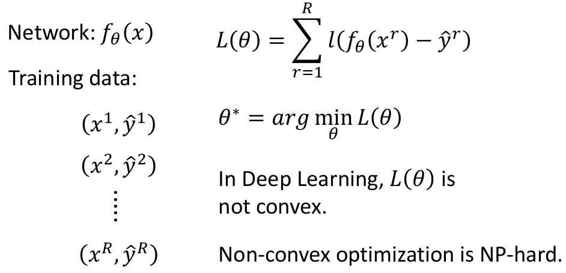
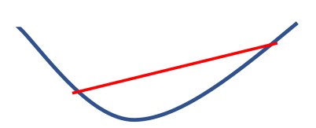
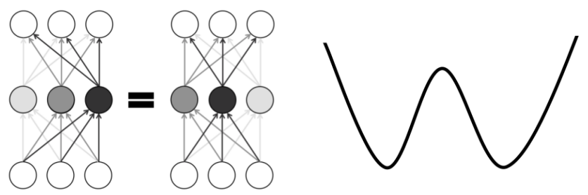
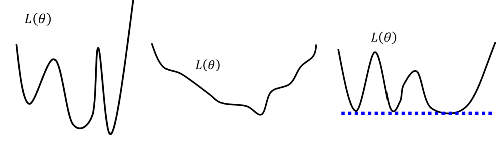
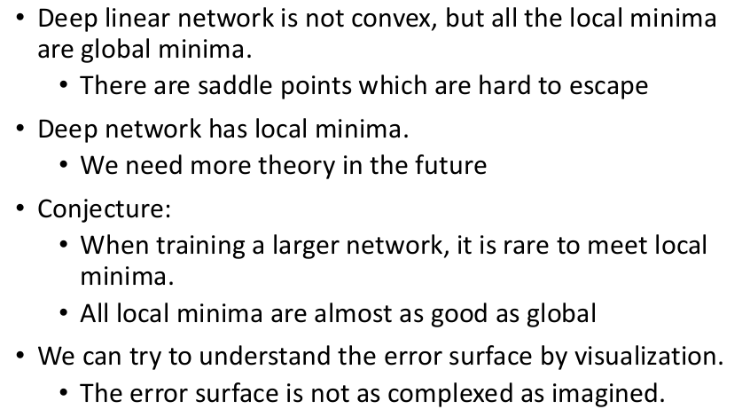

# ch2. Optimization

在进入这章之前，先来了解两个概念：① Optimization的定义，② 为什么要学习Optimization

## 1. Why Optimization

### ① Optimization的定义

下述仅仅从"狭义"(站在deep learning)的角度给出Optimization的定义：

（注：$l$代表损失函数，根据具体问题进行不同的定义）

给定函数空间（即给定网络结构）+训练数据集，寻找使得"损失函数"最小的函数（即寻找最佳$\theta$）

> 别将Optimization和Learning混为一谈：Learning还要考虑找到函数的Generalization。而Optimization就是为了寻找使得损失最小的参数

### ② 为什么要学习Optimization

虽然我们在第一章讨论和论证了Deep Learning的函数空间能够拟合任何函数，但是如果仅仅知道这个函数空间很大很强，但是却没有办法"寻找"到要的函数又有什么用呢（如果没有手段找到合适的$\theta$，Deep Learning理论上多强都等于白搭）！所以学习Optimization是很有必要的。

## 2. Loss of Deep Learning is not convex

① 凸问题

关于convex的概念，各类凸优化书籍上都有很详细的介绍（由于DL的损失函数非凸，所以就略过），总之记住就是下图类似的形式就可以（想深入学习凸优化，推荐[Boyd的凸优化](http://web.stanford.edu/~boyd/cvxbook/)）：

② 非凸问题

需要知道的就是非凸问题是NP-hard的（简单而言，就是目前并没有很好的手段能确保一定找得到最优解）。先给出这一章的一个结论：**虽然DL是NP-hard的问题，但它的Optimization并没有想象的那么难以求解---这也是为什么类似Gradient Descend等方法均有效**

③ 为什么DL是非凸问题

下图是一个非常简单的网络结构：我们只是对调了隐藏层各神经元的顺序（同时保留各自对应的参数---这部分你可以看图理解下就好），则左右两个网络参数的输出结果是完全一样的！假设左边的参数就是最佳参数，那我们必然可以找到等价的右边，显然右边的参数也是最佳参数；这就暗示了**global minimum并不只有一个**，情况如右图所示！

> 注：
>
> 1. 真实情况下，DL的参数量是非常多的，所以其实可能存在非常非常多的global minimum
> 2. "对调神经元"是代表不同的参数，就好比$x,y$轴的值交换了一下，显然在空间平面上是不同的两个点

## 3. Non-convex$\ne$Difficult

上述三种情况均是non-convex的，但显然它们的难度是不同的！

① 左边显然很难用gradient descent走到global minimum（非常依赖初始开始位置）

② 中间的显然可以用gradient descent走到global minimum

③ 右边的其实走到哪个"谷底"都是没问题的，因为都是global minimum呀～

所以，后续我们就是探究下Deep Learning的损失函数要优化的情况到底属于哪类型的Non-convex问题呢！

## 4. 后续章节

1. Hessian矩阵（海森矩阵）
2. Deep Linear Model
3. Deep Non-linear Model
4. Conjecture(猜想) about Deep Leanring
5. Empirical Observation about Error Surface

## 5. 本章的结论（提前先给出）

