# Hessian Matrix

> 这章写的有些乱，你就当科普篇

首先先说下这一节的意义：可以视为一种帮助你分析critical point的手段（工具---当然在数学层面而言，海森矩阵有更广的用途）

> critical point：梯度等于0的点

两种常见的critical point如下图所示

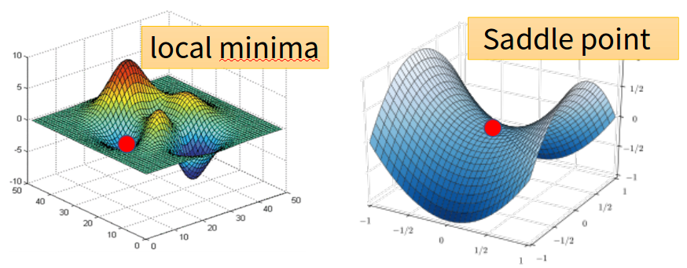

## 1. 海森矩阵的概念

① 泰勒展开引出海森矩阵

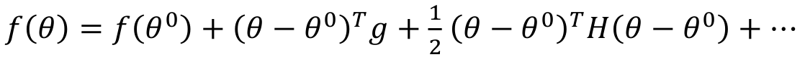

意义：函数在$\theta^0$附近的值可以用泰勒展开来逼近（越高次，拟合越准确，允许的"附近"范围更广）

其中的$H$就是海森矩阵：

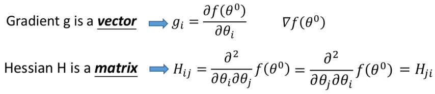

（显然可以发现，海森矩阵是对称矩阵）

> 实对称矩阵的性质：
>
> 1. 实对称矩阵的特征值均为实数、特征向量可以取为实向量
> 2. 实对称矩阵的相异特征值对应的特征向量是正交的
> 3. 实对称矩阵可正交相似对角化

② 海森矩阵的意义

站在函数近似的角度来看，H决定局部的曲率（曲线的弯曲走向）

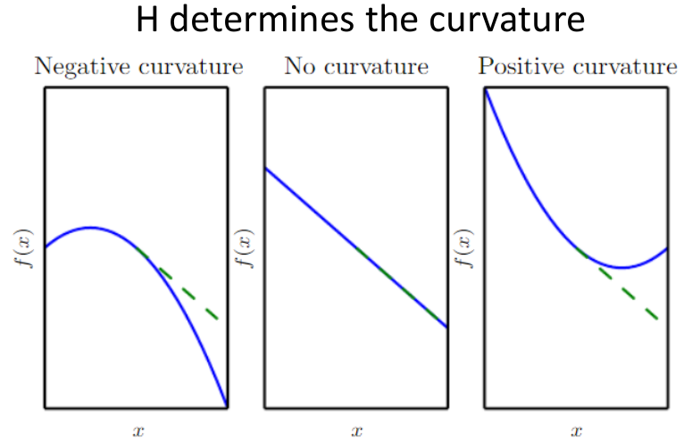

说明：绿虚线---只包含一阶导的泰勒展开近似，蓝实线---原函数（但我们假设此处$x$是一小段范围，此时包含二阶导的泰勒展开和原函数基本一致）；显然可以发现二阶导(即Hessian矩阵)这一项决定了**局部曲率**（其实通俗点理解就是二阶项对应了平方项的情况）

## 2. 海森矩阵的应用：Newton's method

下面主要介绍如何寻找critical point（即寻找梯度等于0的点）

① 牛顿法介绍

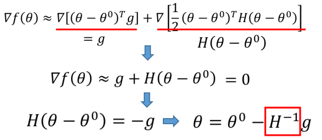

牛顿法即利用$\theta=\theta^0-H^{-1}g$进行参数更新来寻找critical point

> 注：$H^{-1}$并不一定绝对存在

② 牛顿法vs梯度下降法

先来看看两者参数更新方式的不同：

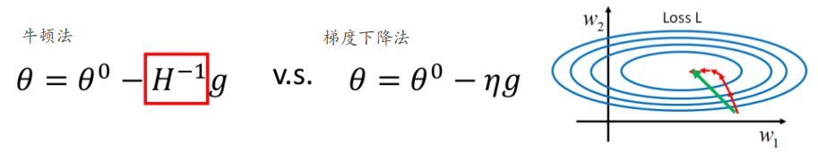

可以发现牛顿法的几个优点：1. $H^{-1}$自己就决定了参数更新的方向(可正可负)，且无需调整步长

此外，牛顿法相对梯度下降法而言，"寻找"的速度更快（绿线为牛顿法，红线为梯度下降法 --- 图中可以理解为较小的范围内，牛顿法可以一步就达到最优解）

③ 为什么牛顿法在DL中并不普及

看完上面估计会觉得牛顿法"吊打"梯度下降法，可为什么在DL的各类实现中看到的都是梯度下降法，压根没见到牛顿法呢？主要有下述几个原因：

1. 牛顿法需要计算$H^{-1}$，而对于DL这种参数成千上万的情况，计算逆矩阵计算量是非常恐怖的
2. 牛顿法寻找的是critical point，所以它非常有可能喜欢跑到paddle point等情况

## 3. 利用海森矩阵来判断critical point属于哪一种

终于到了你可能感兴趣的地方☺

### I. 预备知识：线性代数

主要介绍几个后续需要用到的概念

① 特征向量和特征值

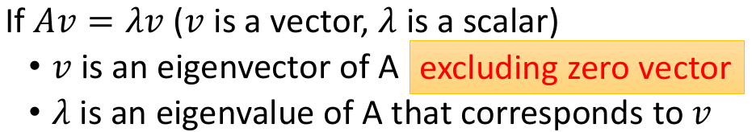

② 正定/半正定/负定/半负定

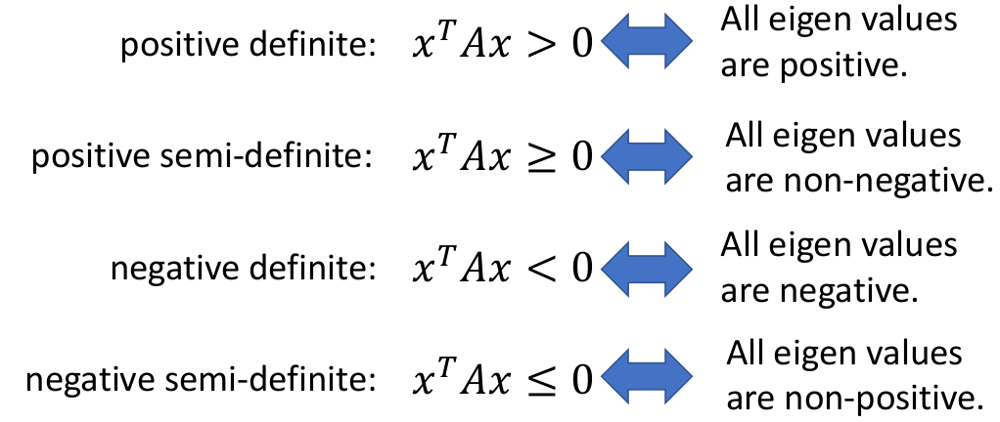

### II. Hessian矩阵判断

再来看下在critical point处的二阶泰勒展开，下面是指在$\theta^0$处导数为零

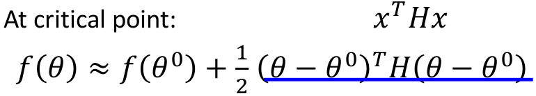

（令$x=\theta-\theta^0$）

我们可以发现Hessian矩阵和critical point之间有下述关系成立：

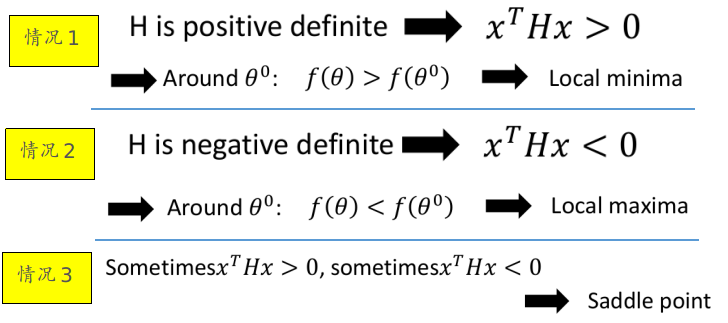

### III. Hessian矩阵判断再探

我们也可以站在特征值的角度来分析：由于H是个对称矩阵，所以有且存在一组单位正交基$\{v_1,v_2,...,v_n\}$来表示这个矩阵空间里的任一向量。所以任一一个向量$u=(\theta-\theta^0)$可以表示成如下形式：

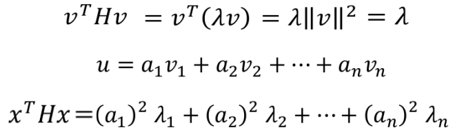

注：上述的$x=u$

显然我们可以发现：特征值全为正对应local minima，特征值全为负对应local maxima（其实和上面的内容是一样的，只是稍微看的形式变了下）

> 但这条表达式蕴含着一个重要信息：当我们沿着对应特征值为负的特征向量方向进行移动（比如假设$\lambda_k$为负，而沿着该方向移动等价于增大$a_k$），会使得$xHx$变小，因为$a_k^2\lambda_k$为更负的值

## 4. Degenerate（退化情况）

退化是指海森矩阵至少包含一个为0的特征值，而退化情况是难以确定到底是哪一种critical point的，以下述几个函数为例：

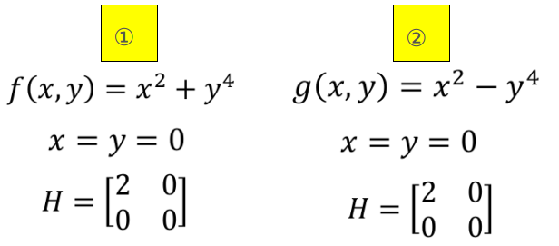

可以发现两个函数的critical point均为(0, 0)，且在该点的海森矩阵也一样。但①是local minima，而②是saddle point（至于为什么，可自行画一下）

## 5. Training Stuck$\ne$Zero Gradient

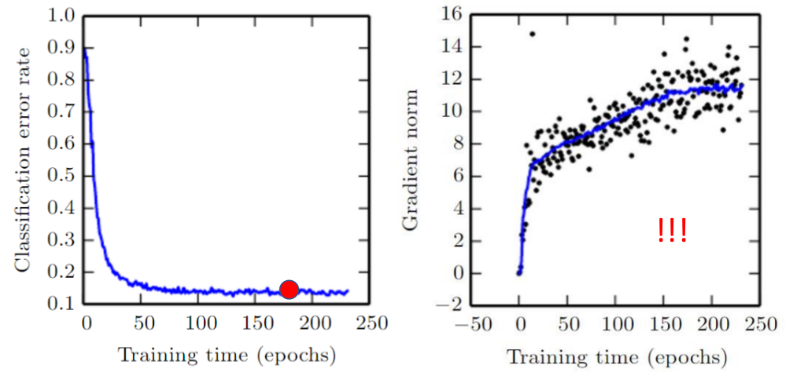

从上图我们可以发现，当你的损失不在下降了，其实并不一定走到了critical point（即右边的gradient norm并没有等于0 --- 但实话实说，在DL里面你基本上走不到Gradient norm等于0的情况）

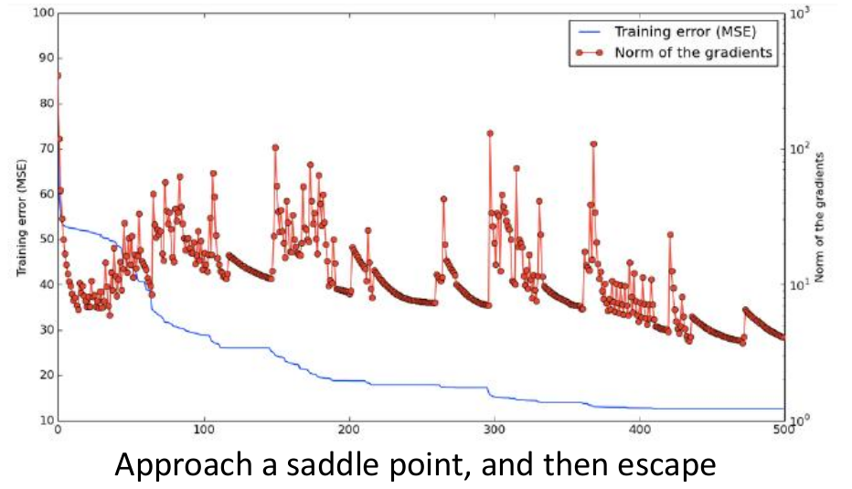

其实也可以发现损失不断在下降，但是norm of the gradients是在不断"乱跳"的，一种解释是那些norm of the gradients下降是不断靠近saddle point，而那些暴增的点其实是逃离了saddle point

> 在Deep Learning中，损失降到一定程度不再下降往往只能看到gradient norm很小了，但你就别指望真的走到0

