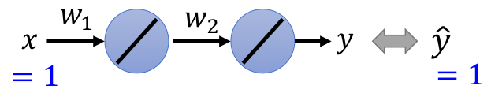
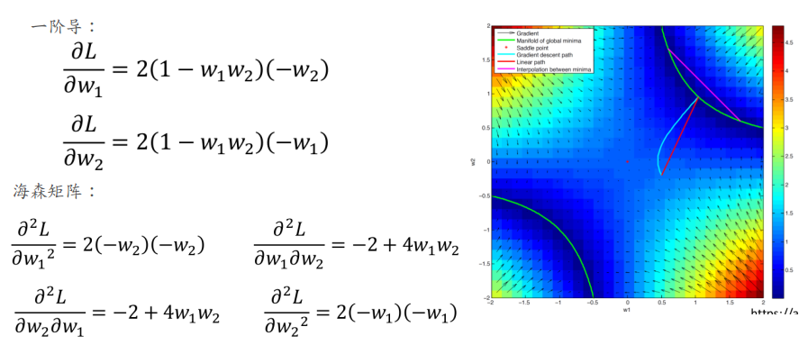
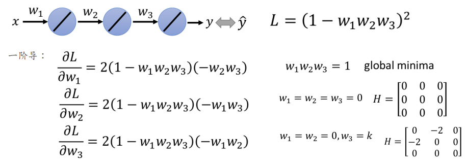
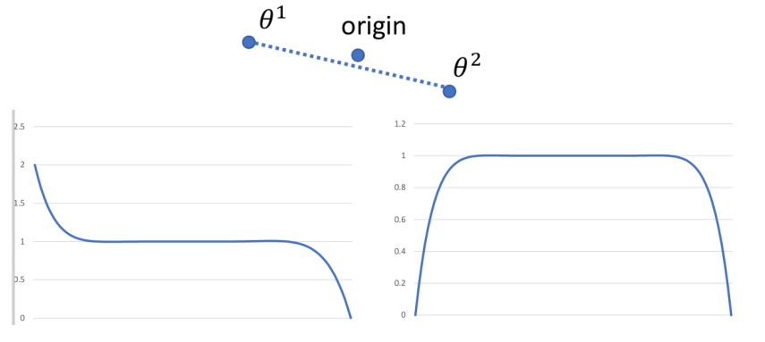
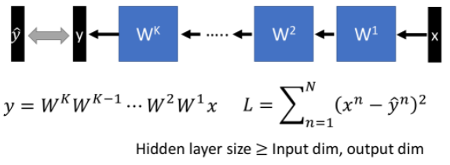

# Deep Linear Network

这部分希望通过"**简单的例子**"来说明Linear Network**所有的local minima都是global minima**，且存在一些"**很平**"的saddle point（这些点掉进去就比较难以逃出来，这也是为什么初始化很重要）--- 而关于严格的证明等等自行查看参考文献

> 虽然$l=(1-w)^2$为凸函数，但是后续的情况均为非凸的～

## 1. One Hidden Layer

此处假设训练集为标量，且只有一个：$(x=1,y=1)$；网络结构如下所示：

损失函数非常容易写出来：$L=(\hat{y}-w_1w_2x)^2=(1-w_1w_2)^2$

下面研究其critical point：由一阶导不难知道，$(w_1w_2=1), (w_1=0,w_2=0)$均为critical points

可以利用海森矩阵分析得到：$(w_1w_2=1)$为local minima，$(w_1=w_2=0)$为saddle point（其实你从图中也可以直接发现这件事情）；此外我们从图中可以获取更多信息：

1. 所有的local minima均为global minima（图中绿线）
2. 该函数为非凸的（如图中的粉红色线的情况）
3. 进入saddle point的可能性比较小（只有初始化在对角线(左上到右下)时才可能），且很容易逃离该saddle point

## 2. Two Hidden Layer

可以根据一阶导求出critical points的点：$(w_1w_2w_3=1),(w_1=w_2=w_3=0),(w_1=w_2=0,w_3=k)$,$(w_1=w_3=0,w_2=k), (w_2=w_3=0,w_1=k)$。且通过Hessian矩阵不难发现$(w_1w_2w_3=1)$为global minima，其他的情况为saddle points。还可以知道下述情况：

1. 对于$w_1=w_2=w_3=0$的情况：可以发现其特征值均为0，这就说明该点附近很平（当范围较小时，泰勒展开后续项非常小）--- 这个saddle points相对One Hidden Layer的情况更难逃掉
2. 所有的local minima也都为global minima

## 3. More Hidden Layer

在更多Hidden Layer情况时，那个"平的"saddle point（$w_1=w_2...=w_n=0$）处会更平，如果落入就更难逃离开来；下图是10层的情况下，任意两个$w_i$维度时的情况：

这说明了：越深的时候，存在**越难**逃离的saddle point（此时参数初始化就很重要！！！）

## 4. 通用Deep Linear Network情况

下述将输入和输出均扩展到向量的情况（此处只给出结论，具体的证明见paper）

在满足条件：Hidden Layer(每层)的神经元个数大于等于`max(输入维度，输出维度)`；

可以有下述结论：**所有的local minima均为global minima！**且当Deep Linear Network超过两个及以上隐藏层的时候，会产生比较"差的"saddle point（即比较平的区域，难以逃离的点---海森矩阵特征值很多0）

## 5. 推荐阅读

上面的内容只是为了让你有一种直观印象（记住有这特点就好）

如果想知道更具体的数学推导：

1. [Deep Learning without Poor Local Minima](https://arxiv.org/abs/1605.07110)
2. [Depth Creates No Bad Local Minima](https://arxiv.org/abs/1702.08580)
3. [Deep linear neural networks with arbitrary loss: All local minima are global](https://arxiv.org/abs/1712.01473)
4. [Learning Deep Models: Critical Points and Local Openness](https://arxiv.org/abs/1803.02968)