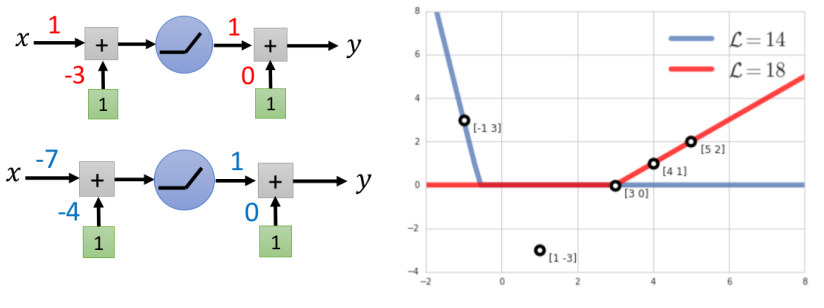
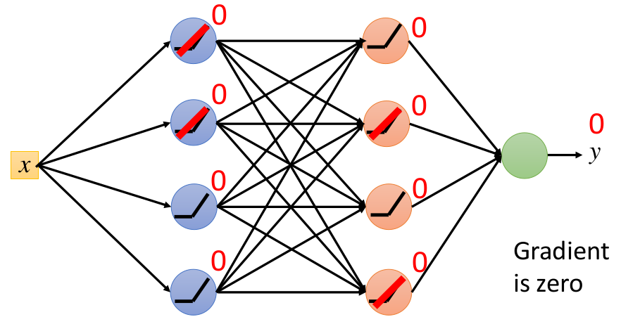
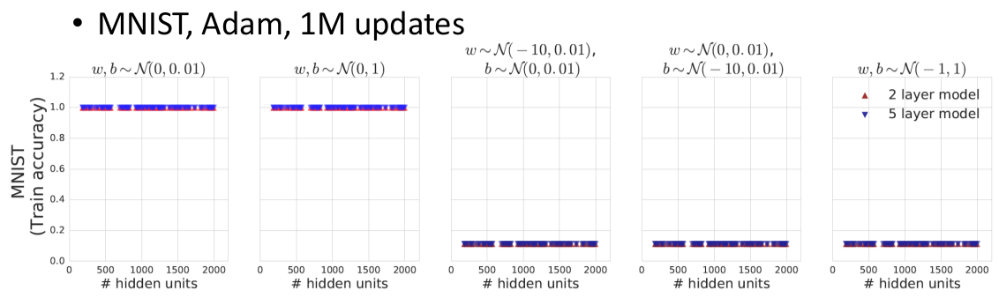
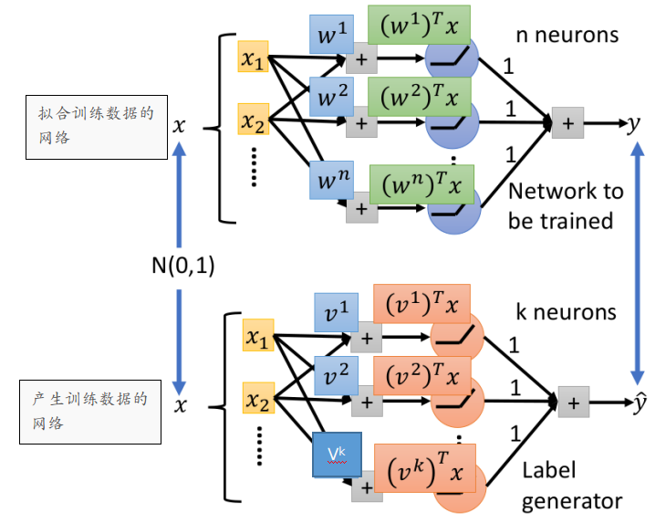
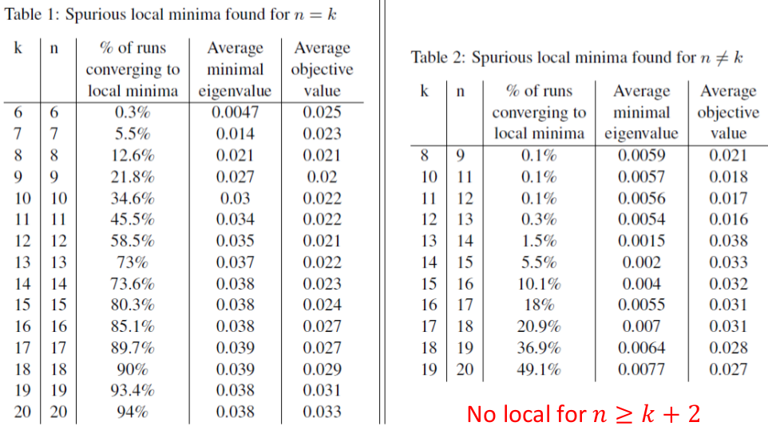

# Non-linear Deep Network

这一节主要为了说明：Non-linear Deep Network存在local minima（这点和Linear Network不同）--- 主要站在寻找local minima的角度来说明

> 虽然后续内容说明了Non-linear Deep Network存在local minima，但同时也"揭露"出在哪些情况下容易进入local minima --- 由此我们通过"限定条件"(初始化，数据分布等)来避免掉进local minima

## 1. ReLU激活的网络存在local minima

### ① 单个神经元情况下的例子

用只包含一个神经元和一个隐藏层的ReLU网络结构来拟合5个数据$(-1, 3),(1,-3),(3,0),(4,1),(5,2)$

（注：其中红线代表$(1,-3,1,0)$这组参数对应的拟合情况，蓝线代表$(-7,-4,1,0)$这组参数对应的拟合情况）

可以发现对于第一组参数$(1,-3,1,0)$而言，是local minima（因为存在另一组参数$(-7,-4,1,0)$的损失比其更小，所以不可能是global minima）

> 关于为什么$(1,-3,1,0)$是local minima可以见论文：[Local minima in training of neural networks](https://arxiv.org/pdf/1611.06310.pdf)

### ② 通用情况

ReLU网络存在"盲点"的情况（下述假设输入输出为标量，且输出是一个正值---输出层暂时忽略bias）

盲点：即输出层的输出均为0（只要我们将第一层参数全设置为负数，或者第一层参数的bias设置为负的很大的值就会进入盲点了）

为什么盲点是local minima：因为如果不考虑输出的bias，那么输出不可能为负数；所以无论我们对参数进行微调是不会出现损失减小的情况（$L=(y-y_{out})^2$---$y_{out}$微调之后只可能略大于0）

## 2. 影响落入local minima的条件

### ① 初始化的影响

从上一部分其实我们就能看出来初始化对是否进入盲点影响很大，下述是一个实验的情况。

对$w,b$采用不同的参数初始化后的结果：可以发现左边两图采用"常规"的初始化很容易训练；而右边的三幅图采用很负的$w$或者很负的$b$均陷入了盲点而逃不出来了

> 从该实验我们可以知道：参数初始化对于ReLU的网络结构非常重要，**坏**的初始化容易落入盲点而逃不出来了

### ② 数据分布的影响

下面这个实验是将下一个网络（参数固定）产生的数据给到上面一个网络进行训练---两个网络的区别就是隐藏层神经元的数目不同

通过实验可以发现**产生数据网络的神经元数目和拟合网络的神经元数目差异**对是否落入local minima有很大影响（或许称之为能够train起来更合适）

从上表可以发现当$n=k$时，比较容易落入local minima（上述是还建立了海森矩阵特征值的大小与掉进local minima的关系---特征值越大，越不容易掉入local minina：其实应该用特征值正的比例更合适），而当$n=k+1$时，相对$n=k$好一些，相对更难进入local minima（但当神经元数目增多也还是有蛮高概率进入）；但是当$n\ge k+2$时，就几乎不会进入local minima了！！！（所以网络还是要大:cry:）

## 3. 结论

上述内容是为了说明：Non-Linear Deep Network并不像Linear Deep Network一样不存在local minima，而是存在local minina，但是在优化过程中，落入local minima的难易程度和**参数初始化**，**目标函数的分布**等有关；因此，可能在某些条件的约束下，Non-Linear Deep Network通过一些优化算法能够保证到达global minima

## 4. 推荐阅读

1. [Local minima in training of neural networks](https://arxiv.org/abs/1611.06310)
2. [Spurious Local Minima are Common in Two-Layer ReLU Neural Networks](https://arxiv.org/abs/1712.08968)
3. [Critical Points of Neural Networks: Analytical Forms and Landscape Properties](https://arxiv.org/abs/1710.11205)
4. [Failures of Gradient-Based Deep Learning](https://arxiv.org/abs/1703.07950)

