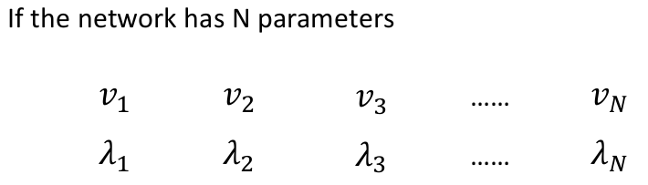
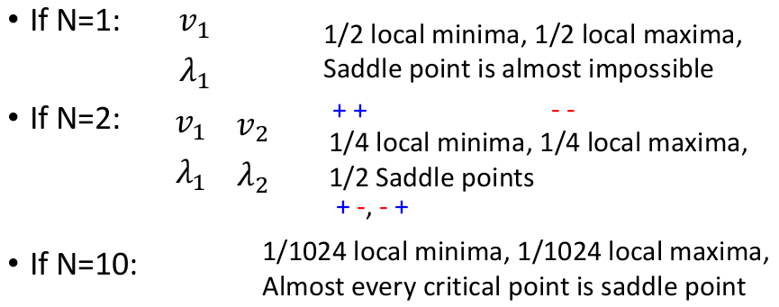
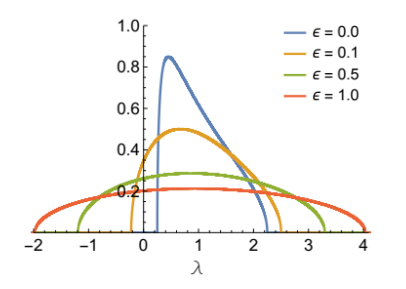
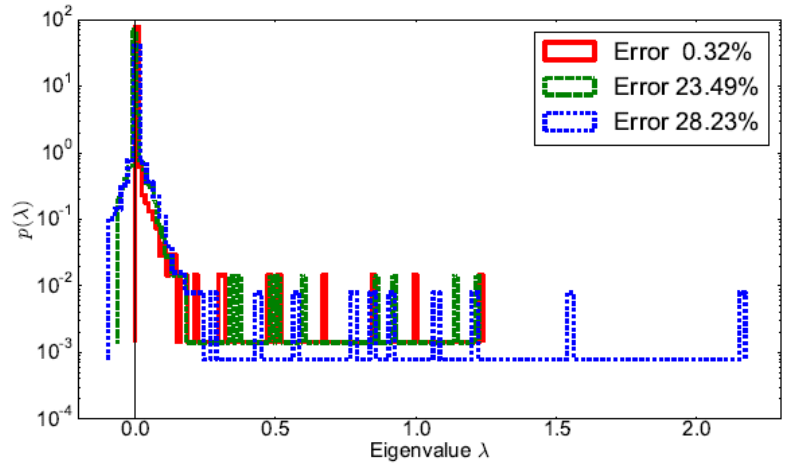
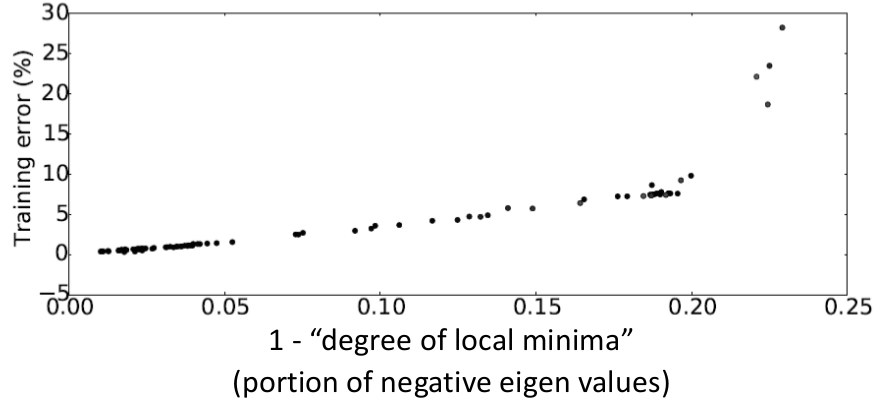
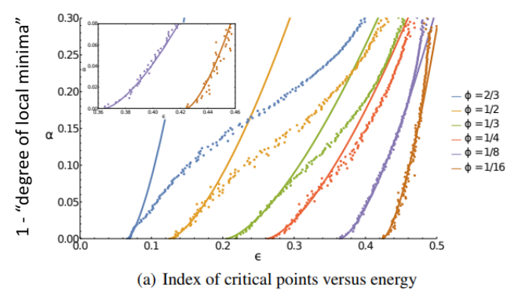
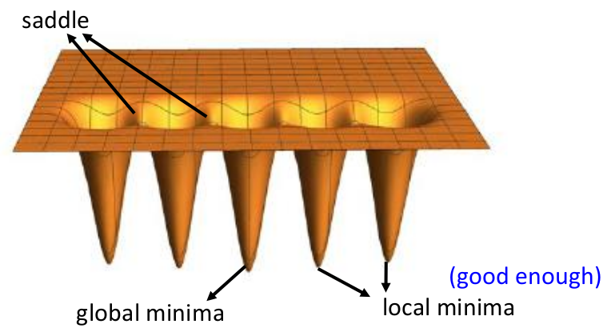
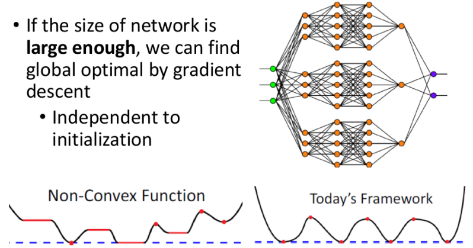

# Conjecture about Deep Learning

这一小节主要是关于Deep Learning优化的一种猜想：几乎所有的local minima和global minima的损失值都比较相近，因此，即使找到了一个local minima往往也是足够了。

> 这也仅仅只是猜想，并没有非常严格的证明；后续的一些解释只是希望能增强大家对这个概念的信服度。

## 1. 前提回顾

由Hessian矩阵那一节我们知道可以通过**特征值**的正负情况来辨别一个critical point是哪一种类型：

- 全正：local minima
- 全负：local maxima
- 有正有负：saddle point

而特征值的数目与网络的**参数数量**是相等的（不删除重复特征值），所以对于有N个参数的network有下述关系：

（其中$v_i$代表特征向量，$\lambda_i$代表对应的特征值）

## 2. 基于特征值的不同假设

### ① 最简单假设：特征值正负概率均为1/2

如果这个假设成立，那么不同参数情况下出现各类critical point的情况如下所示：

显然，当网络足够大（对应参数数量就会越多），几乎所有的critical points都是saddle point。所以local minima并不应该是主要担心的因素。

### ② 更合理的假设：特征值正负概率与损失(Error)有关

假设：特征值$\lambda$为负的概率为$p$，且$p$与当前损失相关。当前损失越大，$p$越大（直觉而言：当损失越大，往周围走损失减小的概率更大，即对应的特征值$\lambda$越可能为负---特征值可以视为往某个特征向量方向走时损失是增是减）

如果上述假设成立，则$\lambda$的分布与损失之间的关系可能如下所示：

从上图能看出什么呢：当损失大的时候，遇到的critical point大概率是saddle point（特征值有正有负），只有当损失很少的时候，critical point才可能是local minima（既然损失都很小了，此时的local minima和global minima差别也不会大了）

> 上图其实是作者在在具体的函数情况下做的实验：[Geometry of Neural Networks](http://proceedings.mlr.press/v70/pennington17a/pennington17a.pdf)

## 3. 更多实验论证上述假设②的情况

下述主要说明：特征值的分布（正负比例）与training error之间的关系

**实验1：不同loss的critical point的特征值情况**

说明：其中红蓝绿三种情况都是落入critical point是的情况，从上图可以发现，error较大的时候，特征值$\lambda$(很多特征值)的区域有正有负，而error很小的时候，特征值基本都是正的

**实验2：特征值正负比例与training error之间的关系**

说明：其中degree of local minima=**负的特征值个数/总的特征值个数**（从某种角度而言：负的特征值数目越多，越不可能为local minima---因为local minima的特征值全为正）；从上图不难发现，**负的特征值占得比例越小，Training error越小**，这也反映了在高的training error时，大概率是saddle point

**实验3：在一些模拟实验上的情况**

其实和实验2结论类型---只是这个实验作者做的更具体；甚至还推出了$\alpha\propto (\epsilon/c-1)^{3/2}$的结论（基于一些假设）

> 这个和假设2是同一篇论文

**others：猜测(希望)优化空间类似下述情况**

local minima和global minima的error非常相近，因此即使最后得到的是local minima往往也足够好了

## 4. 其他更多理论

作者在基于右上角的网络情况下：证明了网络足够大的情况下，采用类似梯度下降法就能找到global minima！！

## 5. 推荐阅读

1. [On the saddle point problem for non-convex optimization](https://arxiv.org/abs/1405.4604)
2. [Identifying and attacking the saddle point problem in high-dimensional non-convex optimization](https://arxiv.org/abs/1406.2572)
3. [The Loss Surfaces of Multilayer Networks](https://arxiv.org/abs/1412.0233)
4. [Geometry of Neural Network Loss Surfaces via Random Matrix Theory](http://proceedings.mlr.press/v70/pennington17a/pennington17a.pdf)
5. [Global Optimality in Neural Network Training](http://openaccess.thecvf.com/content_cvpr_2017/papers/Haeffele_Global_Optimality_in_CVPR_2017_paper.pdf)