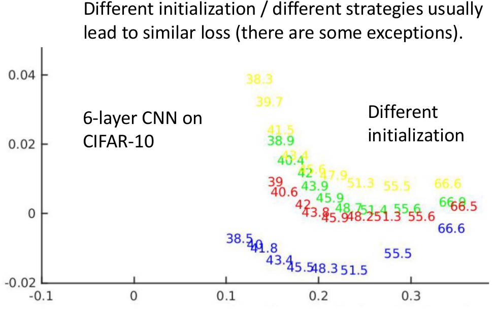
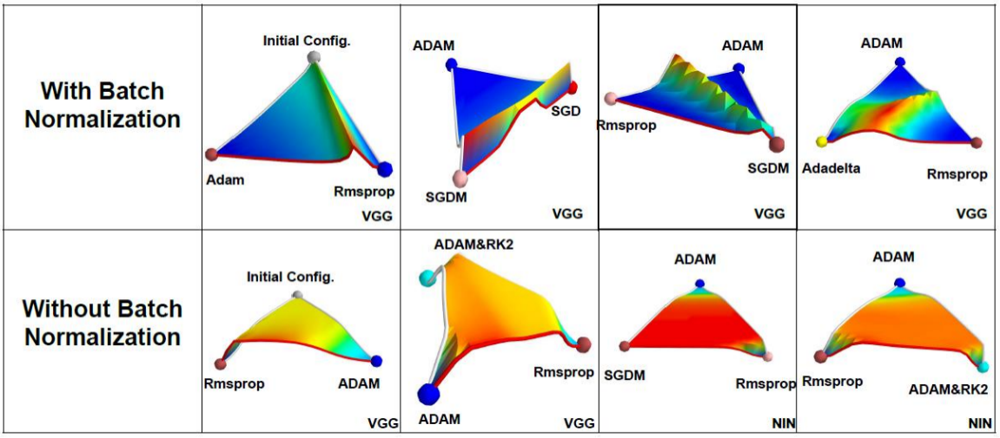

# What does the Error Surface look like?

这章主要提供几种**实验的角度**来查看在优化过程中error surface具体长什么样呢？（因为参数很多，所以几乎不可能在高维空间来看error surface---所以需要一些技巧来合理的可视化） --- 然后通过这些error surface的情况我们可以分析Deep Learning的优化空间可能长什么样

## 1. 一维可视化

### 方式1：$\theta\to\theta^\star$

**MNIST上的情况**

说明：

1. 每组参数其实都可以视为一个向量，那么两个向量显然存在一条直线能够相连。这里的蓝线就是从初始化参数$\theta^0$到优化算法的解（即最终的解）$\theta^{\star}$两者向量之间的连线（我们取直线上的各组参数绘制上面对应的图像），图像的横坐标其实就是$\theta^0+\alpha(\theta^\star-\theta^0)$
2. 真实的优化过程显然并不是完全沿着蓝线的情况进行，这里只是一种可视化的方法---真实情况可能类似黑线那样曲曲折折地前进到$\theta^\star$
3. 从上面曲线来看，可以发现从$\theta^0$到$\theta^\star$的过程还是蛮平滑的下降，而没有非常疯狂的震荡

上述实验是存在两个通过优化算法获得的解$\theta^\star_1$和$\theta^\star_2$（上一章其实就说明了Deep Network存在多个local minima），两个解之间的连线对应的损失情况，而从上述图像来看，不同的local minima其实解都已经够好了

> 这个实验主要是为了说明优化平面或许没有我们想象的那么难，从初始化到解的"途中"其实还算是平坦（局部放大还是会有些震荡）

### 方法2：不同优化解的可视化

下述是采用不同的优化算法，以及不同的参数初始化策略获得的参数$\theta^\star$的情况

这种方法的横纵坐标是将优化算法解$\theta^\star$这个向量利用PCA等方法降维到2维情况下的可视化情况，图像中的具体数字代表准确率（不同颜色代表来自不同的初始化和优化策略）

> 从这个实验我们可以知道Deep Network存在很多local minima，但每个local minima的结果都还不错。

## 2. 二维可视化

（这部分感觉没一维来的舒服）

其中的Projection其实是右图的蓝线(一维情况中的方式)，而另一维Residual其实就是相当于右图中每个黑线垂直到蓝线上的距离（这样其实增加了路径的"丰富性"）

## 3. Others

### ① 不同的优化方法获得的$\theta^\star$并不相同

左图采用相同的初始化参数，但可以发现采用不同的优化算法，获得的解$\theta^\star$并不相同！

那么是不是真的不同呢？会不会只是network的neuron交换了顺序，但本质其实还是同一个解呢？答案是否定的的：上面右图代表不同的优化算法带来的解的差异（你可以理解为参数值不同的程度---大约有8%的数值是不接近的，这就说明了不同的优化算法的解其实是不一样的！）

### ② 什么导致解不同

究竟是什么导致不同的优化算法的解不同呢：一种直观的感受就是初始化参数阶段(如右图中蓝色和红色的地方出发显然会走到不同的local minima)导致了优化方法走到了不同的地方（但其实从上面的情况采用相同的初始化参数就说明其实并不是因为这个原因）。

其实真正的"罪魁祸首"就是优化策略的不同：上图中在不同的阶段从SGD切换ADAM，我们可以发现最后的解都变到了～

### ③ Batch Normalization带来的影响

我们可以发现有Batch Normalization的时候，不同的**解**之间有很"尖锐"的分水岭，但是没有BN的时候，不同的解之间存在一块很平坦的区域：如果初始化到这个区域就走不动，挂掉了（即这块区域梯度很小，容易出现梯度消失的问题）

### ④ Skip Connection带来的影响

此处的skip connection指的是类似residual network里面的residual部分

说明：上面的这个方式是采用了特殊的normalization后的结果；此外网络是很深的

我们可以发现如果没有skip connection是非常容易陷入边缘的一些地方，而有skip connection则会容易很多（这也是为什么对于很深的网络Residual Network效果好的原因！）

## 4. 推荐阅读

1. [Qualitatively characterizing neural network optimization problems](https://arxiv.org/abs/1412.6544)
2. [An empirical analysis of the optimization of deep network loss surfaces](https://arxiv.org/abs/1612.04010)
3. [Theory II: Landscape of the Empirical Risk in Deep Learning](https://arxiv.org/abs/1703.09833)
4. [Visualizing the Loss Landscape of Neural Nets](https://arxiv.org/abs/1712.09913)