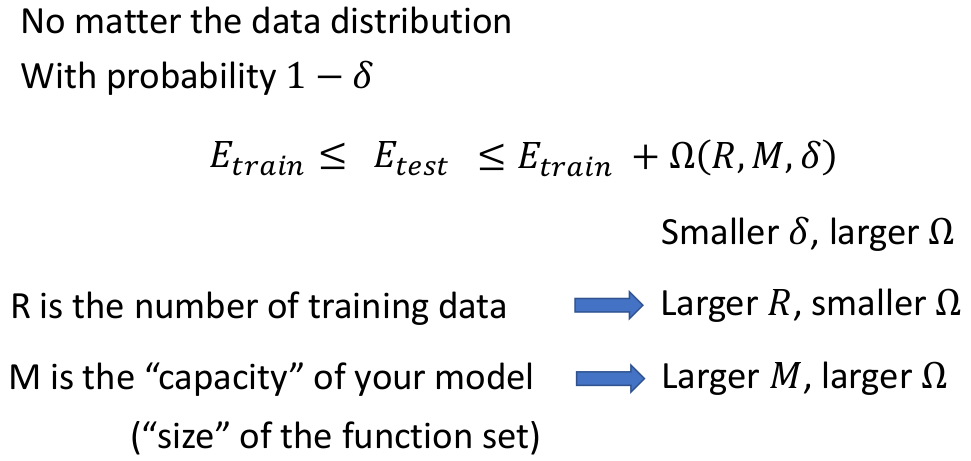
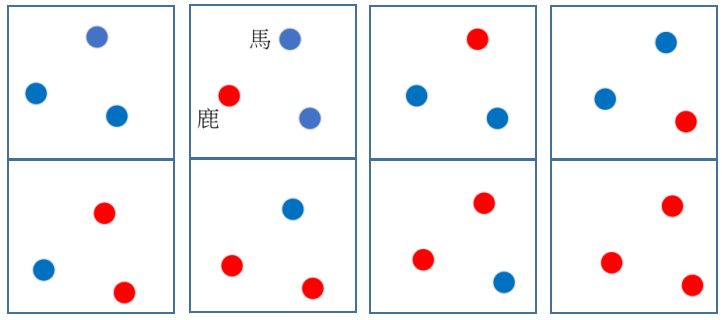
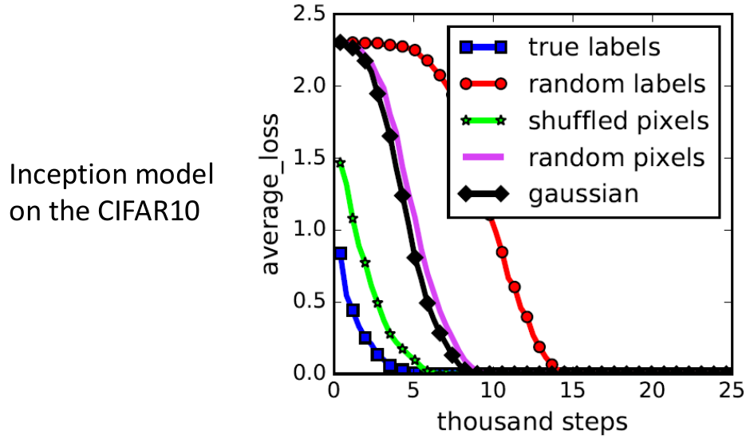
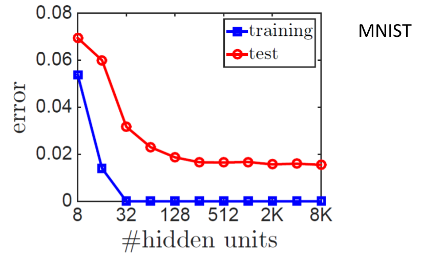
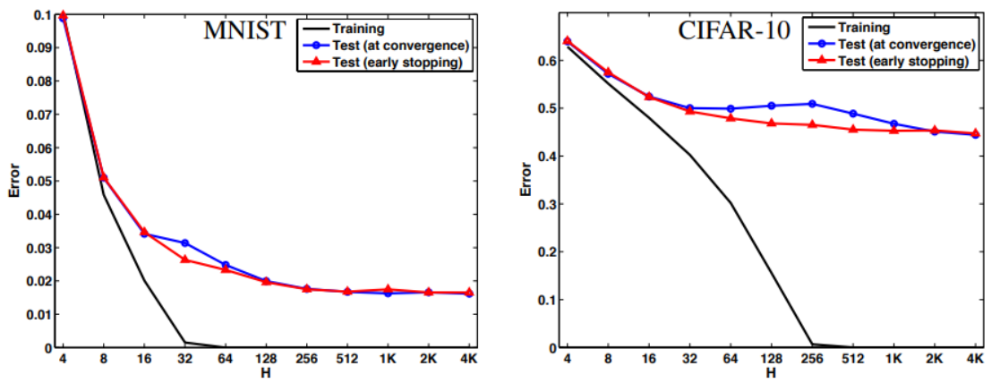
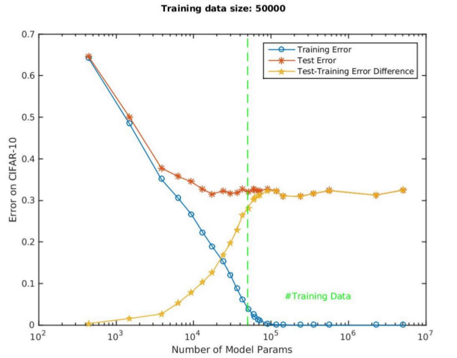
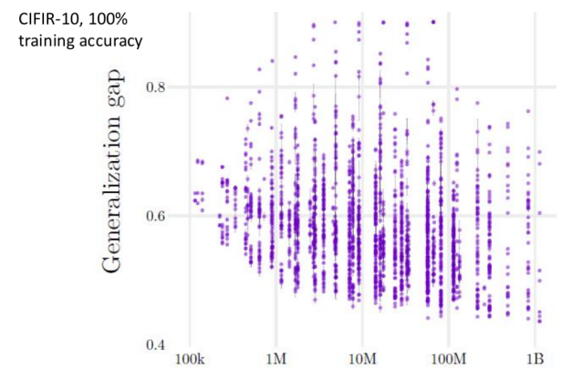
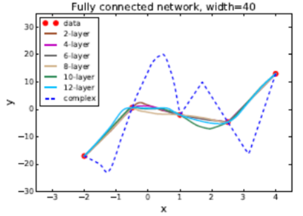

# Generalization Ability

这一节主要分析Deep Model的泛化能力，首先先给出结论：

- Deep Model的模型复杂度（model capacity）非常大
- 虽然Deep Model的模型复杂度很大，但它其实并不容易overfitting（甚至模型复杂度越大的model其泛化能力更好---原因尚无非常好的解释）

## 1. Generalization Gap

机器学习问题里面，训练误差并不等于测试误差，因此存在**泛化能力**一说。而站在[VC维理论](https://github.com/AceCoooool/MLF-MLT)方面两者之间存在下面的关系：

可以看到两者之间的差异$\Omega(R,M,\delta)$与训练集的大小R，模型的复杂度M相关。（训练集的大小往往是给定的，所以我们所能决定的一般只有model的capacity）

> 1. 但这个Gap仅仅只是一个上界，一般比较难进行定性的分析。且实际的Gap往往比这个上界要小的多
> 2. 从这个理论来看，模型复杂度太大的话，容易产生overfitting（但后面你将会看到似乎在Deep Model里面并不适用）

而衡量模型复杂度一般采用VC Dimension。

## 2. VC Dimension分析

### ① VC维简介

以线性模型为例，下面的分析可以发现此模型的$d_{VC}=3$（即所有的可能性均能划分开）

> 当增加到4个点的时候，你可以自己试一下存在一些情况无法用线性模型划分开来

### ② Deep Model的VC维

在某种程度而言，模型的参数越多，对应的VC维一般越大；下面从实验的角度来论证Deep Model的VC维非常大（即capacity非常大）：

从上图我们可以看到各种"可能"（随机标签，随机打乱像素，随机像素等等）情况，Inception model都能够使得training的损失降到非常非常低：这也就从侧面证明了模型的capacity非常非常大！

## 3. Deep Model模型复杂度与泛化之间的关系

就我们以往的认知（从机器学习角度）而言，当我们的$E_{train}$相同的时候，会倾向于选择一个capacity较小的模型，这样的模型越不可能overfittng。（即奥卡姆剃刀定律）

让我们从实验的角度来看看Deep Model里面两者之间的关系：

**实验1：MNIST上面的情况**：我们可以发现training阶段error相近的情况下，模型的复杂度越大的反而test误差更小！！！（这和上面的认知不同）

**实验2：early stopping的影响**：early stopping我们可以视为regularization的一种手段，从下述实验我们可以看到对于模型复杂度非常大的情况，early stopping的结果并没有比不进行early stopping好！！！

**实验3：CIFAR-10上的情况**：我们可以发现随着模型复杂度的增大，似乎并没有增大overfitting的可能性！！！

**实验4：更多更全的实验说明这不是偶然**：下面这个实验的纵轴是(训练误差-测试误差)，为了排除初始化以及优化方法等的影响，同一列上的每个点代表采用不同的初始化及优化策略下的Generalization Gap，整体上而言，我们依旧可以发现模型参数越多，其泛化能力反而越强。

> 上面这么多实验都可以发现，对于Deep Model是违反**奥卡姆剃刀定律**：模型复杂度越大，反而泛化能力越好，并没有出现overfitting的情况。--- 这也是为什么Deep Learning的发展中越Deep，参数越多的模型效果越好！

### 可能的解释（不一定正确）

Deep Model**自带正则化**的功能，类似下图情况，我们可以发现Deep Model并不会出现类似多项式那样非常"扭曲"地去拟合这几个点，反而很"克制"，较平滑地去拟合这几个点。

> 另一个支持此观点的论文：[Deep Image Prior](https://arxiv.org/abs/1711.10925)

## 4. 推荐阅读

1. [Understanding deep learning requires rethinking generalization](https://arxiv.org/abs/1611.03530)
2. [Exploring Generalization in Deep Learning](https://arxiv.org/abs/1706.08947)
3. [In Search of the Real Inductive Bias: On the Role of Implicit Regularization in Deep Learning](https://arxiv.org/pdf/1412.6614.pdf)
4. [Theory of Deep Learning III: explaining the non-overfitting puzzle](https://arxiv.org/abs/1801.00173)
5. [Sensitivity And Generalization in Neural Netorks: An Empirical Study](https://arxiv.org/pdf/1802.08760.pdf)

