# Indicator of Generalization

这一节主要介绍两种对于**衡量**一个模型泛化能力很有用的**指标**(Indicator---指示器)：Sharpness和Sensitivity

- Good generalization are associated with sentitivity
- Good generalization are associated with flatness（存疑）
- Understanding the indicator for generalization helps us develop algorithm in the future

## 1. 前言

### ① 为什么要学习这些指标

首先，由第二节我们可以知道Deep Model往往存在很多的local minimal（且都非常接近global minima）；因此不可避免地需要衡量不同的解之间的"优劣"：

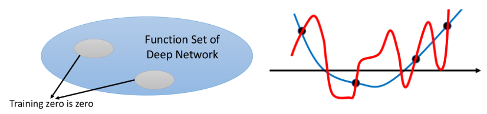

> 如上图中右边，我们显然会觉得蓝线会比红线好：虽然两者在training data上面的loss均为0

但你可能会觉得我们不是有Validation Set用来衡量不同模型的泛化能力的好坏吗，为什么还要学习这些指标呢：对的，Validation Set是一种衡量不同模型泛化好坏的很有用的手段，但是通过学习这些指标能够帮助我们知道理解network有什么特性时比较不容易overfitting，且当我们知道后，可以在training阶段朝着这些指标希望的方向走

> 注：此处泛化能力不好为overfitting

### ② network处于overfitting态和非overfitting态其实是很不同的

> 注：为了避免理解有偏差，在Deep Model里面的overfitting可以理解为模型容纳的信息远多于原本希望它容纳的信息（即它"记住"了很多不该记的杂讯---俗称的暴力记忆）---类似上面图中的红线与蓝线的对比。

**实验1：Real label vs random label的特征情况**：我们可以发现Real label的特征其实是具有一定规律的，而overfitting情况的特征几乎就是"乱七八糟"

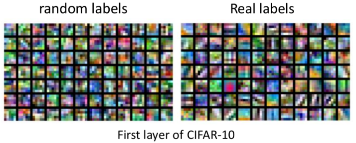

**实验2：不同程度的杂讯的情况**：我们可以发现杂讯越多，越容易overfitting，此外还有一个很有趣的现象，network在一开始阶段，都是希望找出规律，只是随着不断地迭代下去，"被逼无奈"记忆住杂讯

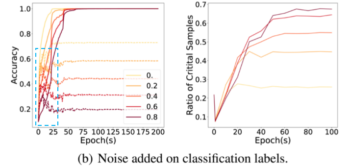

> 1. Simple pattern first, then memorize exception（左图实线为训练集，虚线为测试集）
> 2. 此处需要说明一下右图中的Critical Samples：Critical Samples是指以某个测试数据为中心，一定范围内的数据的label是否和该数据相同，如果不同，则视为一个critical point；而ratio of critical samples是指所有的测试数据中critical sample占总的测试集的比例（一般critical point越大，代表问题越"无规律"）

**实验3：overfitting的一个特点就是参数的norm非常大**：这也是为什么类似$L_2$等regularization能起作用---我们可以发现杂讯会导致norm很大，即overfitting现象（下面实验采用不同的norm，但其实想解释同一件事情）

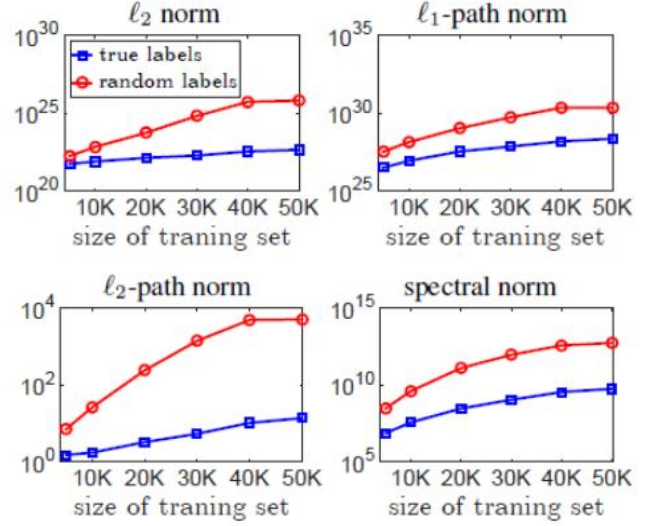

## 2. 指标1：Sensitivity

### ① 首先给出Sensitivity的定义：

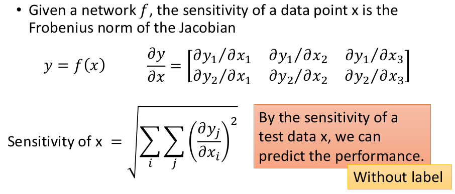

> 1. 从直觉上而言，这个指标还是蛮合理的：因为Sensitivity可以看做对$\Delta x$的变化带来$\Delta y$的变化程度，当sensitivity越小的时候，代表越平滑。
> 2. 虽然这个指标需要有input才能进行衡量，但其实有非常重要的意义：比如给我们一笔testing data，如果我们发现这笔数据的Sensitivity很大，则可以将这笔数据单独拿出来人工进行处理（因为该模型在这笔数据上面效果可能会不好）

### ② Sensitivity与Generalization的联系（实验角度）

**实验1：Sensitivity on and off the training data manifold**：我们可以发现如果测试数据出现在训练集分布的附近，其Sensitivity会比较小，而测试数据离训练数据远的地方，其Sensitivity会比较大（这也和直觉相吻合，在训练集中出现过类似的情况，往往能学的比较好）

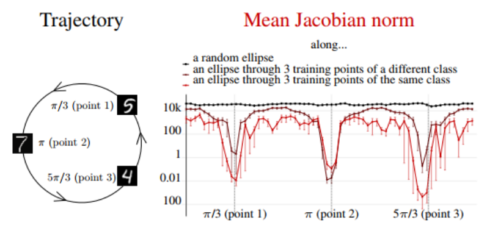

**实验2：Jacobian norm与Generalization Gap之间的关系**

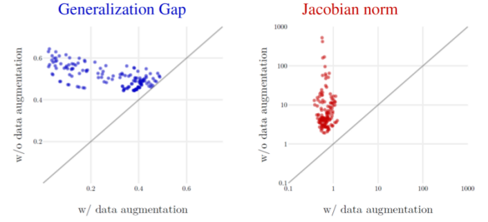

图中每个点代表不同的网络结构。横纵坐标分别指有无augmentation的情况下的Generalization Gap和Jacobian norm：从上图可以发现，有augmentation的情况，generalization gap普遍更小，Jacobian norm普遍更小（即Sensitivity越小，其generalization能力越强）

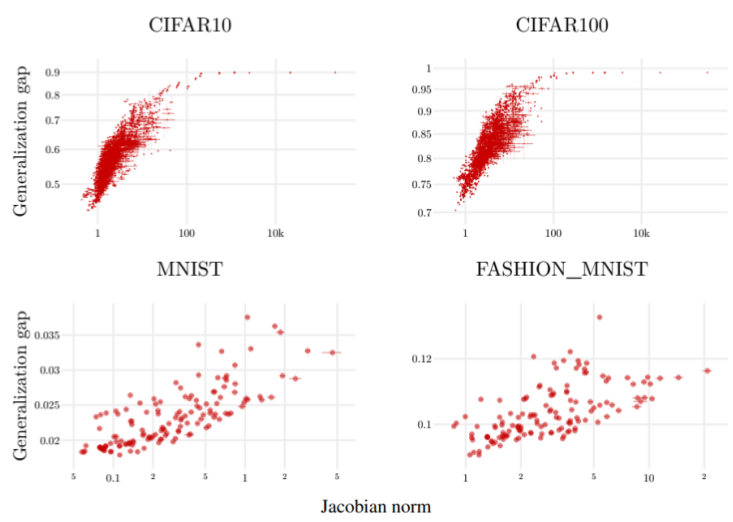

上图横轴代表Jacobian norm，纵轴代表Generalization Gap，可以发现Generalization Gap越大的时候，Jacobian norm也越大，即两者正相关

## 3. 指标2：Sharpness

> 这个指标的有效性存疑：[Sharp Minima Can Generalize For Deep Nets](https://arxiv.org/abs/1703.04933)，这篇论文和下述结论不一致

### ① Sharpness的定义

关于Sharpness并没有非常严格的定义，常见的有下述两种：主要可以理解为衡量训练集上面解周围的"平滑性"

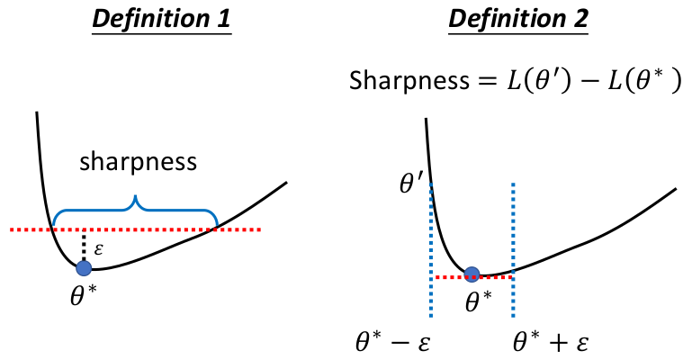

>  注：类似左图中的红线或右图的蓝线在高维空间中其实是对应一个平面。

### ② 为什么Sharpness可以衡量Generalization呢

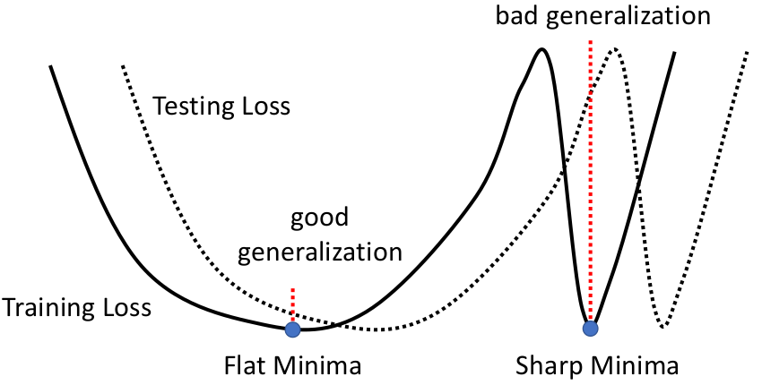

一种可能的解释：由于训练集和测试集的分布可能存在一定的偏差，所以类似上图中如果训练集上获得的解非常"尖锐"（sharp minima），则"衍生"到测试集上面崩掉的可能性明显比左边Flat Minima大。

### ③ Batch Size和Sharpness之间的关系

当Batch Size超过某个范围之后，随着Batch Size的增大，模型的泛化能力越差！！！

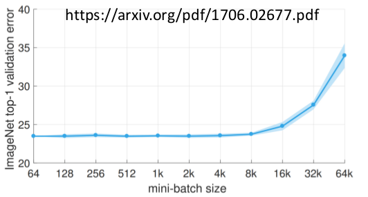

**图像的角度**：可以发现虽然training accuracy两者相近，但SB(small batch)在testing上面的accuracy上面比LB(large batch)的更大

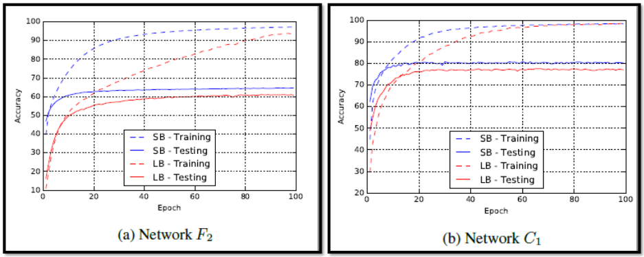

**accuracy vs sharpness**：可以发现small batch在测试集上面对应的accuracy更高，而且sharpness值更小

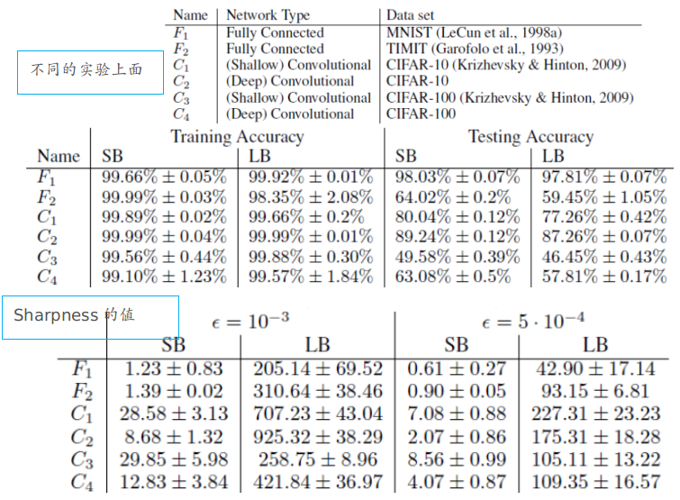

**采用ch2中介绍的一维可视化方法**查看SB和LB的情况：可以发现Small batch的local minima确实更平坦一些

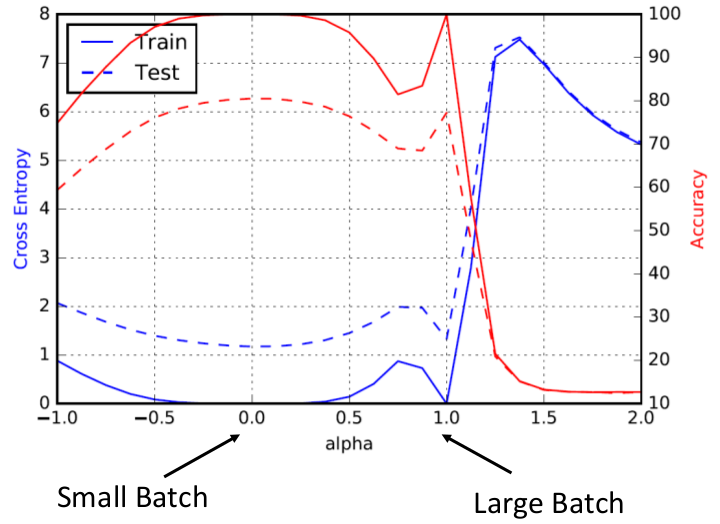

## 4. 推荐阅读

1. [A Closer Look at Memorization in Deep Networks](https://arxiv.org/abs/1706.05394)
2. [On Large-Batch Training for Deep Learning: Generalization Gap and Sharp Minima](https://arxiv.org/abs/1609.04836)
3. [Entropy-SGD: Biasing Gradient Descent Into Wide Valleys](https://arxiv.org/abs/1611.01838)
4. [Exploring Generalization in Deep Learning](https://arxiv.org/abs/1706.08947)
5. [Sharp Minima Can Generalize For Deep Nets](https://arxiv.org/abs/1703.04933)
6. [Sensitivity and Generalization in Neural Networks: an Empirical Study](https://arxiv.org/abs/1802.08760)

