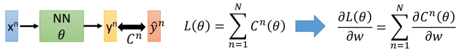
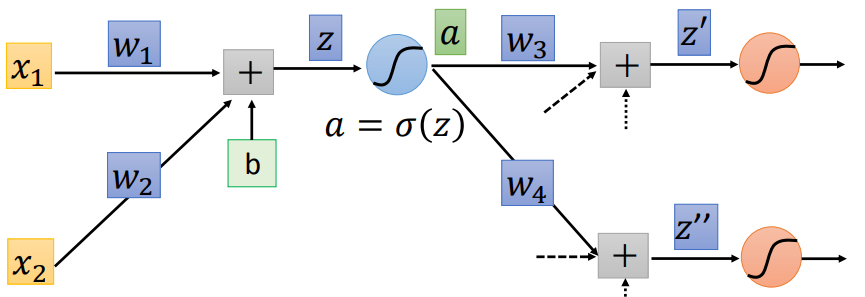
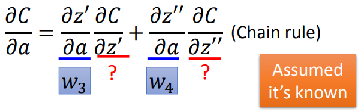
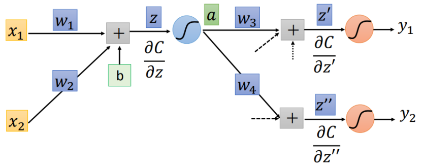
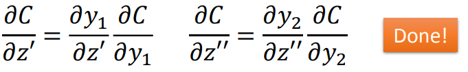
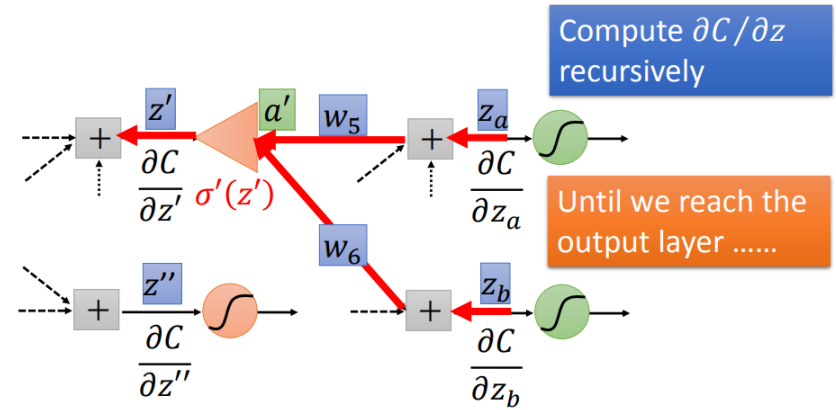
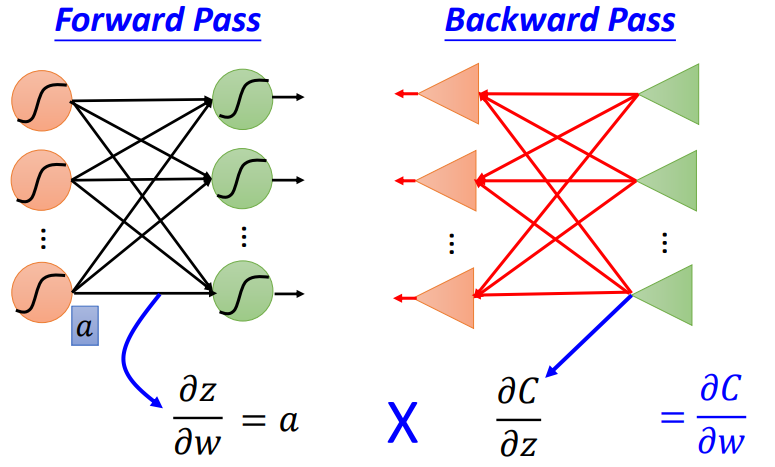

# 反向传播（1）

利用梯度下降法更新参数需要计算"各个参数的梯度"，所以有下述式子：

不妨拿出全部$w$里面的某个w来看下具体是怎么计算的，利用链式法则有下述情况：
$$
\frac{\partial C}{\partial w}=\frac{\partial z}{\partial w}\frac{\partial C}{\partial z}
$$
整个反向传播算法可以有两部分构成：

1. 前向过程：计算$\partial z/\partial w$
2. 反向过程：计算$\partial C/\partial z$

## 1. 前向过程

计算$\partial z/\partial w$

可以非常容易得到：
$$
\partial z/\partial w_1=x_1\\
\partial z/\partial w_2=x_2
$$

## 2. 反向过程

计算$\partial C/\partial z=\frac{\partial a}{\partial z}\frac{\partial C}{\partial a}$

step1：计算$\partial a/\partial z$

这一步和激活函数具体是什么是相关的，例如针对sigmoid激活函数
$$
\frac{\partial a}{\partial z}=\sigma^{'}(z)=\sigma(z)(1-\sigma(z))
$$
step2：计算$\partial C/\partial a$

这样就可以分为两种情况：

① 直接已经是输出层了

则就有下述结果：

② 并不是输出层

> 其实就是不断走到走到最后一层，再回传回去就好

## 3. 反向传播总结

