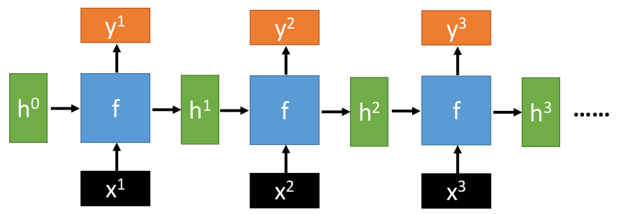
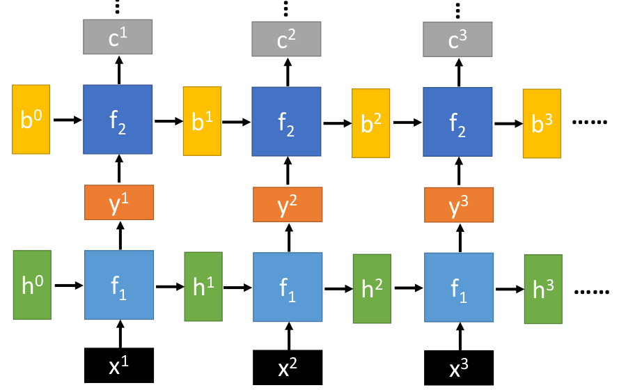
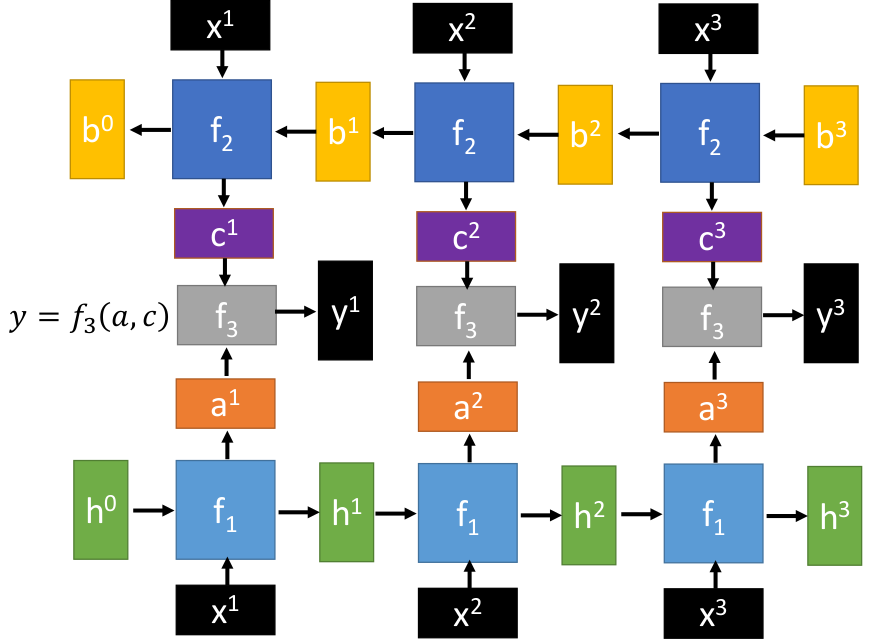
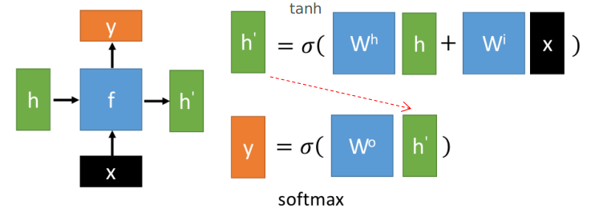
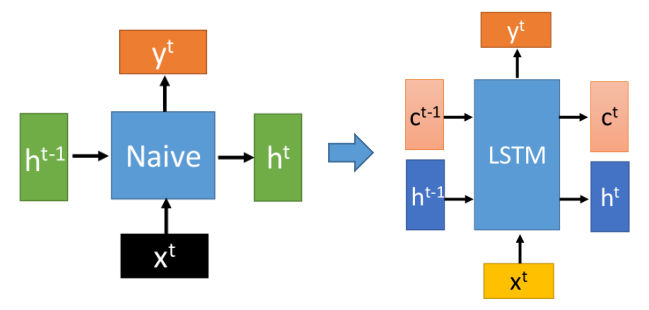
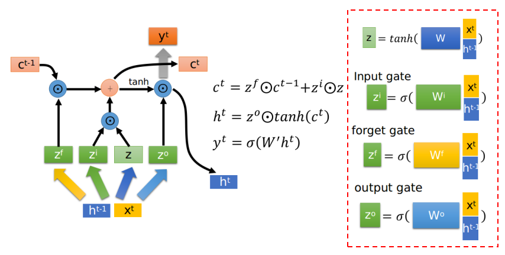
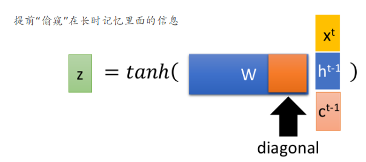
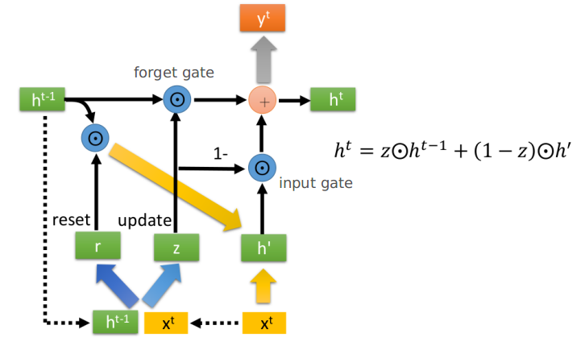
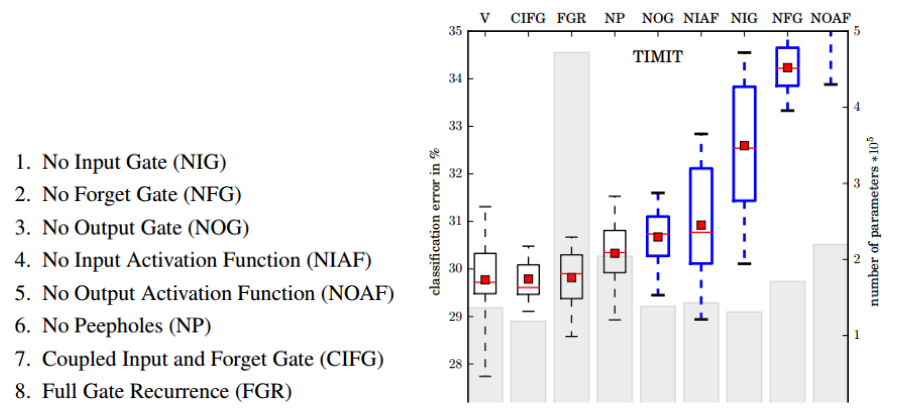

# RNN with Gated Mechanism

这一节主要是"简单"地介绍一些常见的RNN结构

- Naive RNN
- LSTM
- GRU

## 1. Recurrent Neural Network

### ① RNN框架（先忽略f的具体形式）

上述的函数$f:h’,y=f(h,x)$---且满足输出的$h’$和输入$h$的维度是一致的

特点：① 不管输入序列多长，RNN的参数量都是固定的，即全部都是共享同一个$f$。

### ② Deep RNN

上述对应表达式：$h’,y=f_1(h,x);\quad b',c=f_2(b,y)$---即由两个RNN单元组成

### ③ Bidirectional RNN

上述：$h',a=f_1(h,x);\quad b',c=f_2(b,x)$ --- 即输入序列从头到尾和从尾到头两个方向汇聚（这样就能保证每个结点的组合信息：c和a组合起来能够包括整个序列的信息）

其中$f_3$可以是任何函数形式

### ④ Naive RNN（f的具体形式）

常用的RNN中的$f$情况如下所示（理论上$f$可以是任意函数形式---只需保证$h'$和$h$的维度一致即可）

## 2. LSTM ( long short-term memory)

① 相比RNN，LSTM在保留"更之前信息"方面更有优势。LSTM的"抽象模型如下所示"：

- c可以视为"长时记忆"---c随着时间变化会比较缓慢
- h可以视为"短时记忆"---h随着时间变化会比较大

② 下面给出LSTM的**具体形式**：

从上图其实我们也不难发现：$c^t$与$c^{t-1}$之间只存在"线性关系"，连激活函数也没有，这也是为什么c的变化较慢的原因

③ peephole的概念（有些LSTM中会采用这种手段）

## 3. GRU (gated recurrent unit)

- 其中r和z均经过sigmoid激活函数
- 其中两个黄色箭头相当于将左边的输出和$x^t$"拼接"起来再进行W处理
- GRU中的h更类似LSTM中的c，而不是h --- 从上述表达式也可以发现$h^{t}$的变化并不快～
- 不难发现：GRU只有3个Weights，LSTM中有4个Weights（忽略掉最后输出$y^t$的参数）
- GRU可以视为input gate和forget gate联动的LSTM --- 即forget gate+input gate=1

## 4. LSTM中各"组件"分析

[LSTM: A Search Space Odyssey](https://arxiv.org/abs/1503.04069)这篇论文分析了LSTM去掉一些部分等情况下的性能，其中一组实验情况如下所示：

（注：图中的"灰色柱状图"代表参数量）

从实验可以得出下述结论：

- 标准的LSTM的效果不错（V）
- 简单的LSTM：input gate和forget gate联动（CIFG），以及不用peephole（NP）的情况下，性能也能保持的不错
- Forget gate对于LSTM而言是非常重要的！舍去性能大跌（NFG）
- Output gate的激活函数是非常重要的！舍去性能大跌（NOAF）

