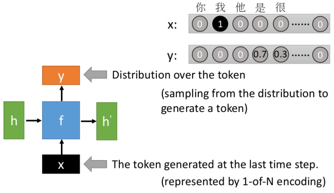
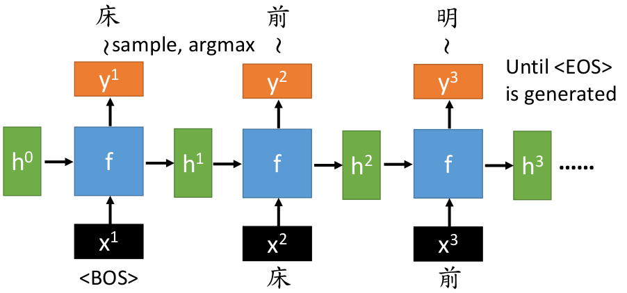
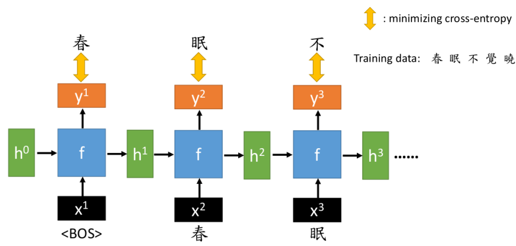
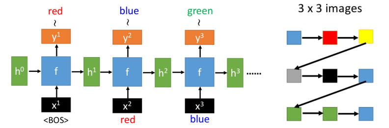
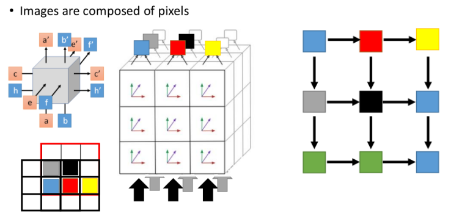

# Sequence Generation

这部分主要介绍Sequence Generation模型的基本框架形式（输入输出形式，训练方式等）

1. 句子生成
2. 图像生成

## 1. 句子生成

首先先理解句子的概念：一个句子是由一系列词或字母所构成

- 英文：apple(词) --- a(字)
- 中文：人民(词) --- 人(字)

而具体采用词还是字作为单元，根据实际情况进行选择就好。

### 基本框架

- 输入：我们可以利用1-of-N encoding的方式（比如有4000个单词，每个单词代表一维）将每个词或字变成一个只有一个元素为1的token作为输入，
- 输出：是一个概率向量，代表每个词出现的可能性，我们可以利用此概率分布来产生下一个词（当然也可以利用argmax产生---但这么做会使得每次产生同一个词）
- 输出相当于已知前面一系列词之后的后一个词（由于RNN具有memory的性质，所以已知前面一系列词）

**一个实例：**

- Begin of sentence：由于我们并不知道句子开头是什么，可以利用一个"标记`<BOS>`"来表示开头（在1-of-N encoding方法中，我们可以将第一维单独留出来作为句子开头标记）
- End of sentence：可以利用一个"标记`<EOS>`来表示结尾（句子产生完毕），方法也类似句子开头的标记方式
- 产生"明"是利用了"床"，"前"的信息，这点别理解错误哦

### 训练方式

- 该例子：可以收集一大堆的古诗词进行训练
- 由于生成的$y$为概率向量，所以可以采用cross-entropy来衡量损失（标签也是1-of-N encoding处理后的）

## 2. 图片生成

① 直接套用句子生成的模型，只是将输入输出换了对象的情况：

- 其实很多sequence generation的模型都是基本类似的，就是将任务对象换了一下而已
- 这种方式存在的问题就是：没有考虑图像相对位置之间的影响强弱问题

② PixelRNN

- 相比较①中的方法，PixelRNN考虑了图像相邻像素之间关系更密切这一情况

