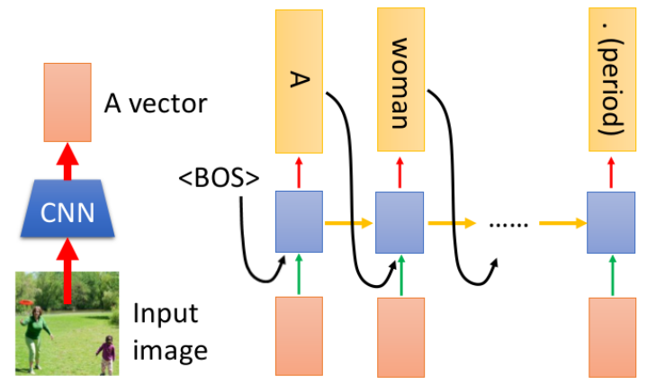
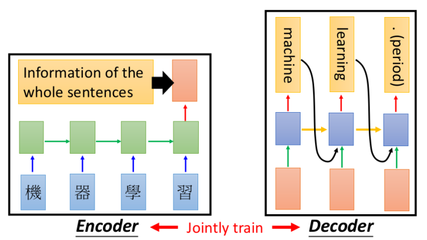
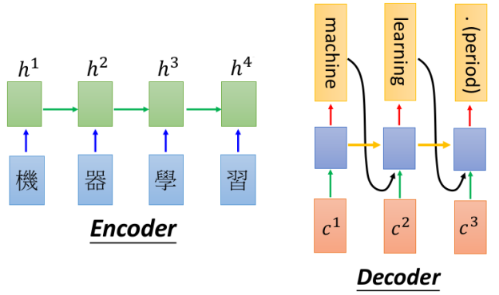
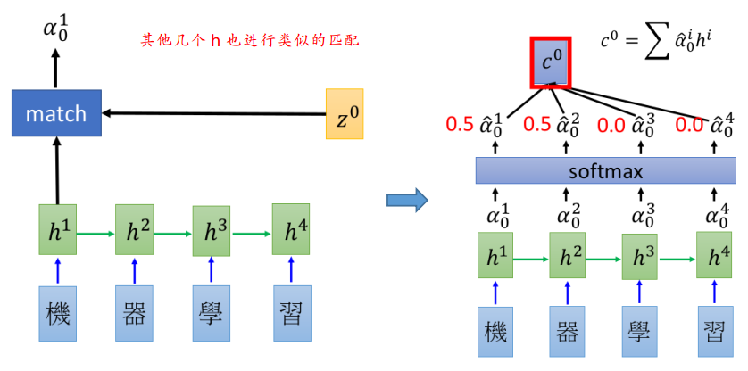
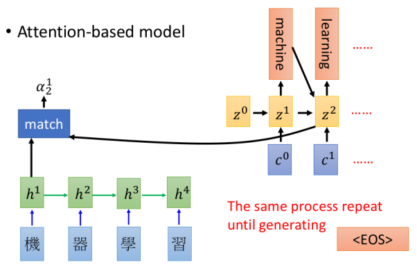
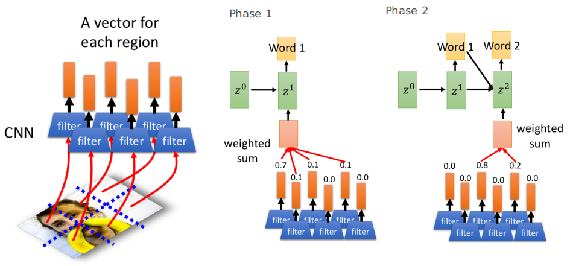
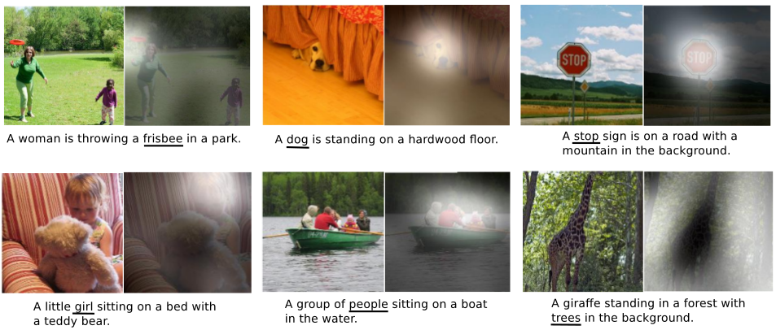

# Conditional Sequence Generation

这部分主要介绍Conditional Sequence Generation：

1. 通过实例理解什么是Conditional Sequence Generation
2. Dynamic Conditional Generation（Attention Based Model）

> 在Conditional问题里面，输出很可能采用的是argmax---例如看图说话问题中；当然也有可能是概率来产生，例如chat-bot中；这个还是要根据实际问题来确定---这点和Sequence Generation略有不同

## 1. Conditional Sequence Generation

### ① 为什么要引入Condition

在现实世界中，我们其实并不希望类似Sequence Generation这种自己"任性"地想生成什么就生成什么，而更希望能够根据**给定的信息**（称之为condition）来产生合适的内容（例如：看图说话，语句翻译等等）

### ② Conditional Sequence Generation基本框架

相较于Sequence Generation，只是多了一个condition，而关键在于如何将"信息"转化为condition，以及该condition以什么形式来影响generation过程：

- 信息转为condition：往往都是将信息通过一系列操作表示成一个vector的形式（编码的过程）
- condition影响generation：将condition作为generation的输入

### ③ 实例1：看图说话

1. 将图片通过CNN转化为一个vector，作为condition
2. 该vector作用到generation的方式：其实可以有各种各样的方式，常见的有两种：① 上图所示，每个"状态"都将此vector作为输入的一部分  ② 只在第一个"状态"将此vector作为输入的一部分，后续的其他"状态"以一个全0的等尺寸vector作为输入（这种方式的一个缺点就是可能在句子产生过程的"靠后阶段"会忘掉了vector的信息---即RNN将vector的信息随着状态的变化给遗忘掉了）

### ④ 翻译系统

这种输入和输出都是sequence形式的称为**Sequence-to-sequence learning**

1. 利用一个RNN将输入语句转化为一个vector，作为Condition（至于是将最后一个输出的$h,y,c$哪个作为vector，还是将它们合并起来作为vector，并没有定论，可以根据实际实验效果来确定）
2. 之后将该vector作为每个"状态"输入的一部分作为condition

## 2. Dynamic Conditional Generation

### ① 为什么要引入Dynamic

在Conditional Generation问题中：通过Encoder产生一个vector（作为condition），再放到Decoder中，但Encoder可能并没有能力将所有的信息压缩到一个vector中，以及Decoder或许并没有能力解析全部的vector的信息，这就会导致Decoder产生的结果不那么好。

引入Dynamic的目的就是使得Decoder的每个"状态"可以拥有不同的condition vector（而如何去选择这个condition vector则让它自己自动地在Encoder产生的database里面去组合），因此Dynamic Conditional Generation也称为Attention-based model

### ② 基本框架

- 其中的$h^1-h^4$称之为Encoder产生的database（其实就是每个"状态"的输出$h$---可以是RNN输出的h或c等的组合）
- 其中$c^k=\sum_{i=1}^4 \alpha^i h^i$（即与Conditional Generation中不同的是，并不是只拿最后一个输出作为condition vector，而是对Encoder产生的各种vector的组合---至于这个参数如何选择，请看下面图片）

**参数选择：$\alpha$的学习**（以翻译系统为例说明）

- 其中的match就是"attention模块"：主要衡量$z$和database里的**每个$h$**的"相关性"---该模块既可以是一个简单的NN模块，也可以是简单的向量相似度衡量（根据自己的问题进行合理的设计）
- 右图中的softmax可有可无，一般影响不大
- 关于$z_0$见下面的介绍

- 每次产生的$z^k$都采用match模块来获得一个$c^k$来进一步指导下一个单词的产生（$z^k$其实就是Decoder的RNN模块产生的h或者c等的组合情况），而关于$z^0$，我们可以将其随机初始化为和$z$同样的尺寸，之后在学习过程中自动会调整到一个比较合适的

### ③ 实例：看图说话---Attention版

- 可有将图片划分为各个部分：每个部分产生一个condition vector
- 图中各个阶段的参数(如0.7,0.1等)都是利用match模块来产生的（此处省略了match模块）

### ④ Attention带来的好处

Attention能使得性能更好，这当然是"无可厚非"的。不仅如此，Attention还可以帮助我们看到Decoder各个"状态"究竟更关注在哪里，如下面看图说话里面每个单词所"关注"图片的区域：

可以发现：单词的"attention"都落在了图片上确实"表达"该单词的区域

> 这个特性还能帮助我们寻找性能不好或者出错的原因究竟是什么

