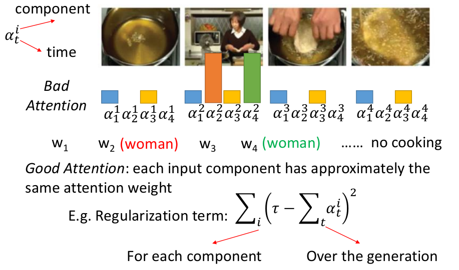
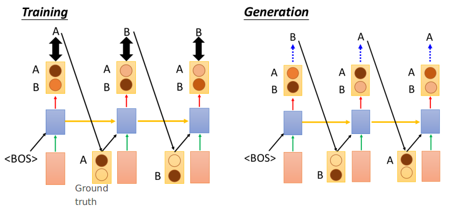
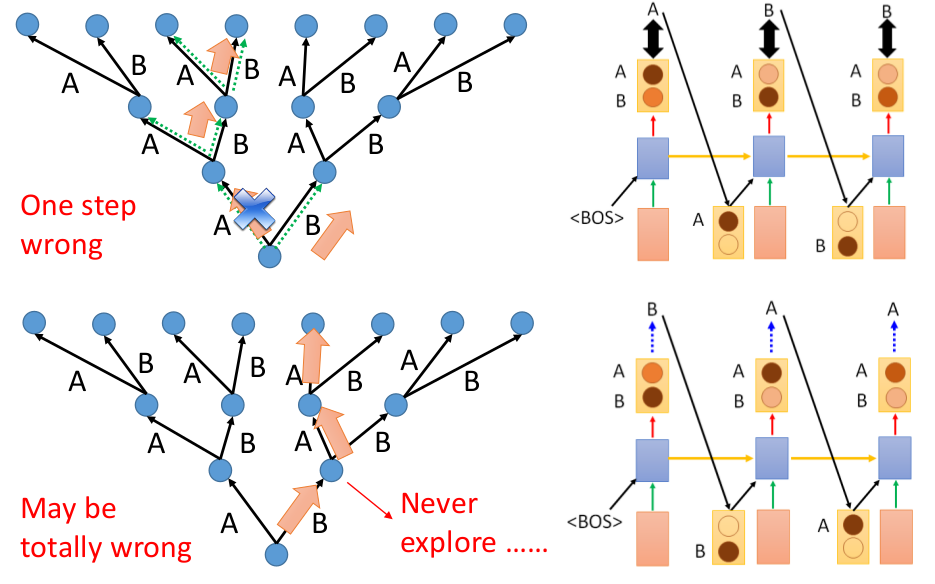
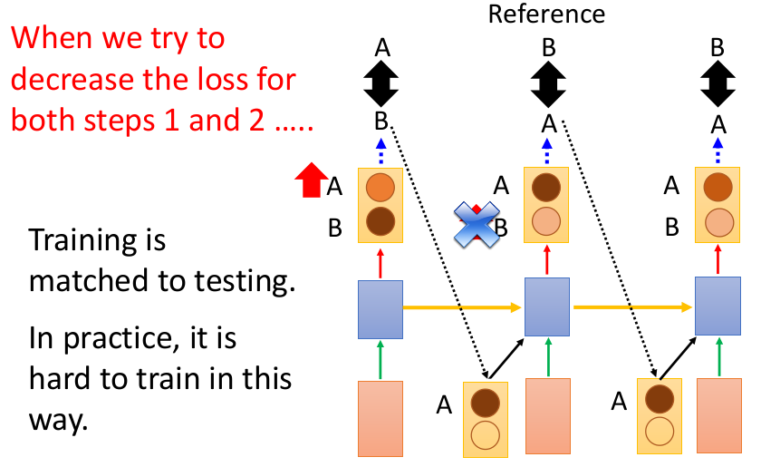
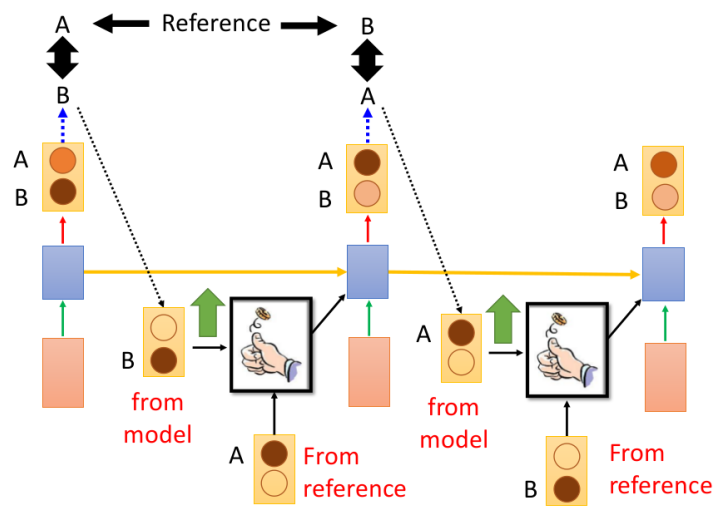
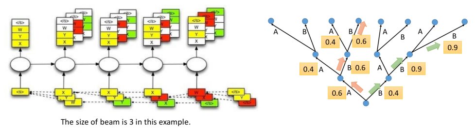
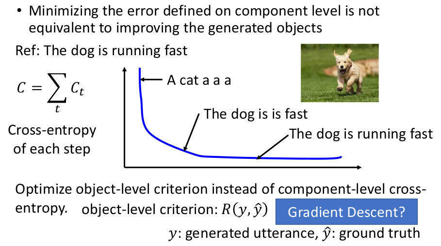

# Tips for Generation

这一节主要介绍在Sequence Generation中常用的一些技巧（但未必保证一定有效）：

1. 对Attention进行一定的约束
2. 解决Train和Test不一致的方法

## 1. Tip1：对Attention进行约束

下述以"看视频说话"来说明Attention-based model可能存在的问题：

- 请先理解$\alpha_t^i$的含义噢！
- 以可能学到的attention（上面的柱状图）为例，我们可以发现一个问题：几个不同的时间点attention可能都集中在某个画面上，而不是"合理"地分配到各个画面中；这就容易导致产生多个相同的单词等情况（而理想的情况则是每个画面我们希望都利用到---针对整个Decoder的所有状态）
- 一种方式就是给attention weight进行约束（加一个正则项）：如上面的$(\tau -\sum_t\alpha_t^i)^2$---即全部时间上面某个画面被累计关注达到某种程度($\tau$)

## 2. Tip2：Train和Test的不一致

### ① 先来看看为什么Train和Test阶段的不一致

常规的Sequence Learning问题，训练阶段都是拿GT来作为下一阶段的输入

- 不难发现在Generation(即Test)阶段并没有Ground Truth，因此会导致一些问题（称为exposure bias）

下图以三个长度的序列来说明这个问题：

- 在train的阶段，即使第一步"错了"，走到B，但这步错不影响我下一步，因为下一步的输入是gt的A！所以只错一步
- 在test的阶段，一步错就步步错了（主要的原因是，这种情况在training的阶段并没有"探索"过）

### ② 一些解决方案

方式1：令Train和Test采用相同的策略（即都对RNN输出的结果y作为下一个输入）

- 这种方法往往比较难训练起来，训练非常不稳定

方式2：Scheduled Sampling

- 即掷骰子的方式来决定采用ground truth还是output distribution来作为下一状态的输入：前期的时候使用Ground truth的几率更高，后期的时候使用output的几率更高（这样就可以一定程度避免方式1中的不稳定情况）--- 这个骰子的几率是可以动态调整

方式3：Beam Search（这招只对test阶段有用）

- 采用贪婪算法类似的策略，每次保留前三的结果；因为一开始概率高的并不代表最后的概率就最高（如右图所示：绿色分支其实比红色分支的整体概率更高）

## 3. 其他Tip

衡量标准不是采用"词-vs-词"的cross-entropy，直接衡量句子的相似性或许更合理

- 但是这样存在的问题就是无法微分！（碰到一个不能微分的东西，采用Reinforcement learning就好了---将目标作为reward即可）

