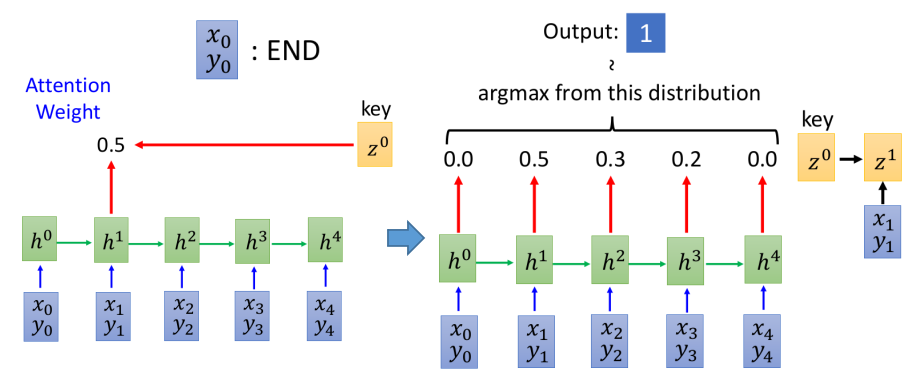

# Pointer Network

这一节主要介绍什么是Pointer Network，以及它有什么作用

- 通过凸包问题来引入Pointer Network
- Pointer Network的常见用途（实例）

## 1. 什么是Pointer Network

为了引入Pointer Network的概念（以及为什么要采用Pointer Network），先引入解决凸包问题的NN框架：

- 该问题相当于从一系列点中寻找最少的点，使得这几个点的连线能够"包围"所有的点
- 由于数据集输入的点的数目往往并不固定，因此往往采用Sequence-to-Sequence的框架来处理（如下图所示）

- 但这种处理方式存在的一个问题就是：我们很难确定输出到底有多少个点（即Decoder的output的维度我们不太好确定），从而类似1-of-N encoding中的N到底定为多少就很难了
- 这类问题又具有一个特点：输出是输入的一个子集！！！（Pointer Network正是利用了这一特性）

Pointer Network可以视为：Attention-based model的一个改版 --- 直接将attention weight作为output distribution，这样输出就直接取决于输入的序列长度了！

- $x_0,y_0$代表终止条件（即$h_0$对应的weight最大时，就停止了）
- 上面这个框架的输出就完全取决于输入的长度了，其采用的方式和attention-based model其实是完全一样的，只是将attention weight直接作为output distribution而已

## 2. Pointer Network的应用

Pointer Network通常和"常规"的Sequence-to-Sequence learning结合起来，下述以Summarization为例说明如何结合

- 可以看到Pointer Network有"一路"输出分布（蓝色），而Sequence-to-Sequence也有"一路"输出分布（绿色），分别给两路不同的权重再结合起来作为最后的分布！（注：蓝色分布和绿色分布包含的单词不一定完全一致）
- 这么做带来的好处：Summarization问题其实就相当于从文本中提取关键词在组合成句子；而这些关键词未必能够存在在Vocabulary字典中（尤其是一些人名地名的情况），这时Pointer Network就能够很有效的弥补Sequence-to-Sequence的不足

## 3. Pointer Network适用场景

从上面分析其实不难发现Pointer Network适合：

1. 输出是输入的一个子集
2. 很难囊括所有输出的情况，而输出又恰好是输入的一部分