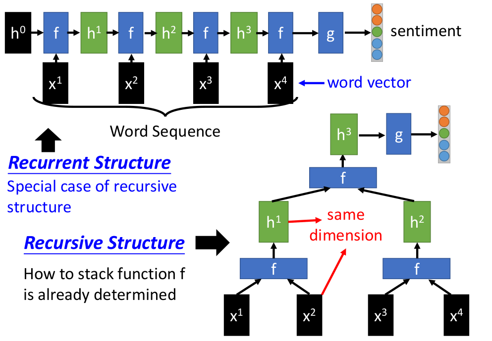
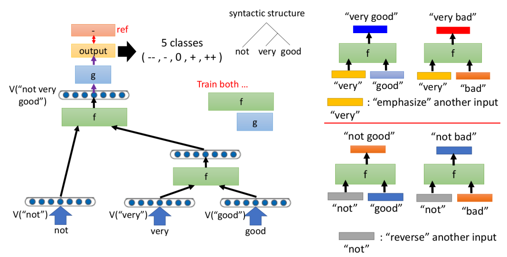
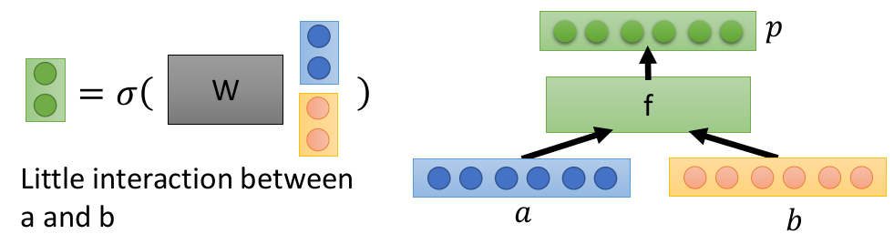
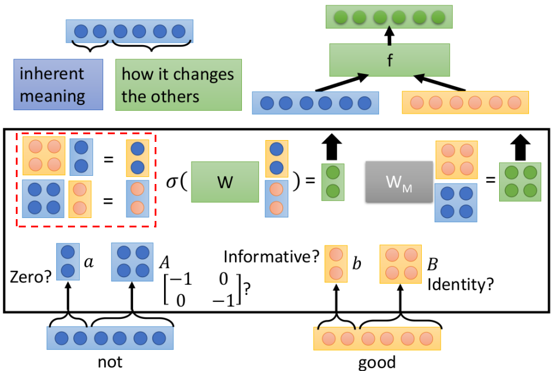
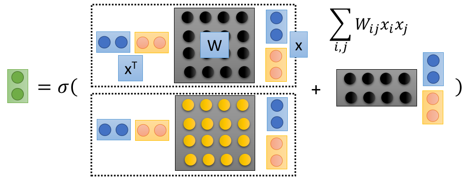

# Recursive Structure

这一节主要讲述Recursive Structure：

- Recursive Structure和Recurrent Structure的关系
- Recursive Structure的一个简单实例
- Recursive Structure中常用神经元结构

> Recursive Structure更适合已知具有"明显"结构组合特点的问题

## 1. Recursive Structure vs. Recurrent Structure

首先给出结论：Recurrent Structure是Recursive Structure的一个子集（或者称之为其中的一个特定结构形式）

下面以Sentiment Analysis(语句正负面性)为例说明两者关系：

- 上述图片中仅仅只是在某种特定结构下（如上述该结构将$x^1,x^2$组合，$x^3,x^4$组合---如何组合，构造何种结构往往由设计者预先决定）的Recursive Structure，各自不同结构的组合都可以称之为Recursive Structrure
- 为什么说Recurrent Structure为Recursive Structure的子集：Recurrent Structure可以理解为序列按照顺序的特定结构的Recurrent Structure

> 正是由于Recursive Structure的"组合"是预先设定，因此更适合具有明显"语义结构"的问题：例如，在英文语句中名词后面接动词，因此我们可以先将一些词按照词性关系先组合

## 2. 一个简单的实例

利用Recursive Structure结构的语句"褒贬评估"的模型往往具有下述关系（下述仅仅以这三个词的情况，实际会有一套规则来定义该怎么组合）：

- 这样的结构我们更容易发现：very具有强调的作用，not具有反义的作用（这样也往往更容易训练）

## 3. Recursive中的f设计

### ① 最常规的情况

- 一般的神经元的方式，请暂时将右边的a,b也视为2维哦！
- 这种方式存在的问题：输出$p$的每一维均是a，b上各维的加法或减法组合操作---这对于某些词义的"表达"或许还不够（比如not+good，将"褒贬性"直接反转了）

### ② Matrix-Vector 

- 每个向量其实包含两层信息：1. 自身的含义，2. 对其他词的影响（至于哪几个维度代表哪项，是自己预先定义，然后学习过程中，网络会趋向于这么做而言--- 任务指向型）
- 在f之前，相当于先将相互影响作用到各自身上（红色虚线部分就是各个之间先相互影响部分---其中对其他词影响部分被拉成一个矩阵）

### ③ Neural Tensor

- 这种形式的话，相当于不仅考虑加法操作，还将乘法操作融入其中；
- 黑色虚线部分得到的是一个标量！，所以多个黑色虚线部分操作构成和右边同样维度的向量