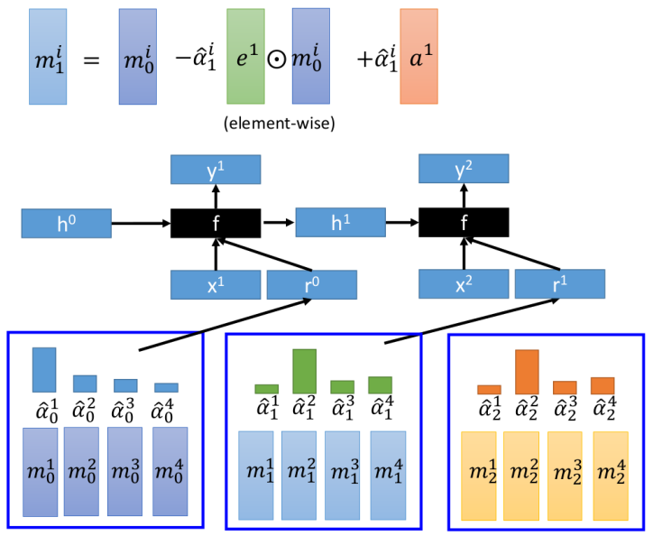

# Attention-based Model

这一节主要讲述attention-based model更"宽泛"的概念，以及一些具体的应用

1. Attention-based model的框架
2. 实例1：Read Comprehension
3. 实例2：Visual Question Answering
4. Attention-based model"可读可写"版本

## 1. Attention-based model框架

更广义上的Attention-based model如左边图所示：右图作为一个前面章节我们学过的一个实例。下述给出一一对应关系：

- Machine's Memory --- $h^1,h^2...h^4$
- Input：类似machine作为产生下一个序列的输入
- Reading Head Controller：可以理解为利用$z^1$与Machine's Memory进行匹配产生$\alpha_2^1$
- DNN/RNN：如右边的Decoder中的RNN结构
- ouput：类似前一个序列产生的后一个序列

> Attention-Based model并不仅仅只能用在Sequence-to-Sequence Learning里面，下面就介绍两个其他实例

## 2. 实例2：Read Comprehension

### ① 模型框架（概念图）

- 将一篇Document表示成Memory machines的形式：即Document里面的每个句子可以用一个vector来表示（例如采用Bag of words --- 在单词出现的位置为1，其余为0；在与一个"矩阵"相乘进行降维---embedding）
- Read Compression问题整体而言可以视为分类问题：即假设有100个answer，每个不同的问题应该针对哪一个answer而已

### ② 具体模型1

- 将Query也采用Bag-of-Word变为一个vector（和生成memory一样的方式）
- Attention-based的方式比"暴力的方式"（Document+Query通过DNN直接产生Answer）的方式效果更好，所需的参数也更少

### ② 具体模型2

这个模型相对模型1有下述几点不同：

1. 将machine memory和代表"文本信息"的vector并不当做同一个信息（实现上即在bag-of-word上采用不同的weight）

2. 采用Hopping的方式，即有一个"相关性传递的问答方式"：如右图所示，一个query提取出Extrated Information，这个Information能够帮助我们进一步理解query是什么，因此将其再加到Query上面作为新的"query"来进一步提取信息（关于进行几次hopping是预先设定好的）；下述有一个很直观的例子来说明Hopping带来的效果：
   

   Greg is a frog（frog）---》 Brian is a frog（Brain）---》Brian is yellow（yellow）

### ③ 更多Read Comprehension模型

- [ReasoNet](https://arxiv.org/abs/1609.05284)：自动确定Hopping的次数---基于强化学习
- [R-Net](https://www.microsoft.com/en-us/research/wp-content/uploads/2017/05/r-net.pdf)：有self-matching机制
- [Bidirectional Attention Flow for Machine Comprehension](https://arxiv.org/abs/1611.01603)
- [FusionNet: Fusing via Fully-aware Attention with Application to Machine Comprehension](https://openreview.net/forum?id=BJIgi_eCZ)

## 3. 实例2：Visual Question Answering

上一个实例是Document+Query输出answer；这个实例是Picture+Query输出answer

### ① 模型框架（概念图） 

- 其实和实例1基本一样，只是Machine Memory的"来源和表示不同"

### ② 模型1

- 其实和实例1中的模型2非常类似，看题自己理解吧

下图是这个模型两步hop的实例：

- 中间的图代表第一个hop的结果：可以发现"注意力"集中在cat和red square，而第二个hop则将关注点集中在了cat的bottom，即red square上面

## 4. Attention-based model"可读可写"版本

### ① 基本框架（概念图）

- 理论上而言：可读可写的版本完全能够表示之前第一个可读版本的情况，以及之前讲过的Attention-based model，但实际情况中，此版本比较难以训练，所以看到的会比较少

### ② 实例：简化的Neural Turing machine

- 其中虚线部分+k就可以视为"只读"的Attention-Based Model，其中的k相当于之前用的z，用来与Machine Memory进行匹配的向量
- 关于e和a的作用如下图所示（e：抹掉部分原本的machine memory，a添加新的machine memory）

> 关于真实情况采用的Turing Machine详见：[Recurrent Neural Network based Language Modeling with Controllable External Memory](https://ieeexplore.ieee.org/stamp/stamp.jsp?tp=&arnumber=7953249)

