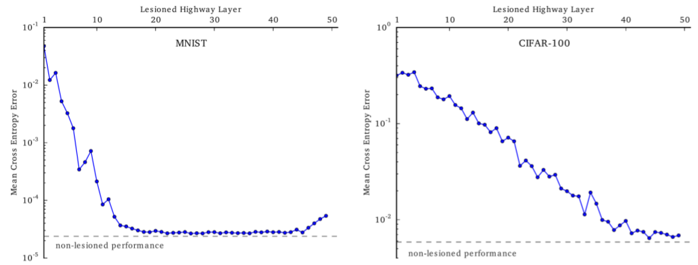

# Tips for Training Deep Network

在Deep Learning中，很多情况遇到的并不是overfitting，反而是根本训练不起来---即收敛不了，这一节主要介绍三种常用的训练"技巧"：

1. 训练策略：Batch Normalization
2. 激活函数：SELU
3. 网络架构：Highway Network

## 1. Batch Normalization

### ① Feature Scaling

在介绍BN之前，还是有必要来了解一下Feature Scaling的必要性：

- 左图是Feature Scaling采用的方式
- 从右图可见：经过Feature Scaling的方式能够帮助梯度下降法更快的收敛

### ② 对每一层输入进行Feature Scaling

首先我们给出对每层进行Feature Scaling的理由：

1. 如①中介绍的好处，能够加快网络训练收敛的速度
2. 在Deep Network中，每一层之间都是"相互影响"的，但所有网络参数是一起调的，这就可能会导致结果变差（因为梯度下降计算参数可以认为是固定其他参数，对该参数求导---能够保证沿着该参数方向是下降的，但多个参数合并起来就比较难了）：解决这个问题的一种方式是采用小的学习率，但带来的负面影响就是训练太慢了。（下面的图蛮形象地反映这个问题---假设一条直线代表最优解）
   

那么现在问题在于如何对"中间层"进行Feature Scaling，这就是Batch Normalization做的事情。

### ③ Batch Normalization（Train Phase）

下面以Batch=3为例说明BN是如何操作的（实际情况，BN有效的前提是Batch要较大）

- $\mu,\sigma$计算的方式其实也算蛮好理解的：就是我没有所有数据，那就退而求其次采用Batch来计算；从而可以假设$\tilde{z}^k$满足$\Omega(0, 1)$分布
- 后续的$\beta,\gamma$则是为了使得网络结构能够"具备"原始网络的能力：只要$\gamma=\sigma,\beta=\mu$，但实际情况这两个参数初始化接近1和0（这样BN才有效果）

### ④ Batch Normalization（Test Phase）

在测试阶段，我们一般是没有Batch的形式，且这几个参数应该要固定住，采用的策略：

- 理想情况：整个训练集在每一层的$\mu$和$\sigma$，但要不因为训练集太大，或者不适合于online learning的情况
- 实际解决方案：训练阶段记录每个batch时的$\mu​$和$\sigma​$，再取平均（更佳的方式是对训练后期的结果采用更大的比重，因为前期的$\mu​$和$\sigma​$误差较大---如下图所示）：
  

### ⑤ Batch Normalization的优点

- 节约训练时间，以及让训练更深的网络成为可能
  - BN使得Covariate Shift更小，从而可以采用更大的学习率
  - 缓减梯度消失/梯度爆炸的情况
- 使得训练对初始化不那么敏感
- BN自带部分Regularization的特点

### ⑥ 关于更多Normalization方法

- [ Layer Normalization](https://arxiv.org/abs/1607.06450)
- [Instance Normalization: The Missing Ingredient for Fast Stylization](https://arxiv.org/abs/1607.08022)
- [Weight Normalization: A Simple Reparameterization to Accelerate Training of Deep Neural Networks](https://arxiv.org/abs/1602.07868)
- [Group Normalization](https://arxiv.org/abs/1803.08494)
- [Switchable Normalization](http://htmlpreview.github.io/?https://github.com/switchablenorms/Switchable-Normalization/blob/master/blog_cn/blog_cn.html)

## 2. SELU：自带Normalization功效

### ① ReLU系列

ReLU系列有下述优点：

- 克服梯度消失的问题
- 计算效率高
- 有一定的生物意义
- Leaky ReLU主要为了解决ReLU陷入"死区"的问题，而PReLU则是将Leaky ReLU里面的那个参数也以学习的形式给出

### ② ELU&SELU

SELU的特点：

- 输出即包含正值也包含负值 --- 这个特点除了ReLU，ReLU家族也是有的
- 存在饱和区域 --- 即当$z\to -\infty,a\to -\lambda\alpha$，这个特点ELU也有
- 输出可以比输入大 --- 即在正值时输出比如输入大，斜率=$\lambda>1$（这个特点是SELU特有的）
- SELU自带Normalization的功效

### ③ 分析激活函数的输入z的特性

通过下图来帮助理解：

- 假设输入满足独立同分布，且$a_i$均满足均值为0（$\mu=0$），方差为1（$\sigma^2=1$）--- 注：并不一定是高斯分布
- 其中的$z=w_1a_1+w_2a_2+...+a_kw_k+...+a_Kw_K$
- 假设参数$w_i$也满足独立同分布且均值为0，方差为1/K

则关于z的均值和方差如下所示：

- 不难发现$z$的均值为0，方差为1；又根据中心极限定理可知$z$近似满足高斯分布！

**SELU的特点就是：经过激活函数后的输出依旧满足(0, 1)的高斯分布，关于这部分的证明请见论文---但估计你也不想看**

> 但是SELU存在的一个问题：其对参数初始化是敏感的，需要令参数初始化满足$(0,1/K)$分布

## 3. Highway Network & Grid LSTM

### ① 首先比较下FNN和RNN

> 注：此处的FNN---Feedforward Neural Network，RNN---Recurrent Neural Network

从上述"概念图"上来看，两者是非常像的；FNN中t代表的是不同层，而RNN中t代表的是时间步长

但存在下述几点不同：

- FNN只有一个input(此处指的是$x$)，而RNN"每个layer"均有一个input $x^k$
- FNN中每个layer的参数是不一样的，而RNN中每个layer的参数是一样的

我们知道在RNN系列中，可以利用Gated结构（如LSTM和GRU）来解决梯度消失和梯度爆炸的问题，那么不经会思考是不是能够将gated思想引入FNN呢？

### ② GRU$\to$Highway Network

下面就是分析如何将GRU的Gated思想运用到FNN中

> 上述将左边的$h$改为了a，为了和FNN中统一

我们来看看从GRU到Hightway Network有哪些改变：

- 去掉每一步的$x^t$：因为除了第一层其他后续均没有input $x^k$了
- 去掉每一步的输出$y^t$：因为在FNN中我们并不需要每一个step输出一个结果
- $a^{t-1}$代表第$t-1$层的输出，$a^t$代表第$t$层的输出
- 去掉了reset部分（也可以理解为reset部分参数始终为1）：主要的原因在于FNN中只有开始有input，因此我们不建议去掉部分信息，即还是倾向于将前面所有的信息全保留下来

**将上述右图Highway更"直观"的表示如下：**

- 其中的z相当于控制$a^{t-1}$和$h^{'}$的信息各取多少，而Residual Network可以看做highway network的一个子例（即z始终取0.5---各取一半）
- Hightway Network具备含gated结构RNN的特点，因此能更好的避免梯度消失和爆炸的问题，且能够自动"甄别"哪些层应该采用多少"新信息"$h^{'}$和"旧信息"$a^{t-1}$

一个特点：当$z=1$时，相当于这层完全没起作用，我们可以利用这个特性来看看去掉highway network一些层是否会对结果产生影响：

（可以看到在MNIST这个简单任务上面，去掉中间一些层几乎不影响结果，在CIFAR-100这个复杂的任务上面，去掉中间层有很大的影响 --- 即Highway Network可以根据问题的复杂程度自动决定采用"多深"的网络）

### ③ Grid LSTM

Grid LSTM是在LSTM的基础上增加一个在深度方向，即不仅时间方向，还有一个深度方向。如下图所示：

其实我们可以发现在真实实现的情况下：就是将$c,a$并起来，$h,b$并起来；和原来的LSTM并没有太大的不同