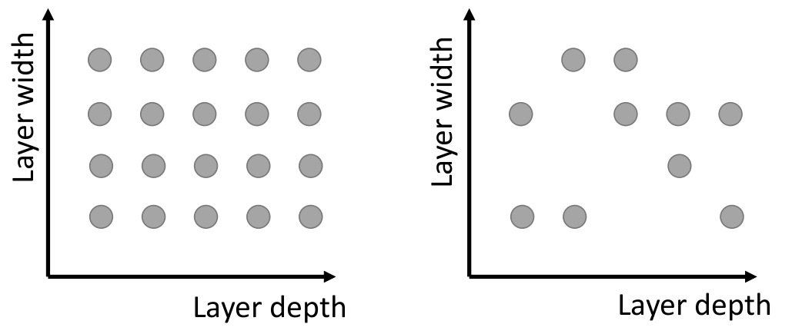
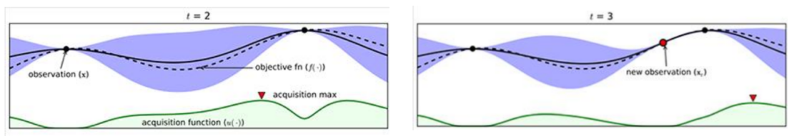
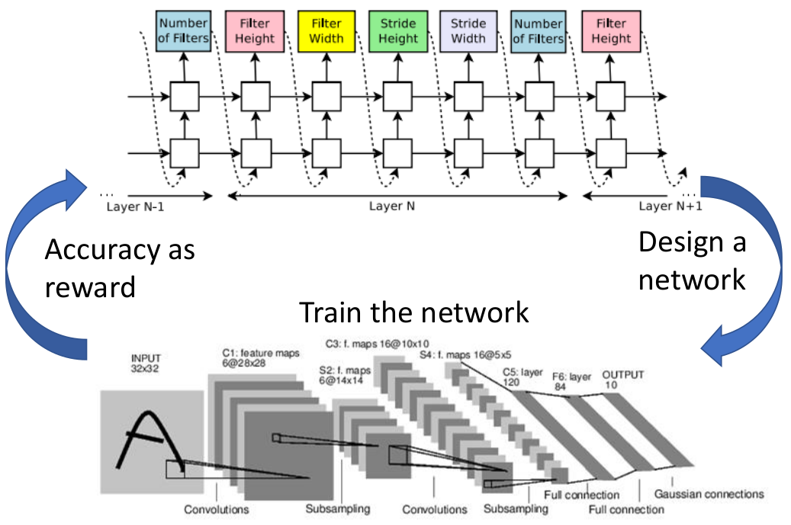
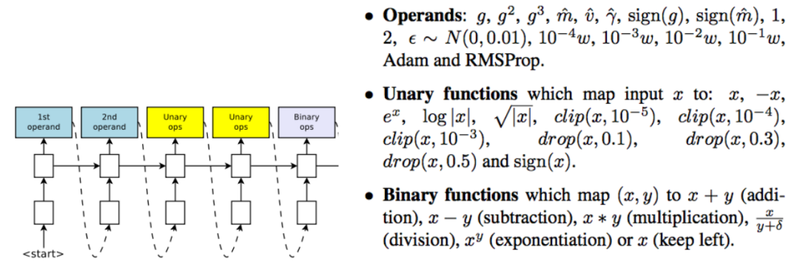
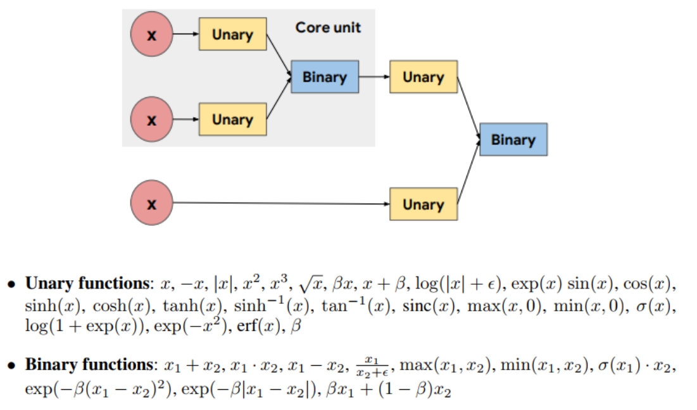
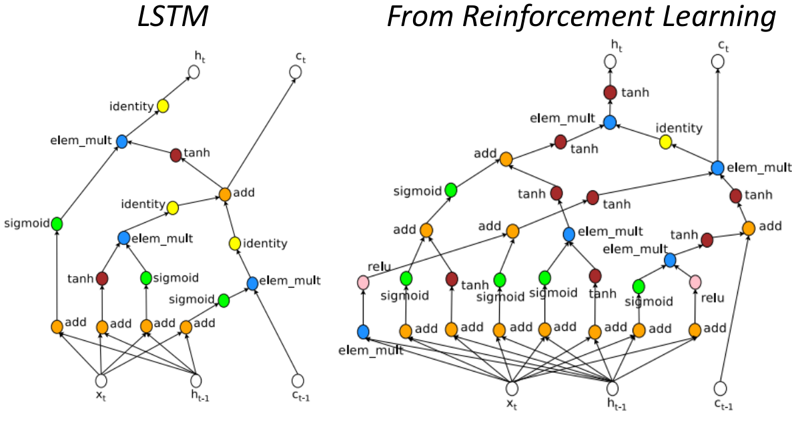

# Automatically Determining Hyperparameters

这一节主要介绍超参数的选择，以及自动学超参数

- 传统超参数选择的方法
- 自动学习各类超参数

## 1. 传统超参数选择方法

### ① Grid Search v.s. Random Search

- 左边为Grid Search，右边为Random Search --- Random Search即从所有的Grid中随机选择部分来进行实验然后选择最佳。（比如上图从20个点随机选择10个点进行实验，选择性能最好的）
- 实际实验Random Search不仅仅只有上述方式，也可能是按照一个概率分布来产生多次

Random Search方法的可行是基于一个假设：top K results are good enough（这点其实在在ch2中已经证明了）

> 假设有N种选择，其中有K/N的概率取到足够好的K个解。那么假设选择x次，其中包含足够好的解的概率超过90%的可能如下所示：
> $$
> 1-(1-K/N)^x\gt 90\%
> $$
> 不妨设N=1000，则K=10时，只需$x=230$就能满足条件；当$k=100$，则只需$x=22$就能满足条件

### ② Model-based Hyperparameter Optimization

- 其中两个黑点代表sample实验的结果，黑色虚线则代表一个估测的函数，而黑色实线代表真实的情况；紫色区域代表一个"置信度"（即估测函数的可信度）；下面绿色则代表估测值与置信度的"组合"，越高代表越好
- 即我们通过两个sample，来获得下一个最佳sample点，即图中红色箭头的地方；后续再通过这几个结果采用类似的方式来获得在下一个sample地方

## 2. 自动学习各类超参数

### ① 自动决定网络架构

通过RNN来决定每一层应该采用的卷积的各类参数（例如kernel大小等等），以及多深多宽（反正整个网络的参数都由RNN来决定）；在利用Reinforcement learning将该网络结构的Accuracy作为反馈扔给RNN来更新参数，从而产生更好的网络结构

### ② 自动设计优化方法

通过RNN来进行不同一元项，二元项的组合方式和各类操作来产生各种不同的优化方法结构（如Adam之类的），从而通过Accuracy反馈给RNN来更新从而获得最好的组合

### ③ 自动设计激活函数

选择不同的Unary和Binary操作，从而获得最佳的组合方式

在该论文中，作者获得的比较好的组合方式为（命名为Swish）：$a=z\cdot sigmoid(\beta z)$

### ④ LSTM的Cell结构

右边是RNN选择出来的方式～

> 注：上面①～④在第一版本的paper中耗时是非常夸张的，但在新版本中所需的时间已经大幅缩短了 --- 主要采用的策略就是每个子模板保留前面学到的参数
>
> 详见论文：[Efficient Neural Architecture Search via Parameter Sharing](https://arxiv.org/abs/1802.03268)

