# Introduction of Generative Adversarial Network (GAN)

这一节主要"笼统"地了解GAN的基本框架以及为什么要使用GAN，主要分为下述几个部分：

- Basic Idea of GAN（GAN的基本概念）
- GAN as structured learning
- Can Generator learn by itself？（为什么Generator不自己学）
- Can Discriminator generate？（为什么Discriminator不自己生成）
- Generator+Discriminator

## 1. Basic Idea of GAN

注：下述以Image为例只是方便理解

### ① "作画"为例来理解GAN

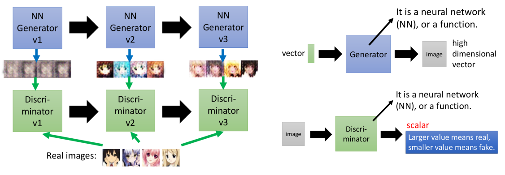

- Generator像一个学画画的学生，而Discriminator像一个老师，学生第一张画(v1产生的结果)画的稀烂，老师(v1)就会"告诉他"哪里哪里不好；然后学生改进后画出第二张画(v2产生的结果)，老师(v2)以更高的标准来要求继续"指出不好的"；之后学生不断产生新的更好的画，而老师则不断以更高的标准来要求
- Generator的输入是一个Random vector（例如采用高斯分布产生等等），然后输出一副image；而Discriminator则输入一副image，产生一个scalar来衡量其好坏
- 两者亦敌亦友（其实和师生关系真的好像～）

> 这里面你可能有两个疑惑（后续会有解释）：
>
> ① Generator为什么不能直接通过Real Image学习，而要通过Discriminator来学呢？
>
> ② Discriminator这么会"批评"，为什么不自己做呢！（即自己来产生image）

### ② GAN的算法流程

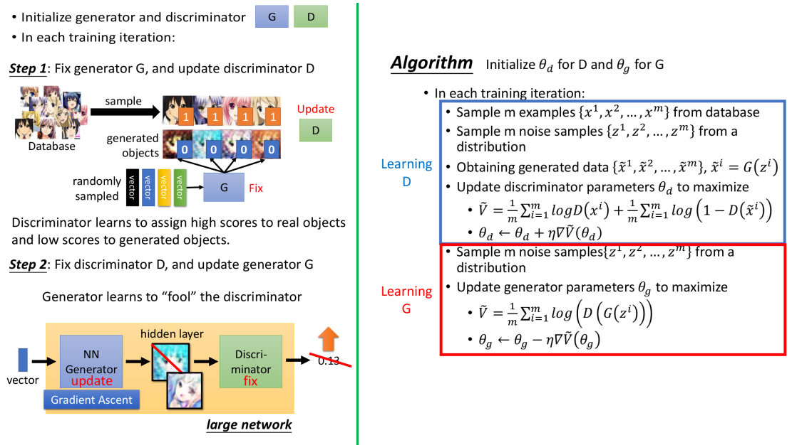

- GAN的算法流程其实很简单：固定G，训练D---希望它能够"鉴别"好坏（真实Image为好，G产生的Image为坏）；固定D，训练G---希望G能够产生骗过D的Image；不断循环迭代
- 右边采用的目标函数$\hat{V}$仅仅只是原始GAN采用的，实际还有更多不同类型的目标函数，将在后面几节中提到

## 2. GAN as structured learning

### ① 什么是Structured Learning

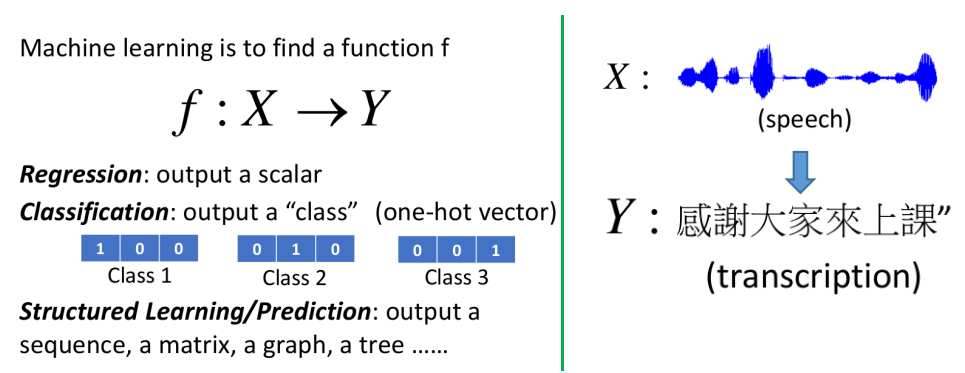

- Structured Learning的输出其实是一个序列或矩阵之类的，而这些输出每个"部分"之间是相互关联的；例如右边的语音识别例子，输出的文字之间是关联的

> GAN是可以用来解决Structured Learning问题的一种方法

### ② Structured Learning为什么比较难

主要有两方面原因：

- Structured Learning可以视为One-shot/Zero-shot Learning问题
  - One-shot learning：例如分类问题，在某些类别中根本没有范例或者只有极个别的范例
  - Structure Learning可以视为极端的One-Shot learning：因为Structured learning的输出每一个都是不同的！(例如没有两幅图是一样的)，那么输出空间是非常巨大的，而其中大部分的"类别"是在training data中根本没有出现过的；需要在testing阶段能够创造出这些没见过的！---这就需要machine具有创造力
- machine需要有大局观
  - 虽然machine产生output是各部分各部分产生的（例如pixel-pixel各自产生），但需要将"全局信息"考虑进来（这些pixels组成的是否是一幅图）
  - 因为output的各部分之间是需要有关联的，因此需要machine能够考虑全局！

### ③ Structured Learning常用的方法

以往解决Structured Learning主要的方法有两种：Bottom Up和Top Down的方式

- Bottom Up：各个component分开去产生（即逐个产生）--- 这样带来的问题是"缺乏大局观"
- Top Down：产生一个object（即output）之后，站在全局的观点看看这个object好不好，然后从所有的object中挑最好的 --- 这样带来的缺点是很难做Generator（如何从所有object挑最好---怎么"遍历"所有object都是问题）

而GAN可以视为这两种方法的结合：

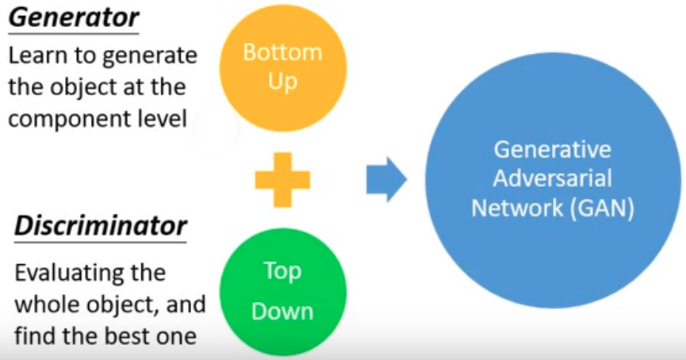

## 3. Can Generator learn by itself？ 

首先答案是肯定的！Generator可以自己拿着label硬学一发就好了；而其中比较具有代表性的：

- Auto-encoder
- VAE（Variational Auto-Encoder）

### ① "最直接"的方式

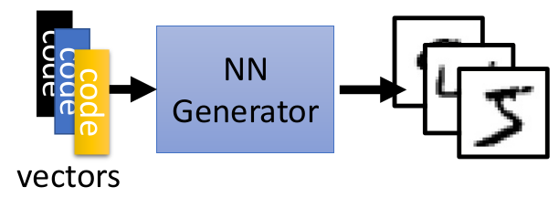

- 这种方式的一个问题在于我们如何"指定"code来对应label

### ② Auto-encoder

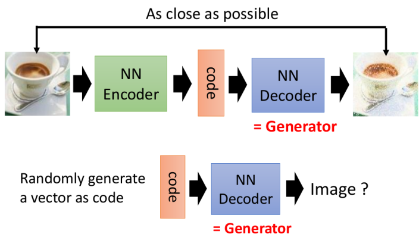

- 但这种方式存在的一个问题就是：不同code之间是否存在一定的"连续"性问题，如下图a和b中间的vector是否代表不同方向的1呢？--- 更简单的理解就是这种方式的鲁棒性如何（code轻微变化会不会发生"巨变"）：
  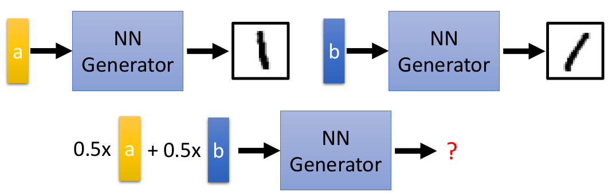

### ③ Variational Auto-encoder（VAE）

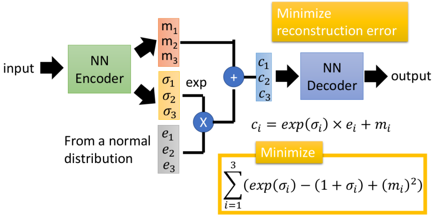

- 关于VAE更详细的解释可以查看：[VAE](http://speech.ee.ntu.edu.tw/~tlkagk/courses/ML_2016/Lecture/VAE%20(v5).pdf)
- 简单的理解就是：在训练的时候给code加上一些noise之后还是能够产生output，即希望code具有一定的鲁棒性（以及希望输出之间有一定的连续性）

### ④ 上述方法存在的问题

一般衡量G好坏的方式，都是采用pixel-to-pixel的损失（例如L1，L2损失之类的），如下图所示：

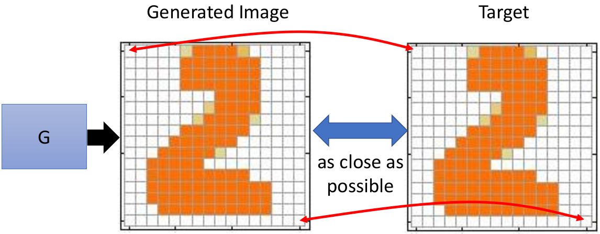

- 当然如果G产生的图和target每个像素都完全一样，那也就没什么问题；但实际情况，往往会存在一定的误差，那么"这部分误差"出现在何处我们更能接受呢？如下面的几种情况：
  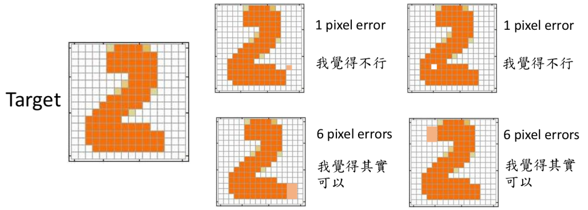
- 显然6 pixel errors对应的损失会比1 pixel error要大，但是从"我们"的角度而言，显然下面两张图更能接受～（即error和我们的主观认为并不一致）

主要是因为Structure Learning的各个部分(如上图为pixel)之间是有关系的：而这个关系是非常重要的

- 而如果我们希望能够"捕获"各个部分的关系，这就需要更大更深的网络结构（多些hidden layer，其实可以看成更大的感受野）

  > 这里有个结论：训练VAE往往需要比GAN更深的Generator

## 4. Can Discriminator generate？ 

先给出结论：利用Discriminator其实是可以产生Image的！

> 首先需要知道，在不同的"领域或者文献"里面，Discriminator有不同的名称，如：Evaluation function，Potential Function，Energy Function等等（所以其实它并不是一个新的概念！）

### ① Discriminator的特点

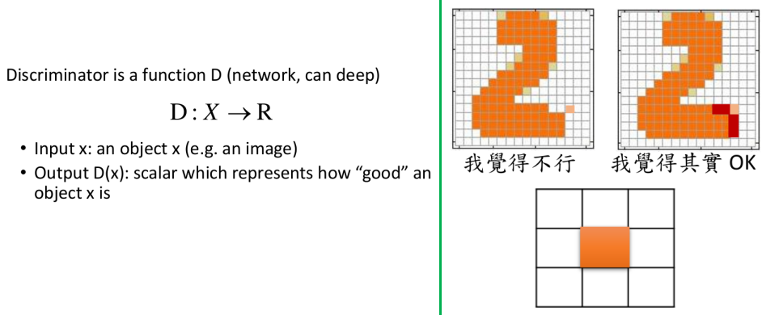

- Discriminator：其实就是输入一个object，输出一个衡量其好坏的scalar
- 右边是一个简单的例子能够说明其特点：能够较容易的考虑各个component之间的关系，例如利用右图中3x3的filter就能够作为一种"衡量准则"：出现这种"单独"的pixel，我们就认为其不好

### ② Discriminator的求解框架

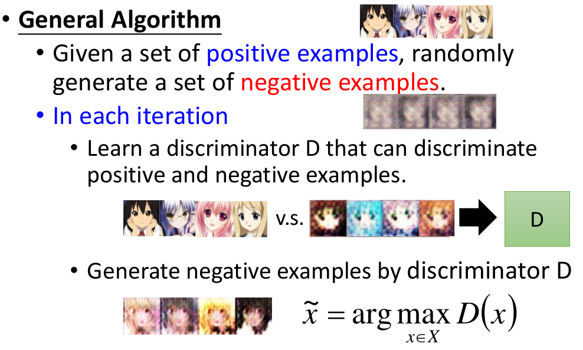

这个框架的"痛点"：

- 如何求解$\tilde{x}=argmax_{x\in X}D(x)$
- 如何产生"好"的negative example（一般就是采用上述的迭代框架）

**简单的图示来说明迭代可能的过程：**

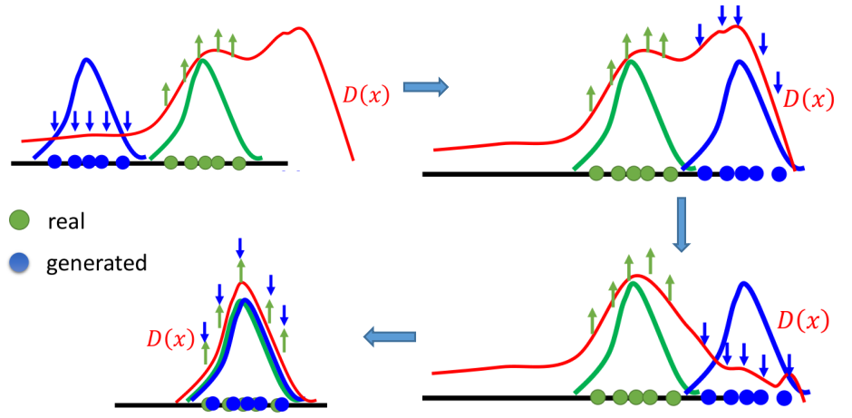

- 首先需要提醒的是：在不覆盖real和generated数据的部分，D并不能确保它是低分的；所以在迭代的过程中，利用argmax来产生那些D的"弱点"，从而再来帮助D来训练

### ③ Discriminator$\to$Graphical Model

其实上述求解Discriminator的框架就是很多Graphical Model的求解框架，而Graph就类比Discriminator，下述列出一些Graphical Model：

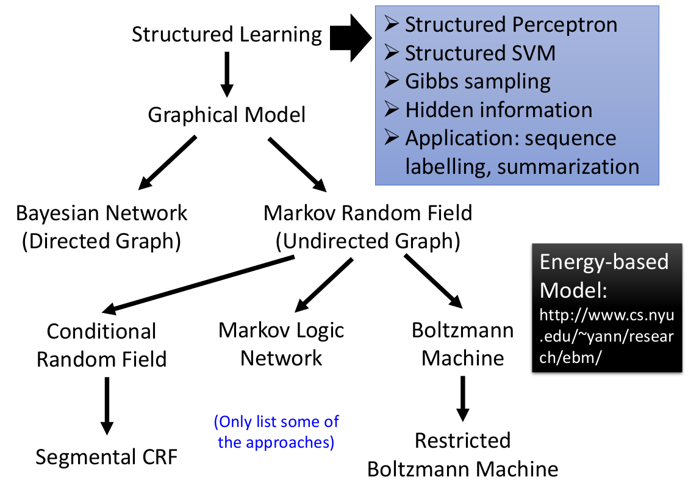

> 只是为了说明其实Discriminator来"自己学"并不是什么新的技术，其实以前很多Graphical Model的求解流程都是类似的

## 5. Generator + Discriminator

### ① Generator v.s. Discriminator

两者各自的优缺点：

**Generator：**

- 优点：很容易通过Deep Model产生object
- 缺点：不容易考虑各个部分之间的关系，往往只是模仿表象而忽略大局

**Discriminator：**

- 优点：可以考虑大局
- 缺点：产生object非常困难，因为要求解$\tilde{x}=argmaxD(x)$，而这个求解是很困难的，且往往需要一些假设（例如假设D是线性的---这又就限制了D的能力）

### ② Generator+Discriminator

利用Generator来取代：argmax部分！！！

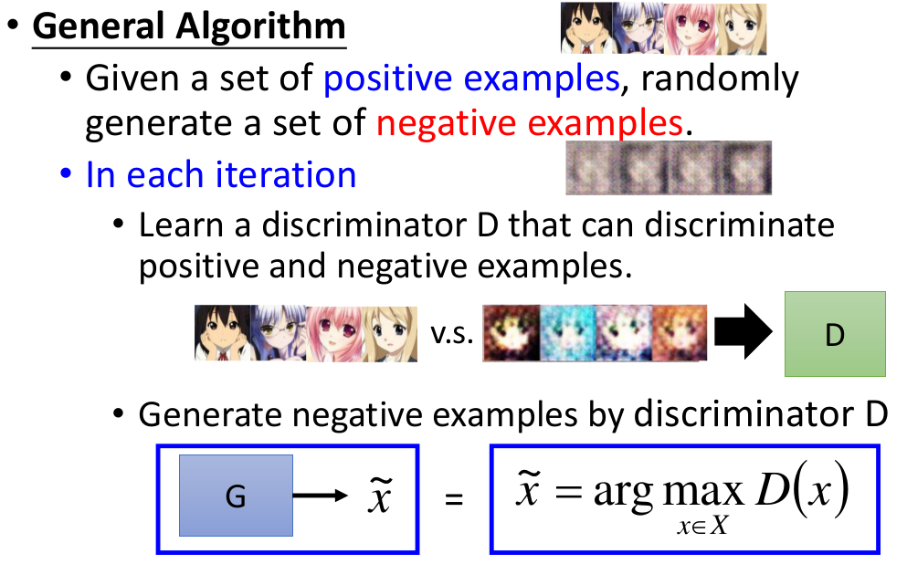

从而GAN有下述优点：

- Discriminator的角度：利用G来替代$\tilde{x}=argmax_{x\in X}D(x)$，从而更加高效，且更容易一般化（即可以采用更复杂的模型）（所谓G"骗过"D，不就是使得argmax更大吗～）
- Generator的角度：通过D来帮助G具有大局观

### ③ GAN v.s. VAE

**一个简单实验：**

- 上图是一个"toy example"：其中左图绿色点为ground truth，右图蓝色点为ground truth；左图蓝色点为VAE生成的结果，右图红色点为GAN生成的结果（两个其实是同一个数据集的实验---只是画图方式不同）
- 可以明显发现VAE其实在将很多"背景区域"误认为了ground truth，而GAN的结果则要好很多

**更宽泛实验：**

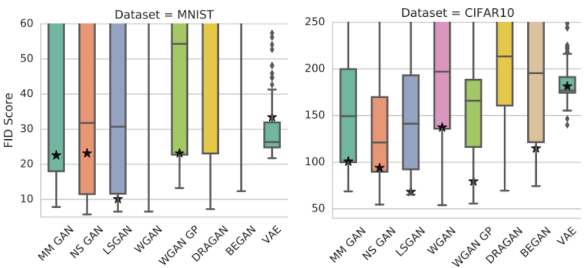

- 其中FID Score：衡量Generator好坏的指标，FID越小，代表越好
- 可以发现各类不同的GAN的结果其实差别并不大！且range非常大（即可能产生很好的结果，也可能产生很差的结果）
- VAE比较稳（即range比较小），但是最好的结果VAE又比各类GAN差一大截

