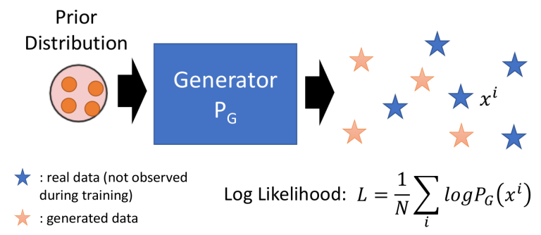
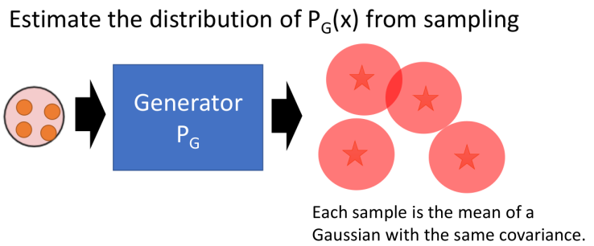
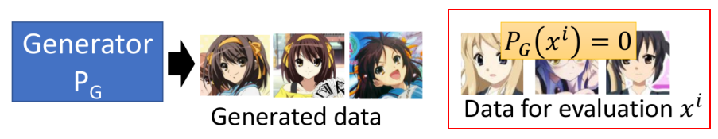
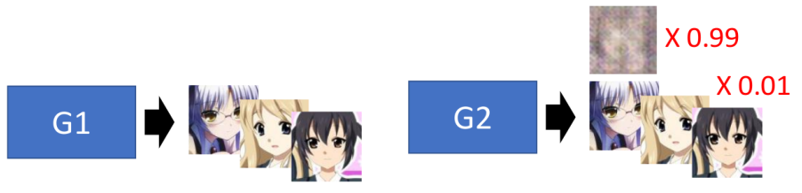
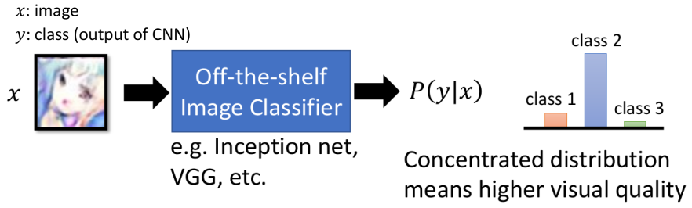
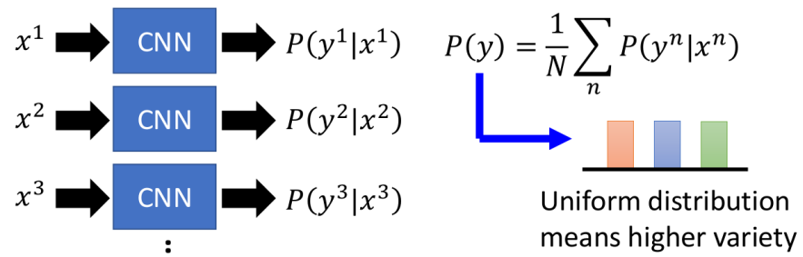
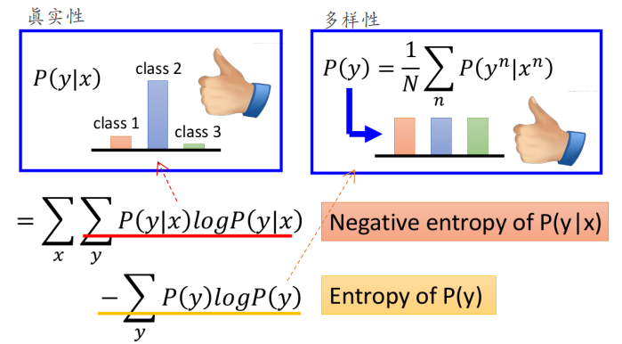

# Evaluation

这一节主要介绍如何衡量GAN的"好坏"

- Likelihood的方式
- Objective的方式（network的方式）

其实"最准"的方式就是直接人眼来看呀，但主要这种主观性太强。

## 1. Likelihood的方式

### ① Likelihood的概念

首先我们先从概念上来看下Likelihood的方式（暂时先别管可行与否）：

- 相当于假设我们可以让G产生"蓝色星星"（即我们的验证集），那么我们通过计算产生这些验证集的likelihood即可用来衡量GAN的好坏（这个思想也是来自于"贝叶斯生成模型"那一套理论）

但我们来看看现实情况会遇到的问题：

1. 我们没有办法计算G产生某张指定图片（如$x^i$）的概率：这点不像高斯混合模型，产生的是一个概率模型。

### ② 一种解决方案：Kernel Density Estimation

采用的方式就是：先用G产生一堆图片(暂时以图片为例)，然后用高斯混合模型来近似这些产生的样本；这样我们相当于将G转化为了高斯混合模型；然后就是一个概率模型了

这样做存在的问题：

1. 应该让G产生多少个样本才合适
2. 应该用多少个高斯模型去近似
3. 其实更大的问题在于这种方式真的"合理吗"（见③）

### ③ Likelihood v.s. Quality

- Low likelihood，high quality的情况
  

假设G很厉害，具有很强的创造力，可以创造出一堆在"Evaluation Data"里面完全没见过的图，那某种意义上来说这张图的Likelihood就等于0：可明明这张图就很好啊！（比如上述Generated data完全没在红框内的数据中出现过---其实这也从侧面反映一个问题：我们明明希望GAN有创造力，可总是希望与Evaluation Data接近，那么又会限制他的创造力）

- High likelihood，low quality的情况

说明：左边代表G1产生图片的情况，右边代表G2产生图片的情况（它有99%的概率产生"模糊"的图片，有1%的概率产生下面清晰的图片，并假设它产生的清晰图和左边一样）；先假设G1产生某张图的概率为$P_{G1}(x^i)$，则显然我们可以知道G2产生这种图的概率为$P_{G2}(x^i)=P_{G1}(x^i)/100$；那么"延伸"到所有Evaluation Data上面，可以有：
$$
L_{G1}=\frac{1}{N}\sum_ilogP_{G1}(x^i) \\
L_{G2}=\frac{1}{N}\sum_ilogP_{G2}(x^i)=\frac{1}{N}\sum_ilogP_{G1}(x^i)/100=-log100+ \frac{1}{N}\sum_ilogP_{G1}(x^i) 
$$
假设$L_{G1}$比较大（即更小的负数），那么$L_{G2}=L_{G1}-4.6$（$log100\approx 4.6$），显然也可以视为高的Likelihood（此处再多说一句：因为类似出现一个图片产生的概率为0.5，则对应$-log2$，多几张就超过-4.6了）

## 2. Objective Evaluation

另一种常见的衡量方式：用另一个训练好的网络来判断（比如衡量图片时采用一个在ImageNet上训练好的分类网络，主要根据生成物体的类型来决定）。然后主要从两个角度来衡量GAN的好坏：

1. 图片生成质量：这种图在某个类别上面是高概率的（即网络认为它像某个东西）
   
2. 图片多样性：即GAN能够生成不同类型的图片（那就说明不同的图在不同类别上面概率高）
   

所以根据上面两个性质我们可以设计对应的"评价指标"（score）：该值越大代表越好

- 第一项 --- 单图越真实：$P(y|x)$越大，$logP(y|x)$越大，整个值越大
- 第二项 --- 多样性：$P(y)$之间差异越大，该值越大；（而我们希望它越小越好，而最小出现在所有$P(y)$等概率）

> 这些方法也只是折中的衡的方式，也还是会存在一些问题～