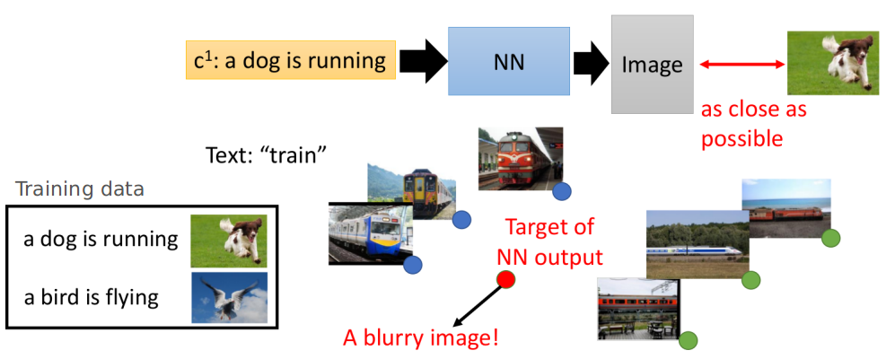
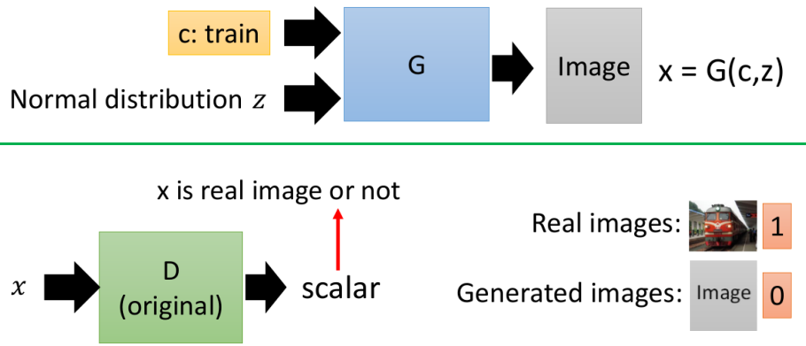
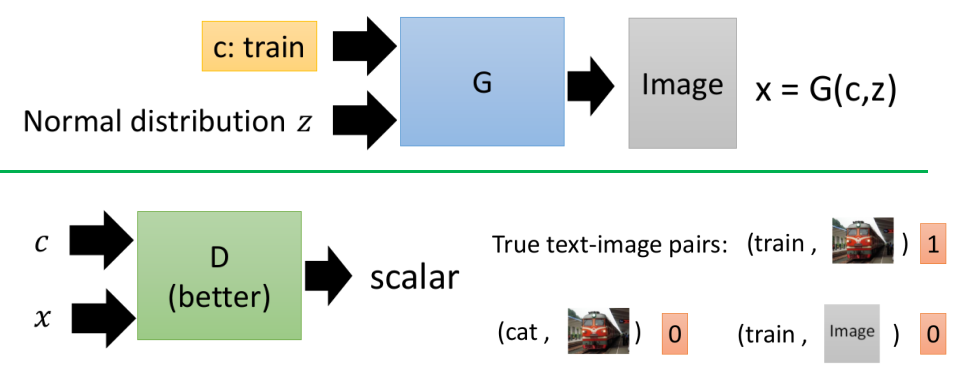
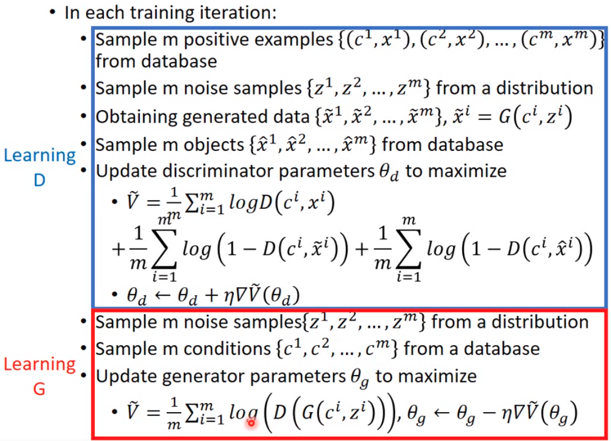
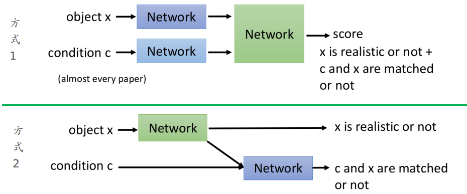
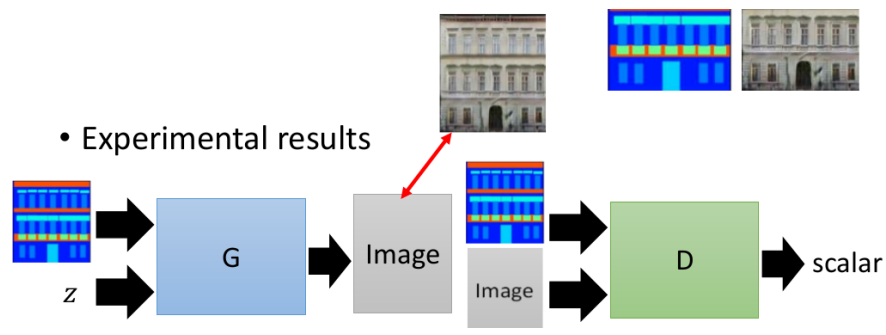
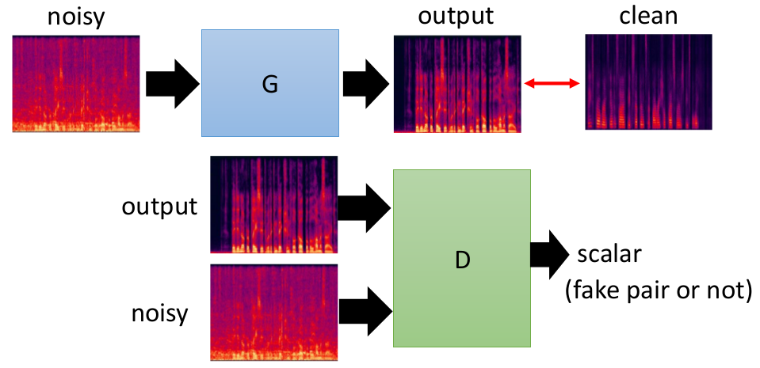
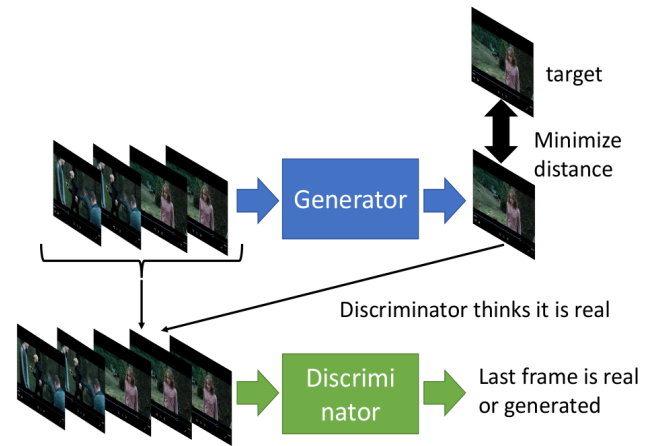

# Conditional Generation by GAN

这一节主要讲述Conditional GAN，其主要想解决的一个问题就是：通过输入一个信息来控制Generator来产生"预期"的结果。（例如Text-to-Image问题中---输入一段话，输出对应场景的图片）

> 单纯的GAN其实没有太多的应用场景，大部分实际应用往往是Conditional GAN

主要分为下述几个部分：

1. Supervised approach存在的问题
2. Conditional GAN的框架
3. 一些应用实例

## 1. Supervised approach存在的问题

下述以Text-to-Image问题来说明："看文字生图"采用"传统"Supervised方法存在的问题。

- 不难发现一个单词可能对应多张图片，那么就会出现"不知道改选哪一张的情况"，很可能会采用的做法就是把这一几张合起来"其平均"（那么就可能会产生奇怪的图片）--- 如上图中train对应6张图片！

## 2. Conditional GAN的框架

### ① 方式1（不太好的方式）

- 这种方式Generator虽然能够生成"以假乱真"的图片，但是会忽略掉条件！（即很可能你的conditonal文本为train，但给你生成个狗的图片---即**文不符图**）---这显然与我们的初衷不吻合

### ② 方式2

- 即将"不真实的图片"和"图不符文"的都视为false

### ③ 整个算法流程

- 上述的D的目标函数包含三项：分别对应 1. 符合条件的，2. 图是"假的"  3. 文字和图片不吻合

### ④ Discriminator的两种选择

- 大部分论文采用的是方式1的情况，[Conditional Image Synthesis With Auxiliary Classifier GANs](https://arxiv.org/abs/1610.09585)，[Spectral Normalization for Generative Adversarial Networks](https://arxiv.org/abs/1802.05957)和[StackGAN: Text to Photo-realistic Image Synthesis with Stacked Generative Adversarial Networks](https://arxiv.org/abs/1612.03242)这三篇文章采用的是方式2
- 从"直觉"而言，方式2似乎更合理：当生成能够"以假乱真"的图片我们是肯定的，但是和条件不吻合并不是我们现在所需要的；而方式1将两者直接混在一起似乎容易使得network更难区分到底是哪里出了问题

> [StackGAN: Text to Photo-realistic Image Synthesis with Stacked Generative Adversarial Networks](https://arxiv.org/abs/1612.03242)推荐阅读：能够帮助我们生成更好的图片

## 3. 一些应用实例

### ① Image-to-Image

- 上图中的"红线"是在Generator的损失时还加了ground truth，不仅希望生成和"y域"类似的图，还希望能够与原图越像越好

> [Image-to-Image Translation with Conditional Adversarial Networks](https://arxiv.org/pdf/1611.07004.pdf)

### ② Speech Enhancement

### ③ Video Generation

