# Unsupervised Conditional Generation

这一节主要讲述无监督的Conditional GAN（从一个域变到另一个域）

1. Unsupervised Conditional GAN的概念和分类
2. Direct Transformation
3. Projection to Common Space
4. 在其它领域的运用

## 1. Unsupervised Conditional GAN

### ① Unsupervised Contional GAN能做什么

首先来看下什么是Unsupervised Conditional GAN，主要通过下述三个"示例"来说明：

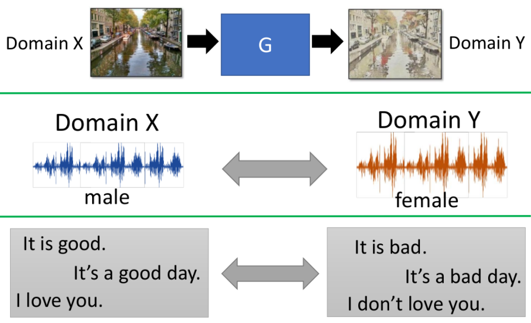

- 这三个示例都是没有paired data，但都有一系列各自域里面的一系列data（比如第一个示例，我们可能有一系列拍照的图片，以及一系列梵高风格的图片；但我们并没有一一对应关系的图片），但是依旧能够将一张Domain X(拍照的图片)的图片转化成具备Domain Y(梵高风格图片)风格的图片

### ② Unsupervised Conditional GAN可以分为两类

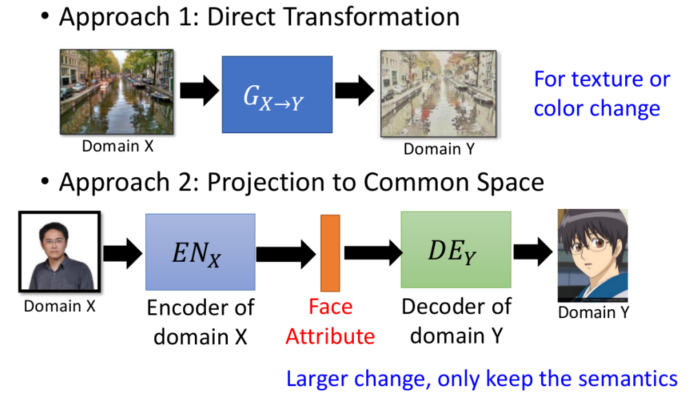

- 第一类：还是会保留input的整体信息，只是在纹理以及色彩等方面进行改变
- 第二类：input和ouput可能就完全不一样了！

> 关于各个大类的具体介绍和方法请看下面

## 2. Direct Transformation

### ① 方式1：直接转

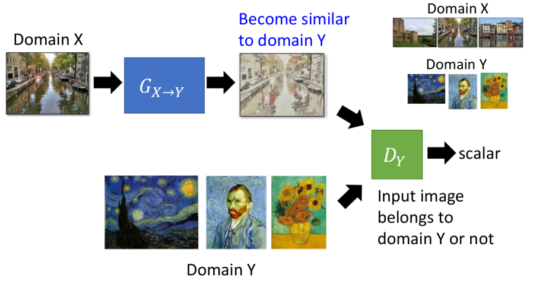

- 没有什么特殊的技巧，就是直接GAN的框架（只是将Discriminator从辨别"真假"，变成了辨别是否具有Domain Y域里图片的特点）

> 你可能会怀疑这样子通过$G_{X\to Y}$产生的结果和输入"风马牛不相及"，但合理地设计网络结构是可以避免此现象的，一般将G设计的比较简单即可；可参考：[THE ROLE OF MINIMAL COMPLEXITY FUNCTIONS IN UNSUPERVISED LEARNING OF SEMANTIC MAPPINGS](https://openreview.net/pdf?id=H1VjBebR-)

### ② 方式2：借助Encoder

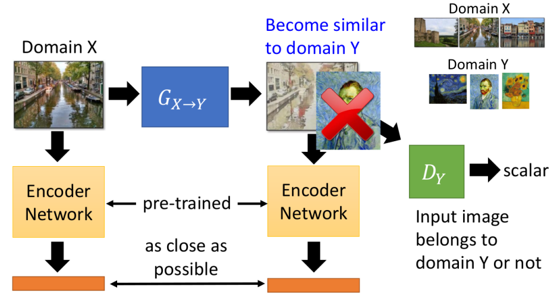

- 在直接产生的基础上，希望$G_{X\to Y}$的输出与输入经过Encoder Network之后的code尽可能接近（其中的Encoder Network可以直接使用类似VGG等训练好的模型）

### ③ 方式3：CycleGAN的方式

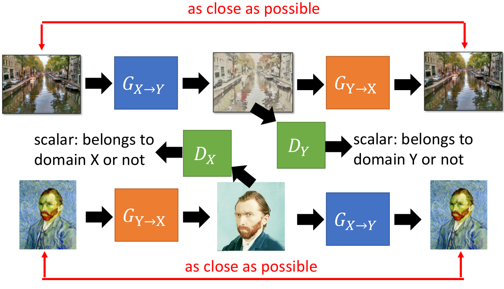

- 即通过$G_{X\to Y}$和$G_{Y\to X}$能够将"变化"转回去

> 关于CycleGAN可能存在的问题就是：它可能只是将信息隐藏起来，而不是真正的"Generation"；详见[CycleGAN, a Master of Steganography](https://arxiv.org/abs/1712.02950)

### ④ Multi-Domain Transform

上面的几个例子都是Domain X转到Domain Y，在两个Domain之间转换；但如果我们希望能够在多个Domain之间转换呢？下面的例子给出了很好的解决方式

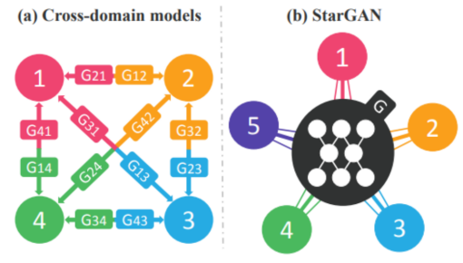

- 如果按照一般的想法：可能就需要设计$C_{k}^2$个CycleGAN来实现，但StarGAN只用一个统一的架构就完成了！

具体的方式如下所示：

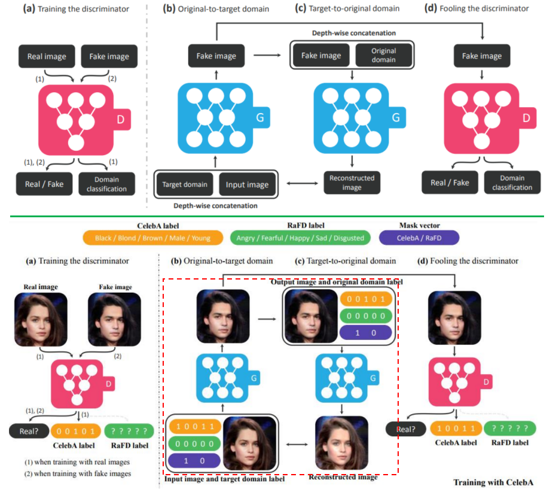

下半部分的图更好理解这个思想：

- Discriminator：不仅判别一张图是真是假，还要判别该Real image是属于哪个domain（此处domain和前面的略有不同，采用label的形式代表domain的组合，此处00101----代表Brown+Young，即灰色头发的年轻人）
- Generator：根据图片以及Domain信息（如10011）来生成"Black"+"Male"+"Young"组合域的新图片
- 其中红色虚线部分可以视为Cycle-GAN，能够根据"转换"后的结果+原始label重新生成回原来的图片

## 3. Projection to Common Space

这种方法的思想在于希望两个Domain经过转换可以有一个"公共的code域"

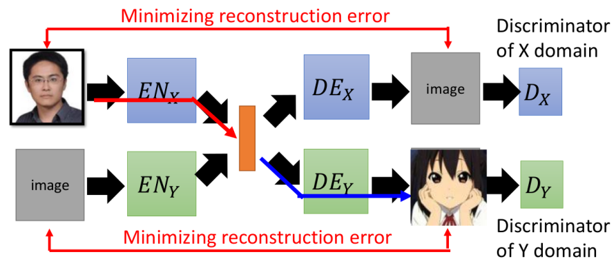

- 即希望$EN_X$和$EN_Y$（两者参数是不一样的）产生的Code具有相同的域（比如第一维代表同一个特征---如戴眼镜等等）
- 这种框架其实可以看成VAE+GAN：EN+DE=VAE，DE+DX=GAN
- 关于如何得到我们希望的目的，下面会介绍各类不同的方式

注：下面所有方式的核心思想其实都是使得$EN_X$和$EN_Y$产生的code相近

### ① 方式1：共享部分参数

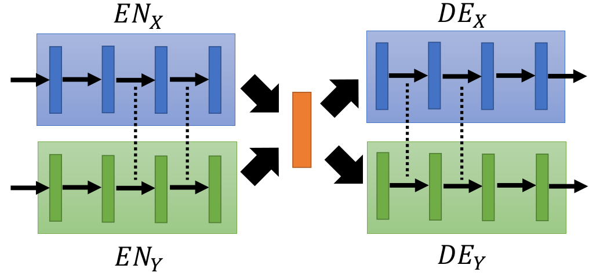

- 即将$EN_X$和$EN_Y$的后面部分参数，以及$DE_X$和$DE_Y$的前面部分参数共享---这样带来的好处就是，强制code变成同一个域了，且不共享的参数部分又允许各个域之间确实能够存在差异；而共享的部分又能够提取出公共的特点

> [Coupled Generative Adversarial Networks](https://arxiv.org/abs/1606.07536)，[Unsupervised Image-to-Image Translation Networks](https://arxiv.org/abs/1703.00848)

### ② 方式2：加入一个Domain Discriminator

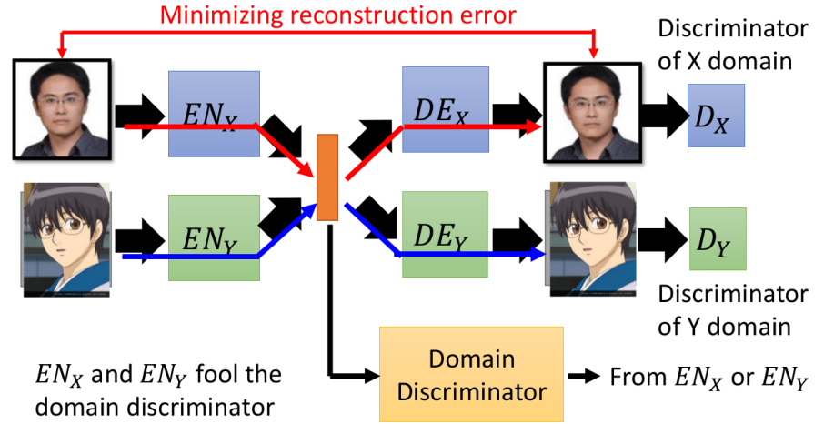

- 希望$EN_X$产生的code能够被Domain Discriminator误以为是$EN_Y$产生的，反之亦然：其实这个目的也是为了让两者产生的code尽可能的相似

> [Fader Networks: Manipulating Images by Sliding Attributes](https://arxiv.org/abs/1706.00409)

### ③ 方式3：类似Cycle的形式

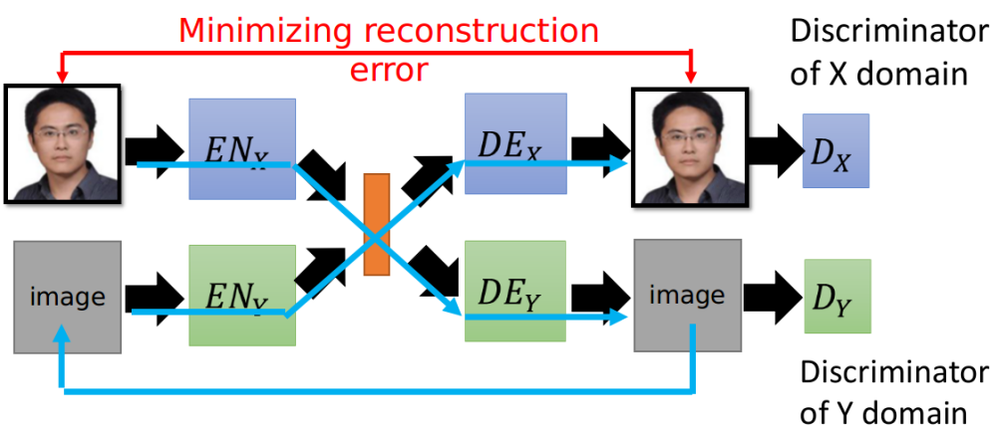

- 上述蓝线过程：$EN_X$生成的Code，经过$DE_Y$产生的image既能骗过$D_Y$，又能经过$EN_Y$产生code，且该code还能够通过$DE_X$复原成和原始输入相近的图

> [ComboGAN: Unrestrained Scalability for Image Domain Translation](https://arxiv.org/abs/1712.06909)

### ④ 方式4：方式3在Semantic上面进行比较

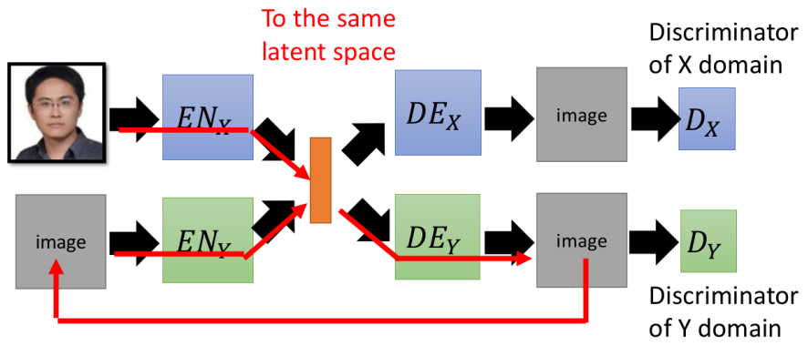

- 其实和方式3基本一样的，只是在比较的时候采用：$EN_X$产生的code1和经过$DE_Y+EN_Y$产生的code2尽可能相近

> [Unsupervised Cross-Domain Image Generation](https://arxiv.org/abs/1611.02200)

## 4. 在其它领域的运用

例如在声音"转变"上面的运用：即将一个人的"语气"转为另一个人的语气：

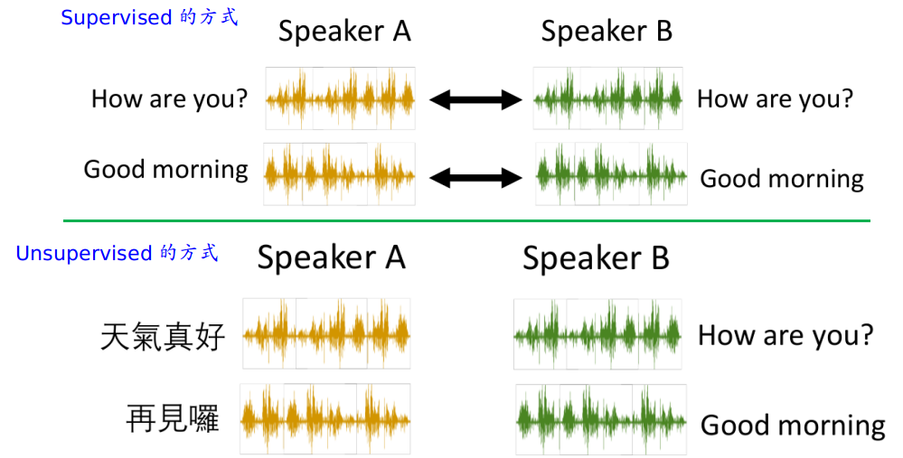

- 我们可以发现对于Supervised的方式，我们必须收集一堆两个人讲的一一对应的话；可是Unsupervised的方式则完全不需要，只需要有一堆两个人的话就好，我们就可以运用类似CycleGAN等上面介绍的方式达到一句话从一个人的声音转为另一个人的声音