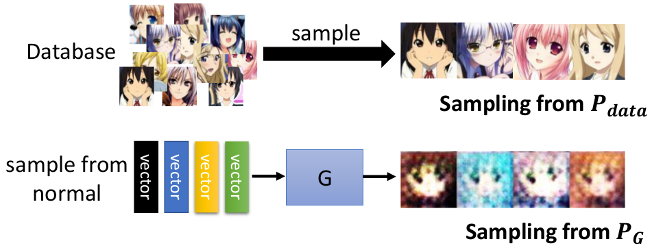
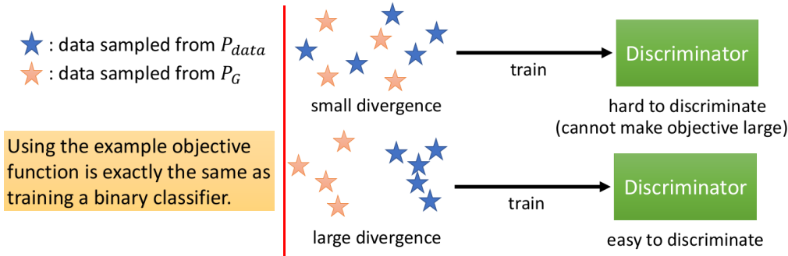
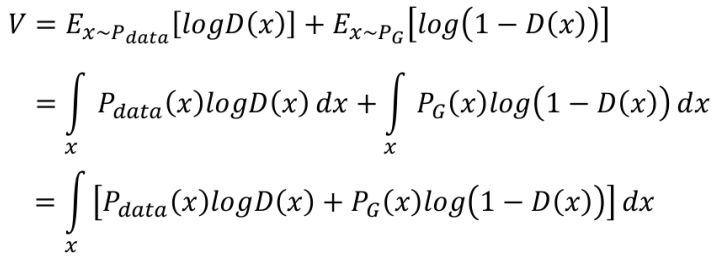

# Theory behind GAN

这一节主要讲述"原始"GAN背后的理论：

1. 生成模型想要做什么
2. GAN的解决方案
3. GAN存在的问题

## 1. 生成模型想要做什么

做具体介绍GAN背后的理论之前，有必要先了解下**生成模型**（可以将GAN视为生成模型这一大类的一种解决方法）具体想解决的问题是什么，如下图所示：

- 我们想找一个"生成模型"$P_{G}(x)$，使得$P_{G}$和真实的分布$P_{data}$尽可能相近

### ① Maximum Likelihood Estimation

而解决这个问题常见的方法就是利用Maximum Likelihood Estimation（MLE），其大致的流程如下图所示：

- 但MLE这个框架带来的一个问题就是：为了能够求解MLE，我们设计的$P_G$往往不能过于复杂，否则很难求解。（所以常见的是采用高斯分布）

### ② Maximum Likelihood Estimation=Minimize KL Divergence

> 注：$D_{KL}(P||Q)=\sum_i P(i)ln(P(i)/Q(i))$

## 2. GAN的解决方案

既然GAN也是生成模型的一种，那么其也绕不过"逼近"$P_{data}$；所以GAN想要优化的目标也可以写成：
$$
\theta^{\star}=argmin_{\theta}Div(P_{\theta}, P_{data})
$$

- 此处写成Divergence，而不是KL主要是因为衡量两个分布之间的"相似性"是可以用各自各样不同的衡量准则

### ① Generator做什么

- Generator：主要希望其具有足够的能力能够产生一个$P_G$和$P_{data}$足够接近

正如1中所提到的，我们这样做会遇到下述几个问题：

1. $P_{data}$的具体分布表达式我们不知道（如果知道，这个问题就不用解了 :smile:）
2. $P_G$的具体分布形式也难以确定
3. 其实归根结底就是：如何计算Divergence！

**首先给出结论：通过Discriminator来"替代"计算Divergence**

在进入下一部分之前，我们先来看看如何解决$P_G$和$P_{data}$分布的问题：虽然我们不知道$P_G$和$P_{data}$具体的分布，但是我们可以获得一系列它们产生的样本：

### ② Discriminator做什么

我们将因果反过来，先看下GAN中Discriminator的表达式是什么，再证明这个形式其实是JS Divergence

#### I. Discriminator的目标函数

> 其实这个目标函数就是一个二分类问题：
>
> 

#### II. 证明Discriminator其实是计算JS Divervgence

step1：给定$G$，使得$V(D,G)$最大的$D$是什么

> 在进入step2之前，这里有个假设：$D(x)$能够拟合"任意的函数"

step2：针对某个具体的$x$，使得上述中括号内的值最大的$D(x)$（我们只需要找到每一个$x$对应的最大，那么积分起来就是最大）

这里我们就找到了使得V最大的D的表达形式

step3：将$D^\star(x)$代入$max_DV(G,D)$

> 注：$JSD(P||Q)=\frac{1}{2} D(P||M)+\frac{1}{2}D(Q||M)\quad M=\frac{1}{2}(P+Q)$

所以证明完毕！可以看到Discriminator的优化目标其实可以看做JS Divergence

### ③ Generator+Discriminator

通过①和②的分析，我们不难将**生成模型**转化为下述表达式：

那么整个算法的流程其实也就水到渠成了，如下图所示：

- 右图中：由于我们希望每次$maxV(G,D)$，所以需要Repeat k times（不然就容易并不是在衡量JS散度）
- Learning G中将$V$的第一项去掉是因为$D$对该项更新不起作用

> 通过下图可以帮助我们理解GAN：
>
> 
>
> - $argmin_{G}max_{D}V(G,D)$：可以看成有三个候选G，而每一个G对应的$max_DV(G,D)$如上图三种情况所示，显然其中的$G_3$是最符合条件的

## 3. GAN存在的问题

### ① 更新G的时候真的有在减小JS divergence吗

**答案是不一定！**

下面的图就很好的说明了这种情况：

- 当$G$从$G_0$更新到$G_1$时，我们的JS Divergence其实也会变了，而梯度下降法往往只能使得在$D_0^\star$这点的$V$变小，可是JS Divergence可能在其他地方的Divergence变得比原本的最大值$V(G_0,D_0^\star)$更大！
- 解决的方法是基于一个假设：即每次更新$G$的时候，$D_0^\star$和$D_1^\star$变化不会太大 --- 即更新G的步长小一些！

### ② Mode Collapse & Mode Dropping

- 即Generator产生的只是真实分布的一小部分，这样子也能骗过Discriminator。但这样的Generator并不是我们希望的

### ③ 数据无交集问题 

这部分在[ch7_6](ch7_6.md)中介绍

## Appendix

观点1：按照这一节的观点，最后的Discriminator应该会"烂掉"，如下图所示：

观点2：而站在[ch7_1](ch7_1.md)可以将Discriminator看做Evaluate function的观点来看：最后的Discriminator不应该会"烂掉"，反而应该接近于$P_{data}$（因为只有在data域内有概率，其他部分概率为0）

在真实情况中，感觉介于两者之间；其实更倾向于观点2