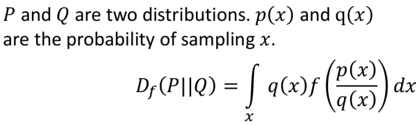
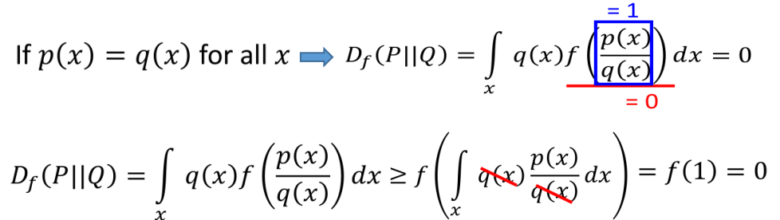
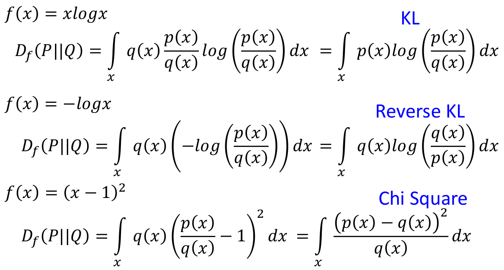
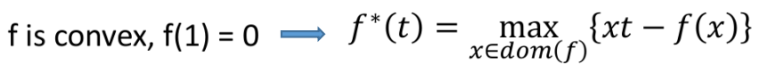
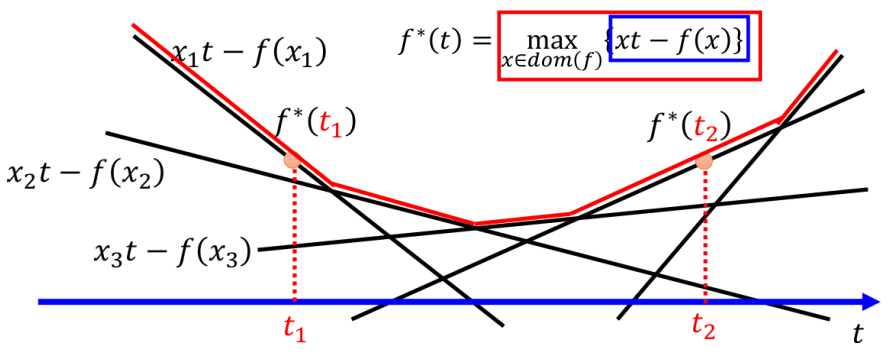
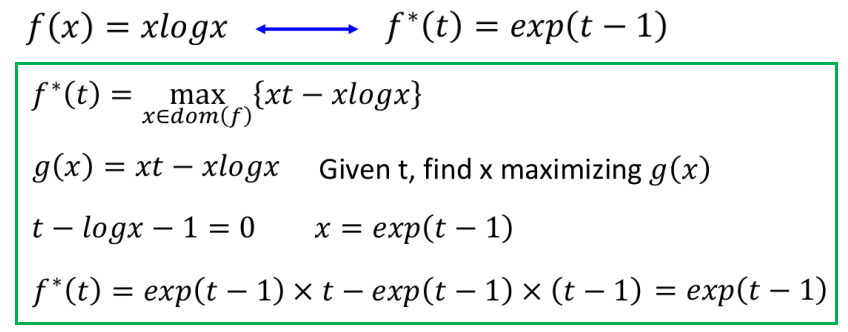
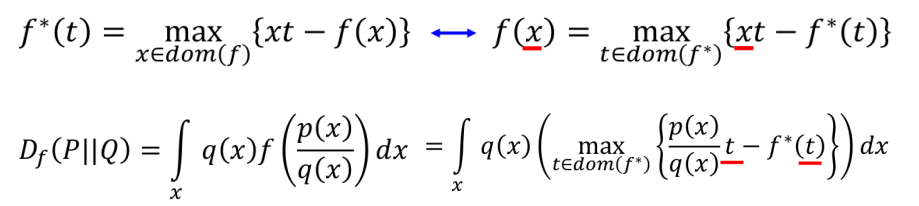
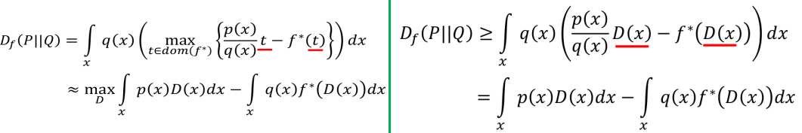
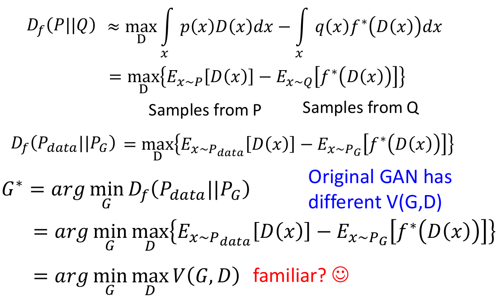
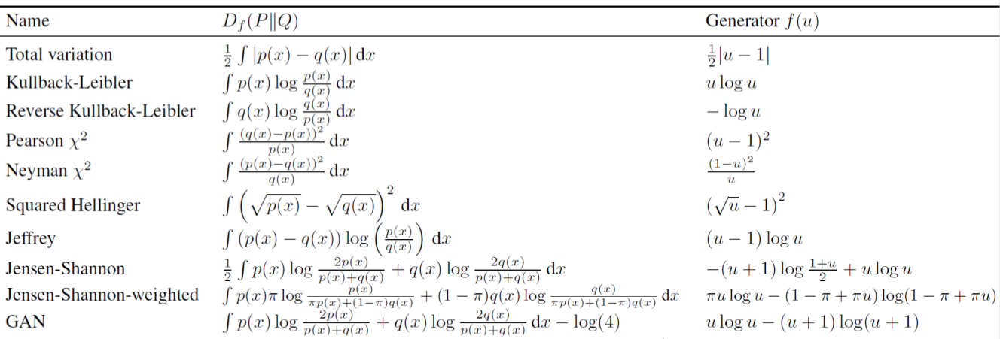

# fGAN：General Framework of GAN

这节主要介绍GAN的通用框架：

1. f-divergence
2. Fenchel Conjugate
3. Connection with GAN
4. 不同的f-divergence对应的Generator

> 注：1, 2部分可以理解为是"预备知识"

## 1. f-divergence

### ① 什么是f-divergence

首先让我们来了解一下什么是f-divergence：

其实的$f$满足下面两个条件：

- $f$为凸函数
- $f(1)=0$

> 只要满足这两个条件的$f$，都可以拿来作为衡量$P$和$Q$差异的divergence

$D_f(P||Q)$能够衡量两个分布$P$和$Q$的"差异性"：

- 我们可以发现，当两个分布一样时，其f-divergence最小=0
- 而当两个分布差异越大：往往f-divergence越大

### ② 几个简单例子

## 2. Fenchel Conjugate

### ① 什么是Fenchel Conjugate

每一个凸函数$f$都存在一个对应的共轭函数$f^\star$，两者之间满足下述关系：

而关于如何求解这个$f^\star(t)$，其实不了解也没事（数学家们会给出很多凸函数以及它们对应的共轭函数）；下面只是从一个直观的角度来说明右边式子的含义：

- 我们可以理解为每一个$x$对应一条直线（t为变量），每个$f^\star(t)$则取这无数条直线中在t处最大的值
- 值得一提的是，共轭函数$f^{\star}$依旧是凸函数

### ② 一个简单的例子

## 3. 将f-divergence与GAN联系起来

step1：将f-divergence的形式变为其共轭函数的形式

- 用到了一个性质：一个凸函数的共轭函数的共轭是原本的凸函数
- 其中的$x$用$p(x)/q(x)$代入

step2：用Discriminator替换$t$

要求解上面的式子的难点就在于如何在所有的$t$中找到一个使得$\frac{p(x)}{q(x)}t-f^\star(t)$最大。这里采取的策略就是将这个任务交给Discriminator！我们就假设针对当前的$x$，$D(x)$能够自动帮我们找到使得"大括号"内值最大的$t$（所以这个是个理论下界）

- 我们可以理解为$t=D(x)$

step3：与GAN的表达式联系起来

## 4. 不同的f-divergence对应的Generator

