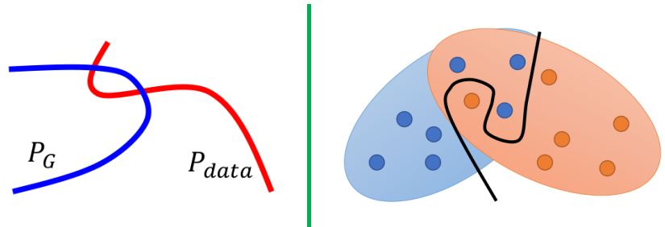
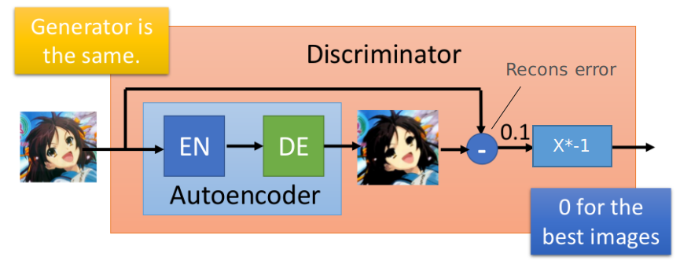

# Tips for Improving GAN

这节主要介绍一些"新的GAN"能够解决原始GAN中存在的部分问题：

1. 原始GAN存在的问题
2. LSGAN (Least Square GAN)
3. WGAN系列
4. Spectrum Norm
5. Energy-based GAN

## 1. 原始GAN存在的问题

此处只关注JS Divergence带来的问题，其他更多存在的问题见：[Theory behind GAN](ch7_4.md)

### ① $P_{data}$和$P_G$几乎没有重叠 

主要从两个方面来说明：

1. 数据分布的特点：$P_{data}$和$P_G$均为高维空间中的低维流（比如32x32的图片，就相当于32x32维的空间---而每张图片都可以认为这个空间上的一个点---而大部分区域是"没有意义"），因此它们几乎没有交集；如下面左图所示

2. 数据采用带来的问题：即使退一万步而言，$P_{data}$和$P_{G}$之间存在一定的交集，但是我们在实际处理时；是通过随机采用的方式获得数据，那这些采样数据不重叠的概率也是占据绝大多是的；如下面右图所示

   

### ② 数据无交集带来的问题

通过[Theory behind GAN](./ch7_4.md)我们知道，GAN在做的是最小化$P_G(x)$和$P_{data}(x)$之间的JS Divergence；但当$P_G$与$P_{data}$之间没有任何交集时，就会使得JS始终等于$log2$（两者相互独立，所以各自"域"另一分布的概率为0）：
$$
JS(P_G,P_{data})=1/2(\int_xP_{data}log(\frac{P_{data}}{(P_{data}+P_G)/2})+\int_xP_{G}log(\frac{P_{G}}{(P_{data}+P_G)/2}))\\
=1/2(\int_xP_{data}log(\frac{P_{data}}{P_{data}/2})+\int_xP_{G}log(\frac{P_{G}}{P_G/2}))=log2
$$
如果GAN的Generator更新后，$P_{G}$和$P_{data}$依旧没有交集，就会使得GAN不知道"朝什么地方更新"（类似优化时陷入很平的一片区域）：

- 这就会使得GAN非常难训练起来（很可能就和参数初始化更密切了）

**站在另一个角度来看**：如果两个分布之间没有交集，那么二分类器（Discriminator）就能够轻而易举地获得百分百的正确率（Generator不管怎么努力，都无法骗过Discriminator，然后就放弃了！）

## 2. LSGAN（Least-Square GAN）

> 这部分更佳详细的证明，请见：[Least Squares Generative Adversarial Networks](https://arxiv.org/abs/1611.04076v2)

根据[原论文](https://arxiv.org/abs/1611.04076v2)可知，在LSGAN中优化目标如下所示：
$$
min_DL(D)=E_{x\sim P_{data}}(D(x)-b)^2+E_{x\in P_{G}}(D(x)-a)^2 \\
min_GL(G)=E_{x\in P_G}(D(x)-c)^2
$$
按照类似GAN的推导方式，我们不难获得给定$G$，最佳的$D^\star$为：
$$
D^\star(x)=\frac{bP_{data}(x)+aP_G(x)}{P_{data}(x)+P_G(x)}
$$
从而可以知道给定$D$情况下，$L(G)$的形式：
$$
L(G)=\int_x\frac{((b-c)(P_{data}(x)+P_G(x))-(b-a)P_G(x))^2}{P_{data}(x)+P_G(x)}
$$
而当$b-c=1,b-a=2$时，上式对应$L(G)=\mathcal{X^2}_{Pearson}(P_{data}+P_G||2P_G)$（即$P_{data}+P_G$和$2P_G$满足皮尔森卡方散度）

- 站在"直觉"的角度而言，采用均方损失而不是采用二分类的损失，会对"差异"更敏感
  

## 3. WGAN系列

### ① Earth Mover's Distance

这部分是预备知识，关于Earth Mover's Distance的定义如下所示：

- 将$P$变到$Q$，可以利用一个"转移矩阵"$\gamma$，而这个转移矩阵$\gamma$可以有非常多种；其中存在一个使得平均距离$B(\gamma)$最小的。那个就是我们定义的Earth Mover's Distance
- 表达式$x_p-x_q$可以视为两个位置之间的距离
- 我们可以发现$W(P,Q)$不仅和两个分布的概率分布有关，也和其"定义域$x$"的距离长远有关（举个例子，如果两个分布没有交集，但离得很远，则其$W$越大；如果两者离得更近，则其$W$会越小）

**$D_f(P_{data}||P_G)$ v.s. $W(P_{data}, P_G)$**

### ② WGAN

WGAN就是采用了上述的Earth Mover's Distance来衡量分布之间的差异；而其对应的优化目标函数为：

- 关于这部分如何证明，详见[Wasserstein GAN](https://arxiv.org/abs/1701.07875)；以及关于Lipschitz Function的定义见右图
- 我们可以发现如果对$D​$不加上述限制：则$D​$很容易出现左下图所示的情况 --- 轻而易举区分出generated和real，即存在JS Divergence情况下的问题

### ③ 如何将$D\in 1-Lipschitz$限制加到实现中

虽然理论上增加这个约束，就起来了Earth Mover's Distance的作用；但实际实现时，由于$D$是由成千上万的参数构成，很难在训练时直接将这个约束加进去。下述介绍几种常用方式。

#### I. Weight Clipping

在最开始的WGAN中采用的方式非常粗暴（但也最容易实现）：

- 强制将网络参数$w$限制在$[-c,c]$之间：在参数更新时，如果$w>c$，则令$w=c$；如果$w<-c$时，令$w=-c$（这样的方式，只是尽可能让网络的变化不要太大，这样就会比较平滑。但其实并没有真的实现上述的1-Lipschitz限制。作者只是通过实验说明这种方式效果还不错）

#### II. Gradient Penalty

> 这种方式是在：[Improved Training of Wasserstein GANs](https://arxiv.org/pdf/1704.00028.pdf)采用的

首先，我们可以知道，下述关系式是等价的：

从而可以利用拉格朗日乘子法，将原本的优化目标等价为：

但是在实际操作中，我们并没有所有的$x$！（此处的所有指的所有空间，包括$P_{data}$和$P_G$），所以退而求其次，在WGAN-GP采用的方式为：

- 即我们只考虑$P_{penalty}$里面的数据让其符合这个要求，其他的就管不了那么多了。

其中的$P_{penalty}$的定义如下所示：

- 就是在$P_{data}$我们的样本和$P_G$我们的样本之间随机取一个点（图中线上随机一个点），将这一系列的点作为$P_{penalty}$。（即蓝色的这个范围）
- 至于为什么采用这种方式，其实就是实验效果还不错！但从直观上来理解，我们希望$P_G$不断向$P_{data}$靠近，所以取"沿着这个方向"的数据作为限制也是蛮合理的

> 其实WGAN-GP中真正采用的优化目标函数是下面这条表达式：
>
> 
>
> - 不仅对大于1的情况进行惩罚，也对小于1的进行惩罚！没有为什么，作者就是做实验发现这样也可以，且似乎效果更好一些！！！
>
> **这种方式其实还是存在一些问题，比如下述这个情况：**
>
> 
>
> - 其中黄色的为$P_G$的一个样本，而红色的为真实数据的分布，那么我们取样本（红色的点）和黄色点的连线上进行约束，其实更合理的应该是找离黄色点最近的"蓝色点"，对该路径进行约束才更合理

### ④ WGAN的算法

- 其实就是改了上述四个黑色的地方

## 4. Spectrum Norm GAN 

> [Spectral Normalization for Generative Adversarial Networks](https://openreview.net/pdf?id=B1QRgziT-)

待补充

## 5. Energy-based GAN

- Energy-Based GAN将Discriminator改成Auto-Encoder的形式。通过计算Reconstruction Error作为衡量生成图片的好坏指标

这么做的好处：

- Auto-Encoder可以对Discriminator进行预训练；这样就可以使得GAN的收敛更快---因为一开始Discriminator就很强

但需要一个注意事项：我们希望Real的Reconstruction error越小越好，但并不是要Generator的Reconstruction Error越大越好（因为建设很难，破坏很容易）--- 实际实现时，会希望Generator的Reconstruction Error只要小于某个margin值(m)就好：(这个值是超参数）

