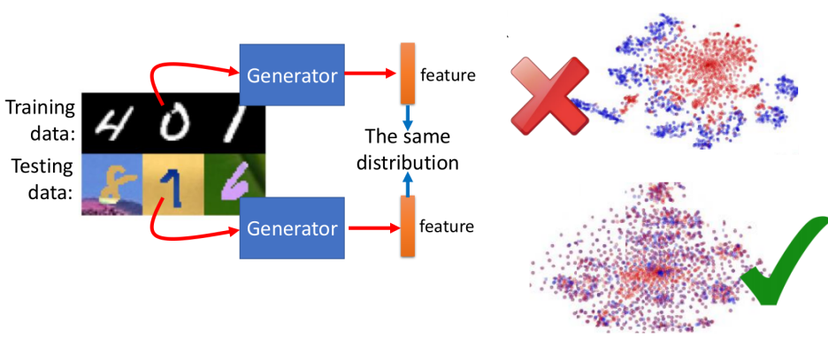
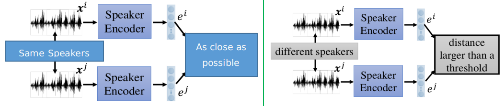

# Feature Extraction

1. InfoGAN
2. VAE-GAN
3. BiGAN
4. Domain-adversarial training
5. Feature Disentangle

## 1. InfoGAN

### ① InfoGAN想解决什么问题

- "常规"的GAN的输入的code（比如高斯分布产生）的每一维的变化其实可能并不具有什么规律性：如右上图每一行其实都是仅仅每一维数值变化时的结果。它的"code"对应数字的分布很可能如右下角所示（即没有太多的规律性）
- 我们希望的code与产生的image之间存在某种"明显"的关系，如左下图所示：比如纵轴这一维变化就对应着数字的变化

### ② InfoGAN架构

InfoGAN在原有GAN的基础上增加了一个Classifier，其实Generator+Classifier可以视为一个Auto-Encoder（只是code变成了image），其中将$z$划分成了两部分$c$和$z^{'}$---每一个均是向量，我们可以将$c$视为我们希望能够改变$x$的特征，而$z^{'}$可以视为和原本的z相类似的功能

这样带来的好处：

- 只有$c$能够显著影响$x$的时候，Classifier才能够"复原"$c$：因为如果$c$对$x$的影响很小，那就很可能使得Classifier根本无法分辨不同的$x$，从而就无力"分类"，找到原本对应的$c$

下面是该架构的一些实验情况：

- 我们可以发现，改变某一个维度，确实具有某一种"显著"变化的特征

## 2. VAE-GAN

我们先来分析一下VAE和GAN的特点：

**VAE缺点：**由于采用的是Recons Error（一般为$L_2$损失），容易使得生成的图像比较模糊（而Discriminator刚好可以帮助它）

**GAN缺点**：由于一开始是采用随机的$z$来产生$x$（比如image），这就需要"非常大"的力气去使得Generator学会如何产生真正的image长什么样子（而VAE刚好可以帮助它）

所以VAE-GAN的框架和算法如下所示：

- 这样的方式同时具备VAE和GAN的优点：使得GAN更稳定
- 注意上面更新Discriminator的时候：Recons的都是为false

## 3. BiGAN

首先直接先给出BiGAN的框架和算法：

- 这与"传统的auto-encoder"并不一样，此处Encoder和Decoder你可以理解为两个相互独立的模块。而Discriminator的作用就是判别$(x,z)$是来自Encoder还是Decoder --- 这样的一个结果就是Discriminator如果被够被骗过去，那就说明$P(x,z)$与$Q(x,z)$之间的分布是"类似"的

**但可能你在想为什么不采用Direct Supervised的方式呢？**

- 这两种方式的理想情况是一样的：最佳解是一样的；但那只是理想情况，基本是无法达到的。
- 两者的Error Surface是不一样的，而Direct Supervised的方式就会存在VAE等方式的一些缺点；而BiGAN生成的结果往往会更像图片一些（即GAN的特点：更具有语义上的信息）

## 4. Domain-adversarial training

属于Transfer Learning的一种方式：Source Data是有标签的，但是Target Data是没有标签的（两者又比较像）

下述以字体识别为例：

两者的色彩等不一样，我们希望在Source上面训练的网络能够同时用来预测Target上面的内容，Domain adversarial training采用的策略如下：

- 希望Source和Target的能够通过Generator产生的feature具有类似的分布（可以将图中红色点理解为Source的特征分布，蓝色点理解为Target的特征分布）

整体架构如下所示：

- feature extrator：类似GAN里面的Generator，使得$x$转为变feature $f$

- Domain classifier：类似GAN里面的Discriminator，用于区分不同Domain产生的feature，当不同Doamin产生的feature能够骗过Domain classifier，就相当于具有类似的分布
- Label Predictor：用于预测输出的label是什么

## 5. Feature Disentangle(特征拆解)

主要的作用就是我们希望不同部分的code代表不同的含义，下述以语音系统为例来说明。

### ① 拆分code

- 即采用两个Encode来产生两部分的code：此处我们希望$z$代表"语句"的信息（即一段话是什么内容的信息），$e$代表"语者"的信息（即说话人的声音特点）

可是如何做到这件事情呢？可以采用下述的方式

### ② "语者"信息

- 我们可以将同一个说话人的声音拆分成好几段，只要保证同一个人讲的话对应的code $e$越相近越好，而不同人讲的话对应的code $c$越远越好

### ③ "语句"信息

- 其实就类似与上一部分讲的Domain-adversarial，我们希望不同人产生的"相同语句"信息能够"骗过"Speaker Classifier（即Discriminator）

