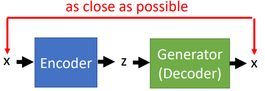

# Intelligent Photo Editing

这一节主要介绍GAN在图片上面的一些"骚操作"：

1. Attribute Representataion
2. Photo Editing
3. Image Super-Resolution
4. Image Completion

## 1. Attribute Representataion 

作用：当我们知道了一张图，我们希望通过改变它对应的code来使得生成的图片朝着我们期望的方式改变（比如头发颜色改变等）

### ① 预期情况

- 输入的code决定了产生的图片
- 我们希望能够理解code的每一维代表什么特征，如上述图片代表理想情况：第一维我们期待是改变头发长短等等

> 但其实在[Feature Extraction](./ch7_7.md)这一节中我们就知道实际情况并不是这样，某一维或许并不能"显性"的代表某一个特征

### ② 实际方法

step1：给定一张生成的图片，如何找到它对应的code

相当于一个逆向工程，可以采用auto-encoder的方式：

- 其中的Generator固定（已经训练好了，能够生成以假乱真的图片），我们希望训练一个Encoder能够"找到每个x"对应的z；
- 实际实现时，可以将Discriminator的参数作为Encoder的初始化参数

step2：同类特征的图片$x$对应的$z$归为一类（下面以长短头发为例）

- 计算出这一类$z$对应的中心（比如左边是长发特征类，右边是短发特征类）

step3：计算两者之间的"特征转移向量"$z_{long}$

- 只要沿着$z_{long}$进行改变，就能达到预期的效果

## 2. Photo Editing

先来看看Photo Editing想要做什么：

- 将人为加的信息"加"到原本的图片上面：比如上面人为画了红色颜色，那么就希望衣服变成红色（但注意哦，不希望改变本身是衣服这个事实）

具体如何实现这个方法，可以分为下面几个步骤：

### ① Back to z (找到上面衣服对应的code z)

常见的有三种方法：（其中$x^T$就是输入的图片）

**方法1**：优化方法的方式 --- "遍历"所有的$z$来寻找最佳的$z$ 

> 其中的By another network，可以视为Perceptual Loss的方式

**方法2：**上一部分采用的auto-encoder的方式

**方法3：**方法1+方法2

将方法2的结果作为方法1的初始化情况

### ② 定义优化目标函数

- 其中$U$代表是否符合constraint的衡量函数---这个一般根据问题自己定义
- 第一部分$U(G(z))$希望产生的$z$包含"用户添加的信息"，第二部分$\Vert z-z_0\Vert ^2$希望生成的图片和原始图片不要差太多（在code域来实现），第三部分$D(G(z))$希望新生成的图片真的像图片

## 3. 推荐阅读

下面两篇都是Conditional GAN在图像上面的运用：

1. 图像超分辨：[Photo-Realistic Single Image Super-Resolution Using a Generative Adversarial Network](https://arxiv.org/abs/1609.04802)
2. 图像"修复"：[Globally and Locally Consistent Image Completion](http://hi.cs.waseda.ac.jp/~iizuka/projects/completion/en/)

