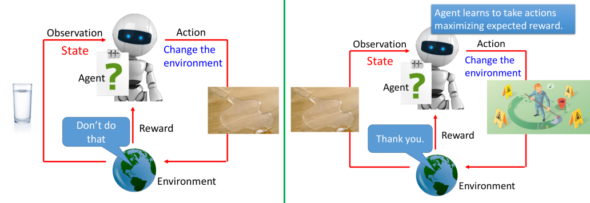
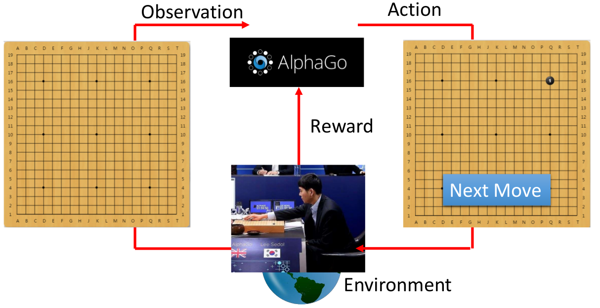
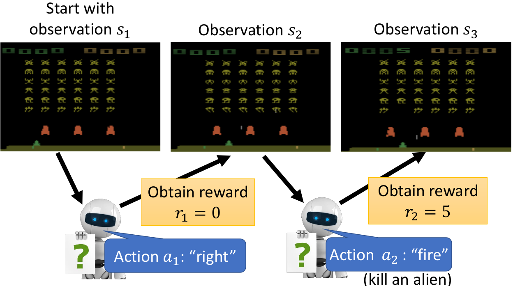
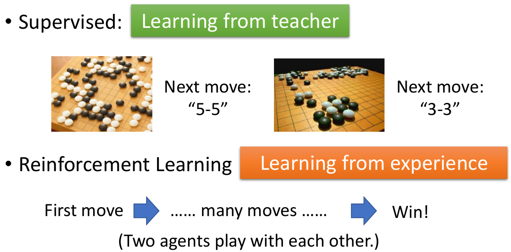

# Introduction of Reinforcement Learning

这一节可以视为对RL的一个概述：

1. RL概念
2. RL v.s. Supervised Learning
3. 后续内容

## 1. RL概念

首先，我们要先知道RL是由下述几个部分构成：

- Agent
- Enviroment

通过Agent和Enviroment之间的互动来"学习"

### ① RL在做什么

（上述左图可以看做第一个状态，上述右图可以看做第二个状态；会有一系列连续的状态）

RL做的事情：

1. Agent通过观察Environment的State，来采取行动；而该行动会使得Environment产生一个反馈(Reward)给Agent。（比如上图Agent看到一杯水，采取打翻的行动，得到了一个negative的Reward；之后看到打翻的水，采取拖地的行动，得到了一个positive的Reward）
2. RL就是希望Agent能学会一系列的行为使得最后的Reward最大

### ② 实例1：AlphaGo

- Agent = AlphaGo
- Enviroment = 对手（比如李世石）
- Enviroment State = 当前棋谱
- Action = Agent采取的落子行为
- Reward = 输赢

即AlphaGo观察当前的棋谱，来产生落子的行为，而对手根据这个行为而改变自身的状态（即对手也进行落子）；之后AlphaGo继续根据新的棋谱来继续产生落子行为，不断进行下去直到输或赢。

> 在下围棋问题里面，Reward比较特殊：大多数情况下Enviroment给Agent的Reward都为0，只有当最后判定输赢的时候Reward才会为1（赢）或-1（输）

### ③ 实例2：Space invader (一种游戏)

- Agent = Agent
- Enviroment = 游戏
- Enviroment State = 当前游戏画面
- Action = Agent采取的左移，右移或开火行为（其实应该还有一个啥也不做的行为）
- Reward = 当前行为的得分情况

Space invader：通过不断左右移动，以及开火来消灭"画面中的怪物"，杀死怪物会有相应的得分。不断进行下去，直到"自己"死了(被怪物发出的子弹打中)或者消灭完全部的怪物。RL希望做的就是能够使得最后得到的分数最高

### ④ 更多例子

1. [Flying Helicopter](https://www.youtube.com/watch?v=0JL04JJjocc)
2. [Driving](https://www.youtube.com/watch?v=0xo1Ldx3L5Q)
3. [Robot](https://www.youtube.com/watch?v=370cT-OAzzM)
4. [Google Cuts Its Giant Electricity Bill With DeepMind-Powered AI](http://www.bloomberg.com/news/articles/2016-07-19/google-cuts-its-giant-electricity-bill-with-deepmind-powered-ai)
5. [Text generation](https://www.youtube.com/watch?v=pbQ4qe8EwLo)
6. [Gym](https://gym.openai.com/)：打游戏
7. [Universe](https://openai.com/blog/universe/)：打游戏

### ⑤ RL的特点（也称难点）

1. Reward delay
   - 一些Action对于当前而言可能没有reward，但会影响未来的Reward（比如AlphaGo里面前面的Action其实都是没有Reward，但会影响最后的输赢；以及Space invader里面的左右移动也没有reward，但能够帮助后续开火获得reward）
2. Agent所采取的action会影响它之后所看到的Enviroment state
   - 希望action具备"探索"的能力，否则很容易陷入有些action在某些状态下永远无法"出现"。（主要在于我们希望考虑的是"长远利益"，有时候当前的行为造成的损失可能会给未来带来更大的"回报"）

## 2. RL v.s. Supervised Learning

下面还是以AlphoGo为例来说明两者的区别：

Supervised：给定一整盘棋的"棋谱"，我们对于每一个"画面"而言，都有对应的下一步该走哪里（相当于每一步都有一个"ground truth"---即最好的一步）。那就照着棋谱的方式来学就好了

- 类似老师一板一眼地教学：带来的后果可能是学生永远无法超过老师。（此外，对于一个"画面"而言，下一步到底走哪里才是最好的，其实并无明确定论！）

RL：我们并没有告诉agent哪一步是好的，哪一步是不好的；我们仅仅有最后的输赢而已。这就给予了agent充分的自由，让他根据成千上万盘棋来自己总结经验

- 类似从经验中学习：可能比较难学起来，但"上限"是很高的，可能能够非常强

> AlphaGo的实现其实是先采用Supervised Learning进行预训练，然后将预训练模型采用Reinforcement learning进一步学习

## 3. 后续内容

后续主要会介绍：

1. Policy-based的方法
2. Value-based的方法

> 需要说明一下：Policy-based的方法一般会比较不稳，比较难训练起来；而Q-Learning（属于Value-based的方法）是比较稳的，更容易训练。
>
> 但Q-Learning比较难处理continues action的问题