# Policy-based Approach (Learning an Actor)

在RL中，常用的方法有Policy-based的方法和Value-based方法（当然现在都是这两者结合）。这一部分先介绍Policy-based的方法

## 1. 预备知识

在进入下述内容之前，我们站在"函数"的角度来看下RL有哪几部分组成：

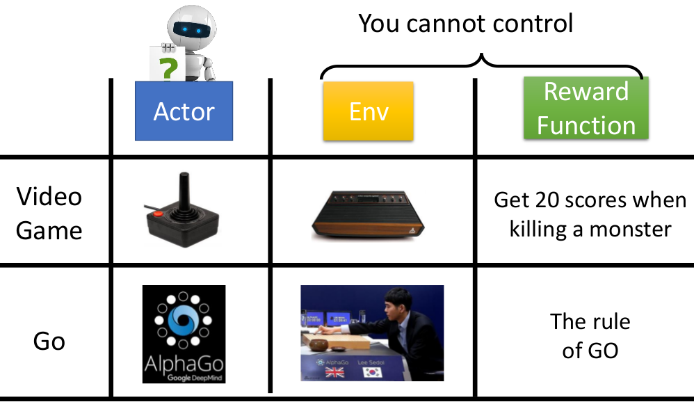

- Actor：可以视为Agent看到Environment后采取行动的函数（而这个函数往往由我们来"定义"）
- Env：环境变化的函数（例如围棋里面对手的落子，游戏里面小怪发射子弹等等），这部分往往是我们无法干预的（比如游戏里面的小怪的行为可能根据一些随机法则来发射子弹，这是由游戏开发商设计的）
- Reward Function：奖励制度，这个也是我们无法干预的，这一套奖励制度往往是预先设定好了的

**三者的关系如下所示：**

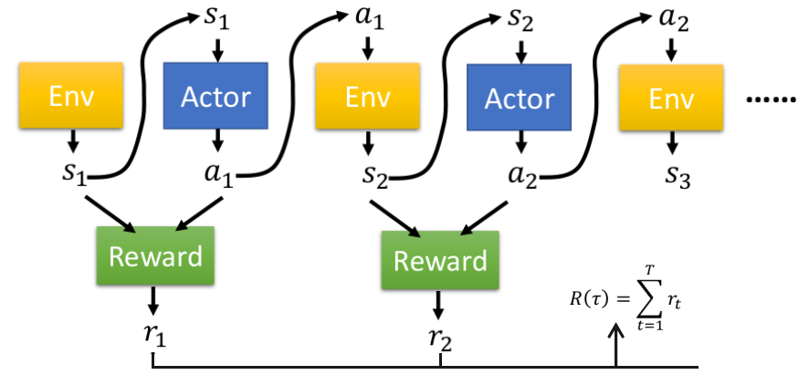

我们以单轮游戏为例来解释上图，我们假设这轮游戏过程为$\tau =\{s_1,a_1,s_2,a_2,...,s_T,a_T\}$(其中$s_k$为当前环境的状态，$a_k$为当前Actor的行为)，令$p_\theta(a_k|s_k)$为Actor看到环境状态为$s_k$时，采取行为$a_k$的几率；$p(s_k|s_{k-1},a_{k-1})$代表当前一个环境状态为$s_{k-1}$，前一个行为为$a_{k-1}$时，下一个环境状态变为$s_k$的几率。那么我们就可以计算出"单轮游戏"出现上述游戏过程的概率：

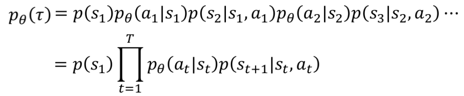

> 这里基于两个假设：① Agent采取的行动只与当前环境状态(比如当前游戏画面)有关  ② 环境状态只受前一个环境状态和前一个Agent的行为影响（但在真实实现时，往往采用前几个环境状态来获得action）

而关于右下角的Reward：$R(\tau)=\sum r_t$其实就是这一轮游戏获得的分数

> 其中环境状态的改变函数：$p(s_k|s_{k-1},a_{k-1})$以及奖励函数都不是我们能够定义的，我们唯一能做的就是改变$p_\theta$使得尽可能让$R(\tau)$大的游戏情况出现的概率更大

## 2. Policy Gradient

其实，整个Policy-based方法的流程其实和DL的三部曲是类似的，也可以划分为下述三个过程：

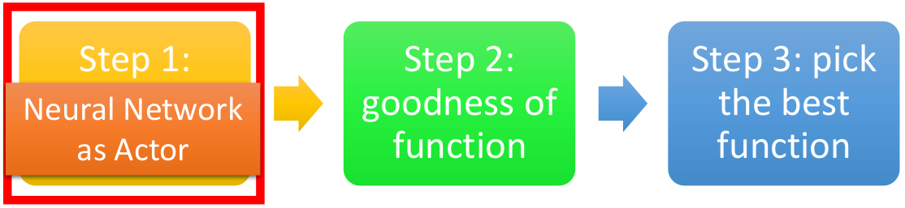

下述主要以打游戏为例来进行说明

### ① Step 1：Neural Netwok as Actor

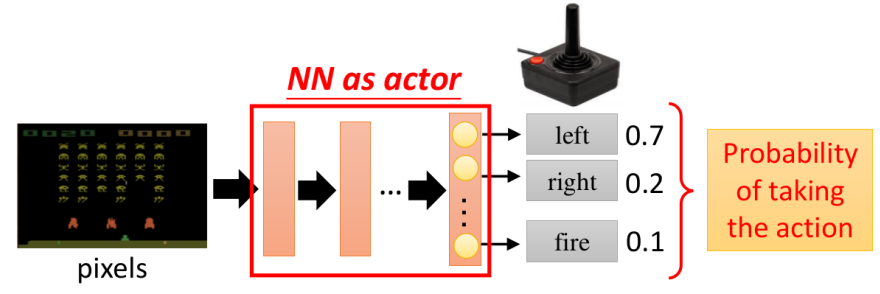

- NN的输入：Agent观察到的Environment的State（如游戏中的当前画面）
- NN的输出：Agent采取的Action（如游戏中的左右移动和开火）
- 此处的Actor也称为Policy：$action=Actor(state)$（也写作：$\pi_\theta(s)$）（可以直接理解为行动函数）

> 注：
>
> 1. 大部分情况下产生action的方式：采用NN的输出作为概率分布，根据分布来产生action；当然也可以采用argmax的方式（但一般概率分布的方式更佳）
> 2. 此处对应$p_\theta(a_k|s_k)$

### ② Step 2：goodness of function

假设给定Actor的参数情况，即$\pi_{\theta}(s)$，则采用该Actor"玩游戏"就存在下述情况(正如预备知识所描述的)：

对于Actor完成"一轮游戏"时，会产生一系列的Reward $r_t$，这些Reward的总和即为此轮游戏的Reward $R(\tau)$。但是由于游戏本身画面的随机性（就例如"怪物"何时放子弹等等都可能是随机的）以及我们采取的Action往往也是以概率的形式产生的。所以采用"多轮游戏"的平均更符合。所以针对某个固定的Actor：$\pi_\theta(s)$，它的Reward定义为Expected Reward，如下所示：

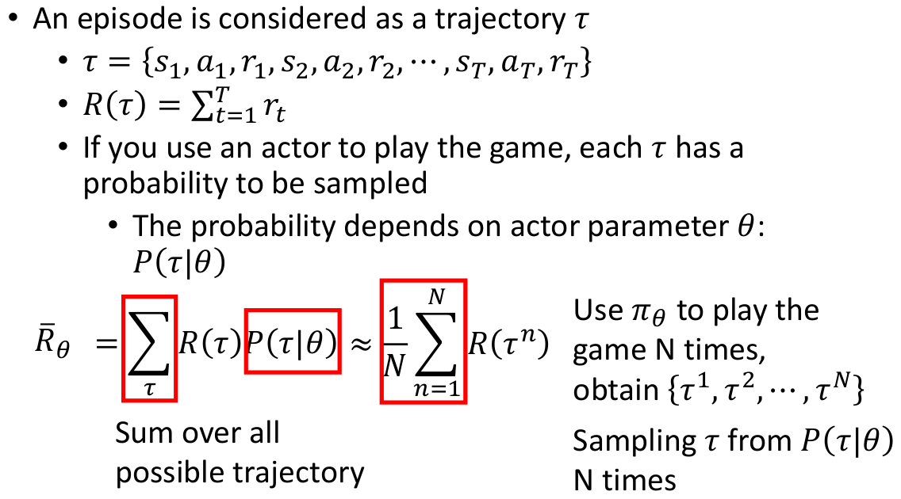

> 其中的$P(\tau|\theta)$其实就是预备知识里面介绍的$P_\theta(\tau)$

讲了这么多，其实就是想表达衡量好坏，即goodness的标准就是$\bar{R}_\theta=\frac{1}{N}\sum_{n=1}^N R(\tau ^n)$

### ③ Step3：pick the best function

已经知道了step2里面的优化目标函数，那么更新参数就直接采用Gradient Ascend就好了（因为我们要最大化Expected Reward），大概念上来看就如下所示：

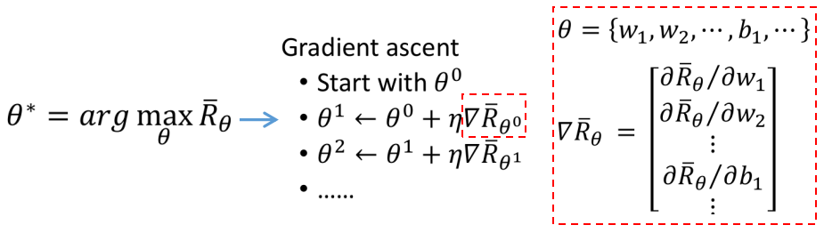

下面逐步"拆解"来分析如何求解

I. 到底如何求解$\nabla \bar{R}_{\theta}$：

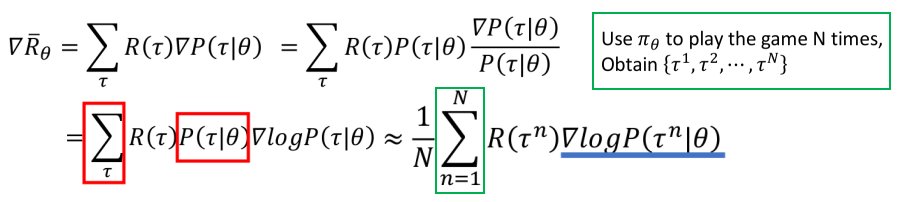

> 其中一个很重要的点：求解$\nabla \bar{R}_{\theta}$并不需要$R(\tau)$可导，甚至只知道$R(\tau)$这个值就够了（到底是如何来的，都可以不管）

所以我们只需关注$\nabla logP(\tau|\theta)$

II. 进一步来求$\nabla logP(\tau|\theta)$：

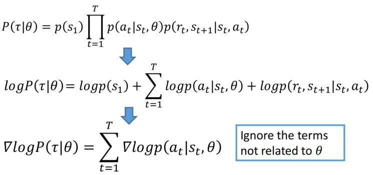

III. 将II的结果代入表达式I中可得：

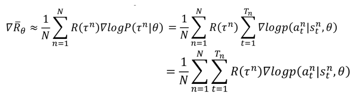

> 其中$N$代表总共进行N轮游戏，$T_n$代表第n轮游戏"进行的总回合数"

针对这个式子，主要可以从下面几个方面从直观上理解（其实数学推过来的就已经很合理了，下述只是从直观上给出一种解释）：

① 当我们在某一轮游戏$\tau^n$中，看到状态$s_t^n$，并采取$a_t^n$的行动后，最后这一轮游戏得到好的结果；那么我们会希望调整参数使得出现$p(a_t^n|s_t^n)$的概率变大。反过来的话，就希望概率变小

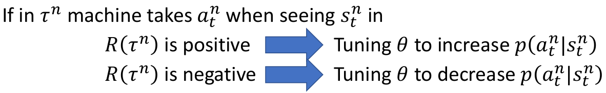

② 需注意的是，我们的Reward都是某一轮游戏结束后的Reward $R(\tau^n)$，而不是"每一回合"对应的reward：如果我们不是考虑整轮的Reward，而是$R(\tau^n_t)$，就会导致只会采取"开火"这一行为（因为只有这一行为才有Reward）

③ 采用$\nabla log p(a_t^n|s_t^n,\theta)=\frac{\nabla p}{p}$而不是直接$\nabla p$的好处（其实都是数学推过来的，但直观上的一种说明）：可以视为一种normalization，因为可以避免因为出现次数多而占据主要影响。（比如进行很多轮游戏，都出现了同一个state，采取行动a对应的最终Reward=2，采取行动b对应的最终Reward=1，但是采取行动b在这么多轮游戏中出现次数远多于a，那么"不normalize的优化过程"会偏向于采取行动b，而明明行动a更好）

### 具体实现

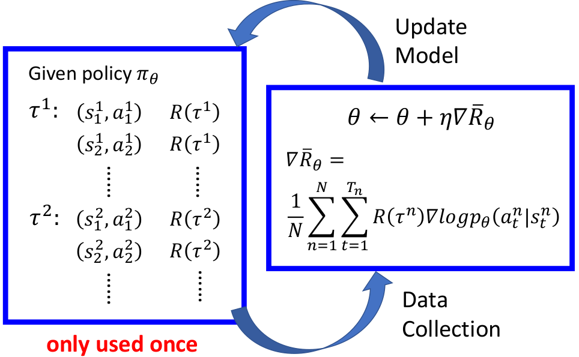

> 每次更新模型后，都需要重新去"玩游戏"来产生新的Data

## 3. 一些小技巧

### ① 技巧1：Add a Baseline

> 主要解决Reward均为正的情况

**问题：**

假设Reward全为正的场景（比如打游戏时候的score），此时的情况如下所示：

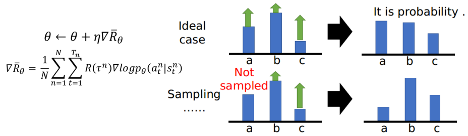

- 右边图假设只有三种Action，代表看到state时产生某种action的概率。即$P_\theta(a_t^n|s_t^n)$
- 绿色箭头可以视为对应的最终的Reward：$R(\tau^n)$
- 我们可以看到，理想情况---我们会根据最终的Reward来调整看到某个state产生不同Action出现的概率，并没有什么问题（大的Reward会使得出现这种Action的几率增加）；但是实际上，我们是采用Sampling的方式来进行多次游戏，这就可能使得看到某个state时，某种Action或许压根就没有出现，那就会"默认"认为这种Action的Reward就是很烂的！这显然与"初衷不符"（可以想成：不是我不够好，而是你压根就没选中我！）

**解决方案：**加一个Baseline，使得Reward有正有负

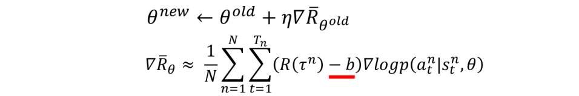

> 至于说b怎么选，这个也算一个超参数啦；一种简单的方式$b=E[R(\tau)]$

### ② 技巧2：Assign Suitable Credit 

**问题：**

从$\nabla \bar{R}_\theta$的式子我们不难看出，对于同一轮游戏，我们都采用相同的权值进行参数更新（即都采用$R(\tau^n)-b$），这就相当于"默认"了下述两个情况：

1. 认为Reward高的一轮游戏中，所有的Action都是好的
2. 认为Reward低的一轮游戏中，所有的Action都是差的

可事实真的是这样吗？其实并不是的，比如下述情况（姑且假设每一轮游戏都很短，都只进行3个操作）：

 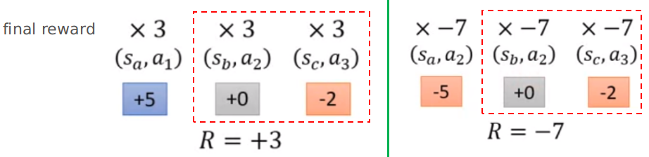

- 左边是"好的"情况，右边是"坏的"情况：可是它们第二三次的状态和行为明明是一样的。可是在这两轮中我们却一次认为好，一次认为坏！

> 当然，如果sampling非常多，问题往往不大，因为可以囊括所有情况

**解决方法：**某个"时间"对应的Reward只与从该时间到游戏结束的Reward，而与他之前的时间没有关系（其实也蛮合理的：因为某个"时间"之前的情况是不受到该时间行为的影响呀！），那么上述情况的Reward就变成下面情况：

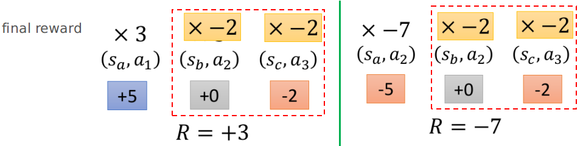

对应的表达式也就变为：

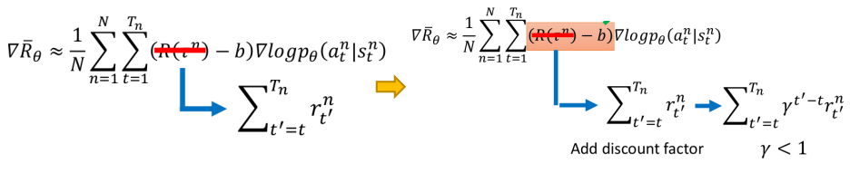

> 注：右边情况相当于加了一个"时间的衰减系数"（离现在越远的时间，影响越小）

当然了，此处的$R(\tau^n)-b$也可以进一步改为其他的形式，称之为Advantage Function：$A^{\theta}(s_t,a_t)$（这部分后续小节会介绍到）