# Proximal Policy Optimization (PPO)

这一部分还是Policy-based的方法。在上一节中主要介绍了Policy Gradient的方法，而这一节在那基础上进一步延伸，来学习PPO，主要分为下述两部分：

1. On-policy v.s. Off-policy
2. Add constraint

## 1. On-policy v.s. Off-policy

首先先给出两者的定义：

- On-policy：The agent learned and the agent interacting with the environment is the same（同一个Agent一边在与环境互动，一边在学习）
- Off-policy：The agent learned and the agent interacting with the enviroment is different（Agent通过看别来玩来学习）

> 在[上一节](./ch8_2.md)我们介绍的方法都是On-policy的

### ① On-policy存在的问题

在[上一节](./ch8_2.md)中，更新参数采用下述的梯度：

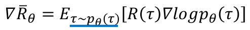

正如当时所说的：每次采用$\tau_\theta$收集一堆样本，然后更新$\theta$，然后再用新的$\tau_\theta$收集新的样本，不断进行下去。**这就使得On-policy的方法训练时很大一部分时间花在sampling data上面！！！**

我们所希望的：利用$\tau_{\theta^{'}}$来产生一堆样本。然后固定住$\theta^{'}$，重复使用这堆样本来更新$\theta$（即Off-policy的方式）

在引入这个方法之前，先介绍一个技术：Importance Sampling

### ② Importance Sampling

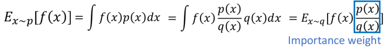

- 我们利用$q$产生的样本来"代替"$p$的分布（假设我们只有$q$产生的样本时，这种方式尤其"好用"）

**存在的问题：**两者的variance并不一样！如下所示：

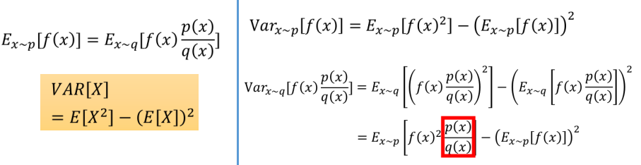

> 上面最下面采用了"变量替换"，将$(f(x)\frac{p(x)}{q(x)})^2=(f(x)^2\frac{p(x)}{q(x)})\frac{p(x)}{q(x)}=g(x)\frac{p(x)}{q(x)}$

我们可以发现两者的variance的区别在于"红色框框"那一部分：这就需要我们对$q(x)$加以限制了，我们需要$q(x)$与$p(x)$比较相似，否则我们需要的样本数量就会非常庞大（如下例子所示）

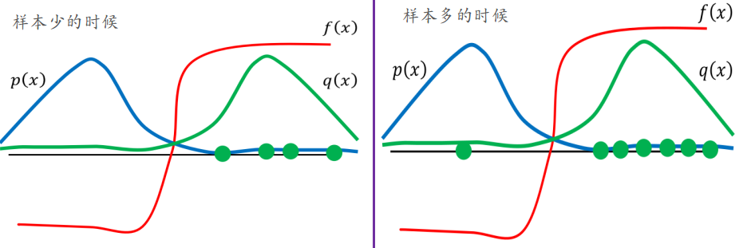

- 原本$E_{x\sim p}[f(x)]$应该是一个负值，但如果$q(x)$和$p(x)$差别较大的时候：① 样本少---$E_{x\sim q}[f(x)p(x)/q(x)]$可以发现为正值！！！  ② 样本多时，才能够负值

下面我们将Importance Sampling的技术引入到On-Policy中，从而到处Off-Policy方法

### ③ On-Policy方式

将Importance Sampling方式引入Off-Policy，我们可以将梯度更新部分修改为下述情况：

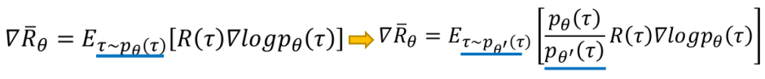

- 此时我们就可以从$\theta^{'}$来产生样本，并且利用产生的样本，来多次更新$\theta$

对上述过程再进一步细化，可以得到：

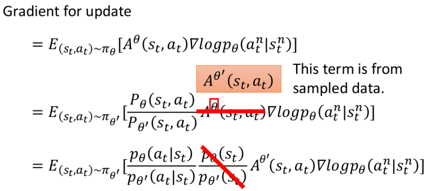

> 此处关于为什么$p_\theta(s_t)/p_{\theta^{'}}$能够消去：一方面是由于state的状态往往是由系统自己内部的规则决定的，而采取什么action并不会对state有太大影响（这其实主要是在游戏中，但类似AlphaGO似乎就解释不通）；另一方面是我们并不会求$p_\theta(s_t)$（这才是最主要的原因:cry:）

根据上面的梯度，我们很容易"反推"出现在的"能量函数"（或者称优化目标）长什么样：

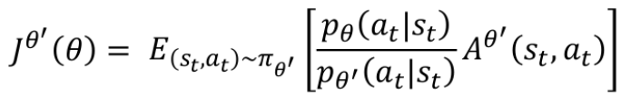

但现在还存在的问题：

1. 如何保证$p_\theta$和$p_{\theta^{'}}$始终保持差别不太大

这就是下面要介绍的。

## 2. Add Constraint

其实就是加一个"约束"，使得$p_\theta$和$p_{\theta^{'}}$差别不要太大。（只是采用不同的方式达到同样的目的）

### ① PPO v1

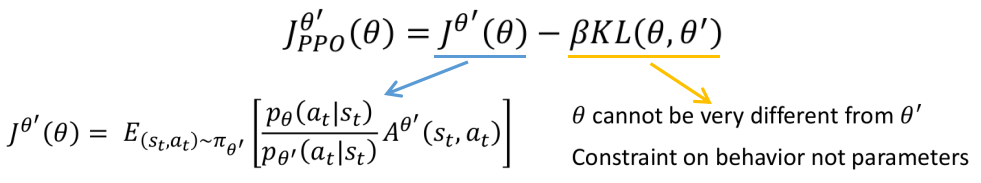

> 这边KL divergence衡量的不是$\theta$越$\theta^{’}$之间距离上的差异！而是"行为"上的差异

整个PPO的算法流程：

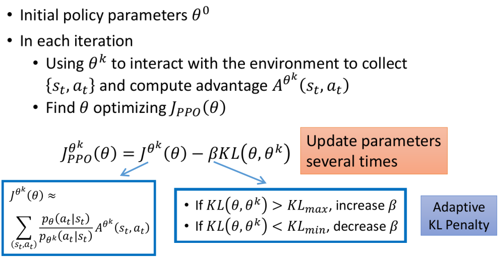

> 其中的$\beta$也是个超参数，往往采用右下角的方式进行更新

### ② PPO v2

其思想和PPO v1其实是基本类似的，只是在实现方式上有所区别，其对应的优化目标函数如下所示：

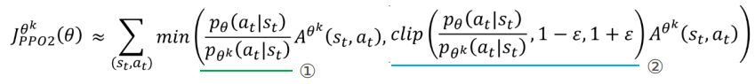

> 通过上述方式来达到类似KL的效果

下面我们来看看这个目标函数是如何使得$p_\theta$和$p_{\theta^{'}}$相近的：

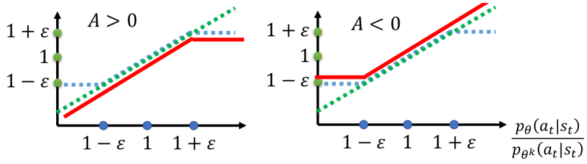

- 上图中的绿线对应①，蓝线对应②。而红线是min(①, ②)的情况（只考虑A的正负情况下）
- 左图：当$A>0$时，我们会更新$\theta$使$p_\theta$朝着更大的方向走，但从图中可见，当其大到一定程度时，我们就不允许它再变大了！
- 右图：当$A<0$时，我们会更新$\theta$使$p_\theta$朝着更小的方向走，但从图中可见，当其小到一定程度时，我们就不允许它再变小了！
- 这就使得$p_\theta$与$p_{\theta^{'}}$之间的差距始终无法太大或太小！

> PPO v2的具体算法和PPO v1是类似的，就不重复了。

