# Q-Learning (1)

这一部分进入Value-based的方法，主要分为下述三个部分来介绍：

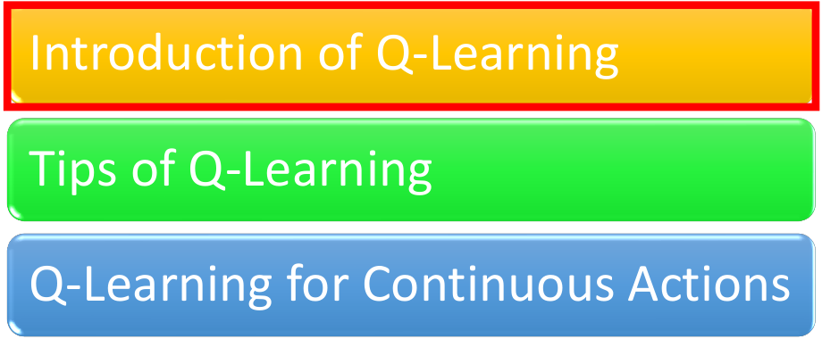

这一部分主要介绍Introduction of Q-Learning

## 1. Critic介绍

关于Value-based的方法，我们需要一个Critic来评价Actor的好坏，关于Critic的定义（或称之为说明）如下：

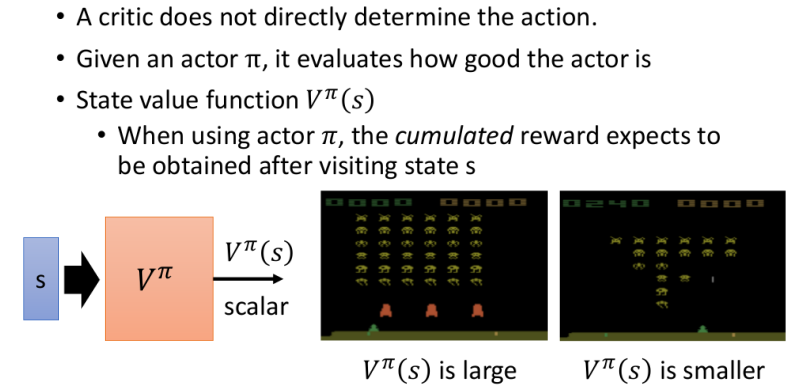

  1. state value function（其实就是Critic）：相当于给定一个画面的state，从这个state一直走到最后获得的Expected Reward（比如右边的图，第一幅对应的state value更高---因为"当前小怪更多，更易拿分，且障碍物保护也还在"，而第二幅对应的state value就小）--- 这个function往往就是Neural network
  2. 每一个critic其实都是"绑"一个Actor的，它并不是凭空衡量一个Actor的好坏；即一个Critic的输出其实也是取决于Actor $\pi$的

## 2. 如何衡量Ctiric $V^\pi(s)$  

主要有两种方法：

**I. Mento-Carlo (MC) based的方法**：让Critic看Actor $\pi$打游戏

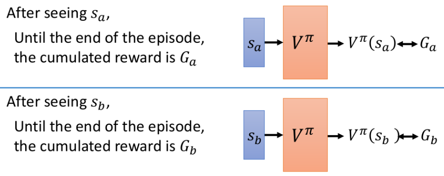

- 相当于不断看各种不同的画面 (state)，从而获得各种画面对应的Reward；之后的训练其实就是一个Regression的问题了
- 每次都是玩完**整轮(episode)**游戏才获得一个cumulated reward $G_k$，且我们往往无法捕获所有的游戏画面(这就只能靠NN的泛化能力了)

**II.  Temporal-difference (TD) 的方法**

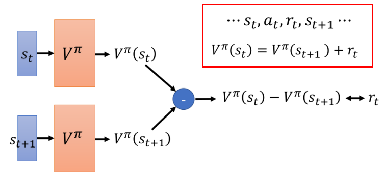

- TD相当于将求解的问题"转换"了一下（求"变化"）：这样带来的好处就是，我们其实无需玩完整轮游戏才能计算才去与V进行比较。（尤其是在那些一轮游戏特别长的情况下）

#### **MC v.s. TD**

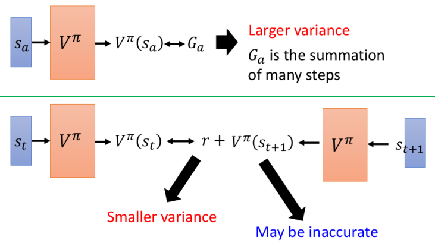

- MC存在的问题：由于我们从State $S_a$开始，到之后经历一系列的其他状态$S_k$直到游戏结束我们才能获得$G_a$，而每一个状态以及Reward都有一定的随机性；这就会导致最终获得的$G_a$的variance会非常的大 --- 因为$G_a=r_a+r_{a+1}+...r_{k}+...r_{end}$，而其中假设每个$var[r_k]=var[r]$，那么$var[G_a]=var[kr]=k^2var[r]$
- TD存在的问题：虽然r的variance不大，但是我们并不能保证critic $V^\pi$估的准，这样$V^\pi(s_{t+1})$的误差会带给$V^\pi(s_{t})$

> TD的方法比较常见，而MC较少用

**反映两者区别的一个例子：**

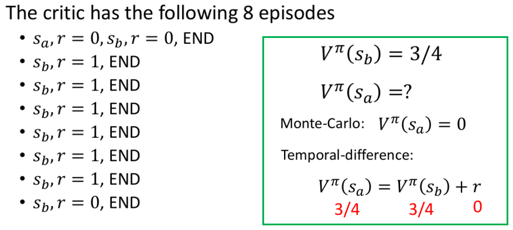

- 我们可以发现一个很"奇怪"的现象，完全一样的8轮游戏，采用MC方法和TD方法求得的$V^\pi(s_a)$既然不同！
- 那到底哪一个才是对的呢？其实两者都是对的，只是两者考虑的角度可能略有不同。游戏$s_a,r=0,s_b,r=0$的情况其实有两者角度：① 是由于$s_a$的影响，才使得$s_b$最后的reward=0 ② $s_b$获得的reward=0可能完全是一种偶然现象（即本身就有这种概率）

## 3. Another Critic：$Q^\pi(s, a)$

其实更常用的一个Critic，是State-action value function（一般也称为Q-value）：

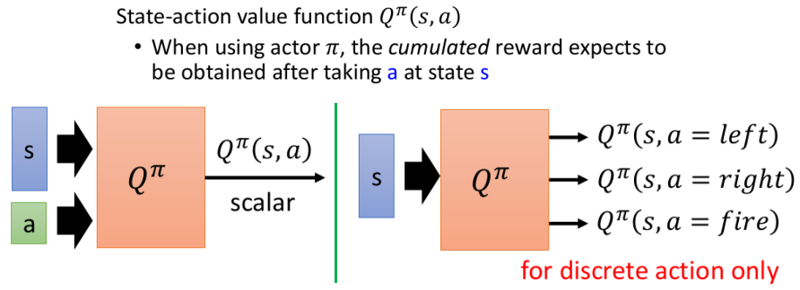

- 上述左右两图只是Q-value的两种不同的表示方式（右图更常见，但是只能用在离散的Action上面）
- 还有一个需要注意的是：actor $\pi$在看到state s时未必是采取a这个action，只是我们强制在state s采取a这个action罢了

## 4. 另一种采用这个Critic的方法：称为Q-Learning

### ① Q-Learning

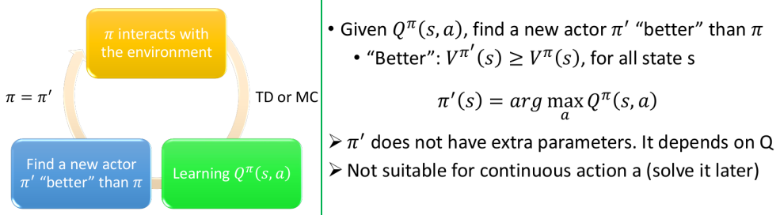

- 虽然我们用Q-function来衡量Actor的好坏，但实际上只要有了这个Q-function，我们就可以来做RL；其整体流程如左图所示
- 因为只要我们学出了一个$Q^\pi(s,a)$，我们总是能够找到一个更好的$\pi^{'}$使得，它比$\pi$更好！
- 关于右边式子$\pi^{'}(s)=argmax_aQ^\pi(s,a)$的一个简单解释：因为$\pi$在state s对应的action并不一定为a，因此我们总能从不同的action中找到一个最好的来替换

### ② 证明$\pi^{'}$总是比$\pi$好！

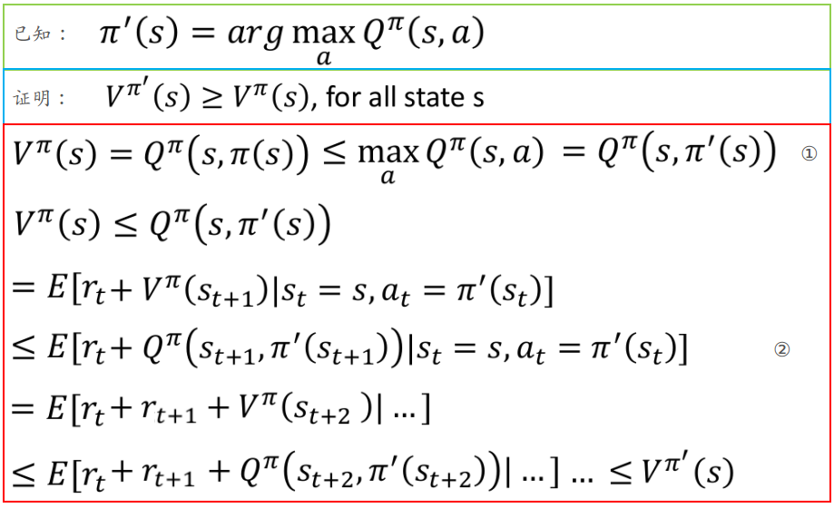

- 其中的②是由①所得：其实整个证明过程很直觉 --- 步步都好，那自然最后就会更好

### ③ 实操技巧1：Target Network

采用TD的方式来训练$Q^\pi$时：

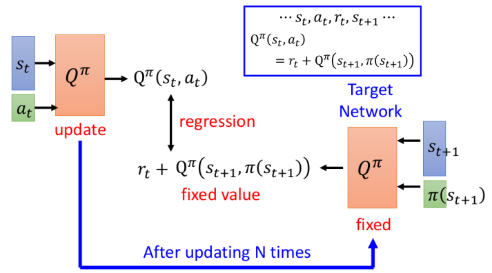

- 如果不将右边的$Q^\pi$固定住，会使得target=$r_t+Q^\pi(s_{t+1},\pi(s_{t+1}))$也是不固定的；一般在求解regression问题时，target不固定往往会使得训练过程非常不稳定。
- 右边固定，左边参数更新N次后，再用左边更新后的Q去替换右边的Q

### ④ 实操技巧2：增加Exploration

如果我们的Q-function在某个state s总是采取某个action a，这就会导致Q总是认定了这个action a，可是或许有更好的action，只是我们没有sample过而言！

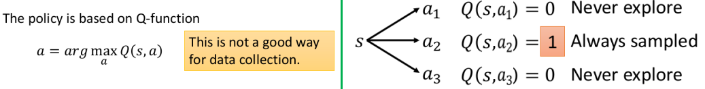

> 因为只有在某个state s，采取过action，才会估计的出$Q(s,a)$，否则就估不出，会当做0来处理

所以我们需要给Q-learning增加Exploration的能力，让他也偶尔去尝试下其他的action，主要的方式有下述两种：

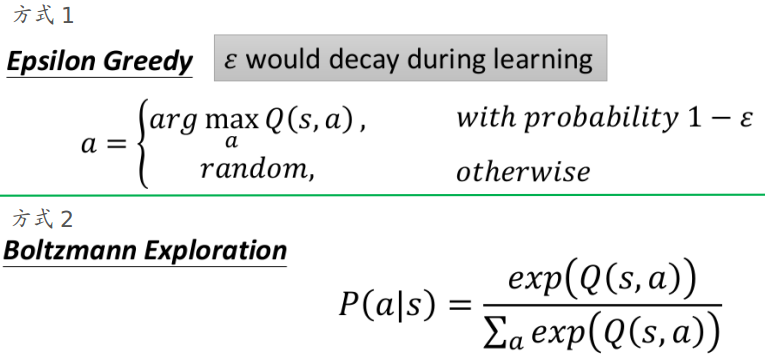

- 第一种方式是给一定的几率使得action采取"随机的行为"（即随机采取所有action中的某一种）
- 第二种方式类似Policy-based方法的方式：以几率的方式来产生action，对应reward大的action对应的概率会更大（此处即使Q=0，也会使得$exp(0)=1$，也是有影响的）

### ⑤ 实操技巧3：Replay Buffer

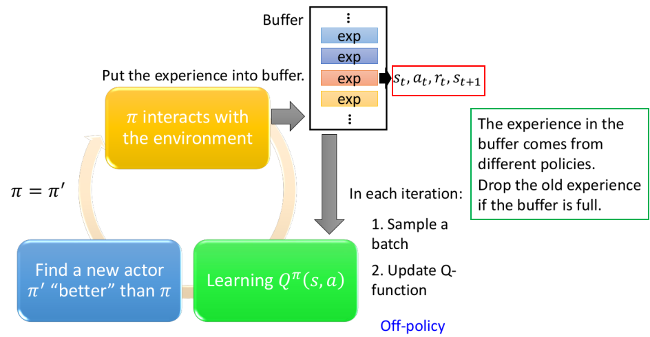

- 即利用一个Buffer来将采样保存起来，然后在更新Q的时候从Buffer中随机取样就好；而每次换到新的Actor $\pi$时，重新生成一些样本，再放到Buffer中，如果Buffer满了，则将最旧的内容去掉一部分

这样做的几点好处：

1. RL训练时最花时间的部分其实在与环境的互动上面，而采用Buffer则能够节约时间（因为允许你可以每次令Actor $\pi$少产生一些样本）
2. 这种方式用来更新$Q^\pi$的样本其实更具"多样性"，这有助于训练（Deep Learning中往往希望batch的样本具有多样性）

其中你可能疑惑的之前不同的Actor产生的样本，比如上面的$exp=s_t,a_t,r_t,s_{t+1}$能用来更新$Q^\pi$吗？明明$Q^\pi$要求的是$\pi$产生的Action，可是你仔细看下基于TD的式子：

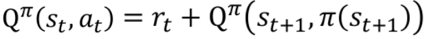

> 其中的$a_t$并不一定是$\pi(s_t)$的行为，以及右边的$r_t,s_{t+1}$也和$\pi$并没有关系

### ⑥ 整个算法流程

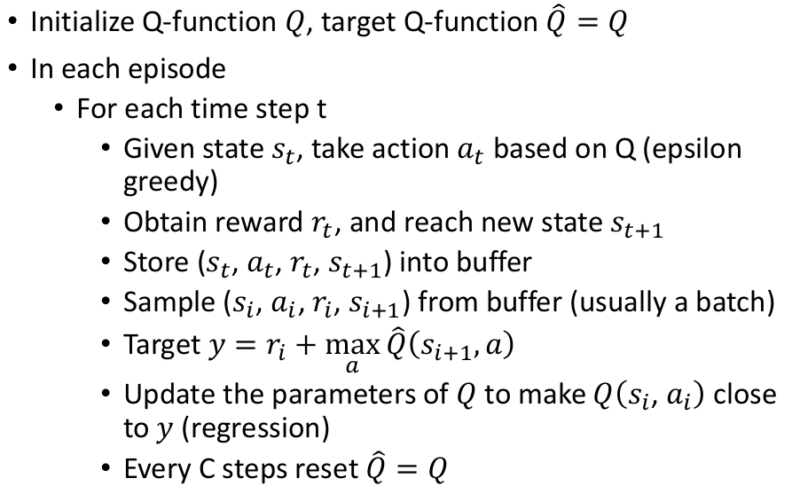

