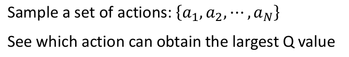

# Q-Learning (2)

这一部分进入Value-based的方法，主要分为下述三个部分来介绍：

这一部分主要介绍Tips of Q-Learning和Q-Learning for Continuous Actions

## 1. Tips of Q-Learning

我们将Q-Learning对应的那个计算Q-value的Network称为DQN（Deep Q-Network），所以这种方法有时也成为DQ的那方法。

### ① 先来看下Q-Learning存在什么问题

Q-value经常被高估，我们可以通过下图来说明：

- 我们不妨假设从$Q(s_{t+1},a_{t+1})$对应的真实情况如左图所示（就当你玩了很多轮游戏后的结果），那么采用TD的方式来更新QN时，采用的是下面的表达式，而我们的QN的估计往往是存在误差的，而这误差会导致我们对Q-value的高估：因为如上图所示，我们总是选择最大的Q-value作为右边$Q(s_{t+1},a)$的结果，这就会导致我们regression的target容易偏大
  

### ② Tips1：Double DQN

做的事情非常简单，只是将右边的$r_t+max_aQ(s_{t+1},a)$修改了下：

利用Target Network来计算右边的Q-value（这也是为什么叫做Double DQN），这样带来的好处如下：

1. 即使$argmax_aQ(s_{t+1},a)$获得的action a对应的Q-value"偏高"了，但这个action并不一定对应$Q^{'}(s_{t+1},a)$的最大value！
2. 加入$Q^{'}$的最大Q-value值是偏高的，但是$Q^{'}$又未必会选到这个action
3. 有点两权分立的感觉

### ③ Tips2：Dueling DQN

- 这个方法其实就是改了DQN的网络结构，原本直接输出$Q(s,a)$，现在是两路之和$Q(s,a)=A(s,a)+V(s)$

至于这么做的好处可以如下图所示：

1. 加入我们获得的$V(s)$和$A(s,a)$的情况如左图所示，那么现在比如我们的$Q(s,a)$想要更新到右边的样子（且我们只看到了$Q(state2,action1)=4,Q(state2,action2)=0$这两种情况），那么如果通过更新$V(s)$的话，我们可以同时更新了$Q(state2,action3)=-1$这种情况（也就是通过改变$V(s)$，我们可以影响这个state的所有action --- 即使有些action在sample中并没有出现）；而如果只有$A(s,a)$这个矩阵，没有出现的action我们往往就会更新不到

但现在存在的一个问题就是：$V(s)$真的会做到如我们"赋予"它的使命吗？会不会倒是训练的时候$V(s)$倾向于全为0？

- 理论上，确实会出现$V(s)$"名不符实"，这就需要我们来施加一些约束来"提高"$V(s)$的地位。一种简单的方式：令$A(s,a)$的每一列的和为0，且$V(s)$为$Q(s,a)$在状态$s$全部$a$的平均 --- 这样的话，network更倾向于会去改变$V(s)$（主要是因为$Q$的改变在$V$上"更容易体现出来"）

### ④ Tips3：Prioritized Reply 

- 在Sample的时候并不是采取简单的uniform sample，而是不同样本被采用的概率不同（一般令太久前的取样概率较小）

> 注：这个改进也会改掉training phase，待补充

### ⑤ Tips4：Multi-step

- 在MC和TD两种方式的折中：既不是只取"下一阶段"的，也不是取"整轮游戏的"，而是取"N长度的"来计算Q-learning

### ⑥ Tips5：Noisy Net (Exploration)

我们之前介绍的Exploration的方式是在action space上面加noise，如下所示：

但其实有一种更好的方法，是给Q-function加noise（比如Gaussian noise等）：

> 注：只在每一轮游戏开始之前给Q-function加上noise，而在这轮游戏过程中，Q-function是并没有既然加不同noise的（这也是这个方法和Noise on Action等方法的本质不同）

我们来看看这样的方式的好处是什么：

- 其实主要的好处就是两者的Exploration体现的不同：第一种方式是即使是同一种state，由于我们给了action一定的随机性，所以可能会出现不同的action；而第二种方式针对同一种state，其action都是一样的（主要是因为我们采用argmax的方式来产生action，所以是固定的），而它的Exploration机制是体现在不同轮时，采用不同的noise，会使得我们有机会尝试到不同的action

### ⑦ Tips6：Distribution Q-function

引入这种Tip的原因如下图所示：

- 即使是相同的Expects Reward，可能它们的"Reward"分布其实是并不一样的

而为了能更好的刻画真实情况的Reward的概率分布，可以采用这个技巧：

- 我们直接输出Reward的distribution，实际情况可能每个action对应-10~10这么多种Reward，我们将其划分成5个bin，每个bin代表"一段区间"内reward的概率

### 全部技巧合起来 --- Rainbow

- 横坐标可以简单理解为训练迭代次数，纵轴理解为性能
- 左图代表不同"技巧"的性能提升，而rainbow就是所有技巧合起来后的性能！
- 右图代表从rainbow减去不同的技巧后性能的"下降"情况

## 2. Q-Learning for Continuous Actions

Q-Learning在选择Action时采用的方式：

这样的话，如果action是continuous的，就会遇到问题！我们无法穷举所有的$a$（例如无人驾驶的任务中，假设action为方向盘转动的角度，这是个"continuous"的）

下面我们来看看一些"可行"的方法。

### ① Solution1

- 通过采用很多的action，来计算哪一个的Q-value最大，从而选择对应最大value的Action
- 存在的问题：其实就类似"离散化"的方式，这样往往精度一般

### ② Solution2

- 即将action当做一个参数，然后将$argmax_aQ(s,a)$当做优化目标函数，采用梯度上升法求解；
- 存在的问题：1. 是否真的会走到global maximum  2. 大幅增加了运算量（因为这一步也在采用梯度更新的方式）

### ③ Solution3：方式2的另一种实现方式

改变network的架构，使得我们求解的优化目标函数$argmax_aQ(s,a)$变得容易求解：

- 即令$Q(s,a)$类似二次型的形式，而上述表达式$a$的最优解刚好等于$\mu(s)$，这样就很容易求解了
- 此处需注意Matrix $\Sigma(s)$应该是正定的
- 存在的问题：这样会不会限制了解

### ④ Solution4：不用Q-Learning !

将Policy-based的方法和Q-Learning的方法结合起来！

