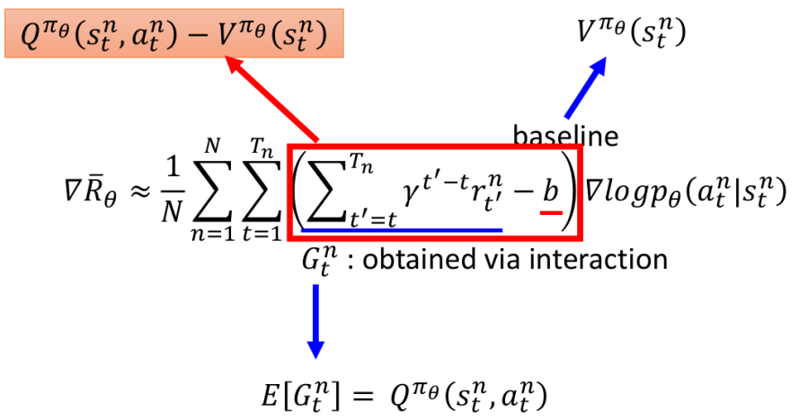

# Actor-Critic

这一节主要来讲Policy-based+Value-based的方法：取各自的精华

## 1. 前提回顾

### ① Policy Gradient

由[Policy-based 1](./ch8_2.md)可知，目标函数的梯度如下所示：

- 令$G_t^n=\sum_{t'=t}^{T_n}\gamma^{t'-t}r_{t'}^n$

Policy Gradient存在的问题：我们的reward---$G_t^n$其实是非常不稳定的（因为与环境互动本身存在非常多的随机性---action的"概率产生"，环境本身自带的随机性等等），这就会导致整个参数更新变得非常不稳定。关于$G$的不稳定可以看下图一个简单图示：

- 我们可以看到从state s和action a，之后的一系列状态和行为都带有一定随机性，导致最后产生的Reward之间的variance非常大。
- 这样我们就在想能不能用G的期望来替换掉G呢？此时就需要借助Value-based的方法（此处用Q-learning）

### ② Q-Learning

由[Q-Learning 1](./ch8_4.md)和[Q-Learning 2](./ch8_5.md)可知，Value-function有下述两种不同形式：

- 其实我们可以看到Q-function输出的恰好是Expected Reward！！！

## 2. Actor-Critic

下面就是将Actor+Critic结合起来～以及一些"进一步改良"

### ① Actor-Critic 

- 其中的Baseline其实有很多种不同的加法，这里采用$b=V^{\pi_\theta}(s_t^n)$：为什么这样是合理的呢？其实我们可以将$V$看成是$Q$对所有action的数学期望！从而使得红框里面的项满足均值为0，有正有负！

### ② Advantage Actor-Critic (A2C)

上面①其实已经能够求解问题了，但是①中需要两个Network（Q-Net和V-Net），这就带来了一个"隐式风险"---一个网络估不准就会使得结果不准以及参数量多。所以我们想要进一步"合二为一"，采用一个网络来解决问题。我们先来看下Q和V的关系，Q和V满足下图左边的关系：

- 请站在"本身含义的角度"去理解上面左边；
- 右边我们只是"强行"这么做了，严格意义而言应该采用"约等于"；（但其实实验上做出来采用这种方式效果最好！）

那么我们①中红框部分就可以替换为下面蓝色部分，这样我们可以只估计一个V-Net了：

### ③ A2C的算法流程

- 先用Actor $\pi$收集一堆资料，然后用这些资料来学出Value-Function $V^\pi$。再用Value-function去更新我们的Actor $\pi$

### ④ 常用的两个Tip

1. 网络参数共用（即Value function $V^\pi(s)$和Actor $\pi(s)$）有部分参数是共享的，如下所示：
   
2. 对Actor $\pi(s)$进行一定的约束：希望输出的各Action的"entropy"不要太小（即各个行为的几率差异不要太大，这有助于Exploration）
   

### ⑤ Asynchronous Advantage Actor-Critic (A3C)

其实A3C相较于A2C增加了"更多个影分身"，使得多个训练能够同时帮助"原来的"更快的训练（总体而言是在效率上更快）：

- 相当于我们对global network复制很多个，分别放到不同的CPU上面去跑（每个上面采用的sample一般不同），而每个跑完就直接更新global network的参数；当然可能会存在Worker2先跑完更新了参数，然后再Worker3跑完，没有关系，直接在Worker2更新后的基础上再更新就好

## 3. Pathwise Derivative Policy Gradient

在Value-base的方法中，我们需要求解$a=argmax_aQ(s,a)$，而这条式子往往是比较难求解的，尤其是在continuous的情况下。那么联想到Actor其实做的是什么呢？$\pi(s)$输出的刚好是Action，能不能通过Actor来帮助我们求解$argmax_aQ(s,a)$的问题，这就是这种方式的核心。其整体思想如下所示：

- 我们用$\pi$来代替求解$argmax$这部分，即固定住$Q^\pi$，我们更新Actor $\pi$的参数，使得$Q^\pi(s,a)$的值尽可能大，这样我们的Actor $\pi$相当于输出了使得$Q^\pi$最大的action（也就相当于求解除了$argmax_aQ^\pi(s,a)$这条式子）
- 这种方式其实和Conditional GAN是完全一样的！其中的Q可以视为Discriminator，而Actor可以视为Generator

我们来对比以下Q-Learning的算法和Pathwise Derivative Policy Gradient的算法：

- 可以发现其实就是将求解$argmax_aQ$的问题转化为用$\pi$来求

> 其实很多时候不同的算法，可以站在不同的角度来看待，比如Pathwise Derivative Policy Gradient：
>
> 1. 如果我们以"Q-Learning"为主，可以看成Actor来帮助求解$argmax_aQ$的问题
> 2. 如果我们以"Policy-Gradient"为主，又可以看成Q-function帮助我们知道在state应该采取什么action更好；如下图所示：
>    