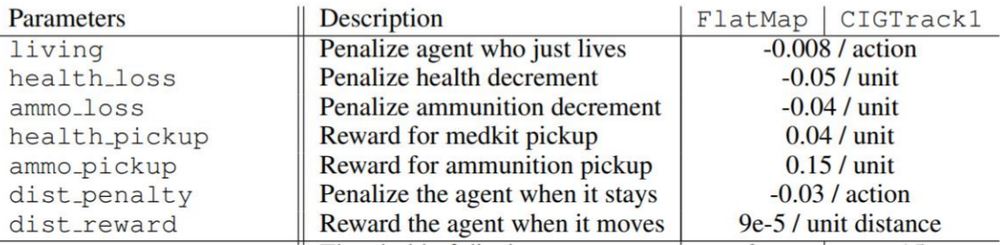
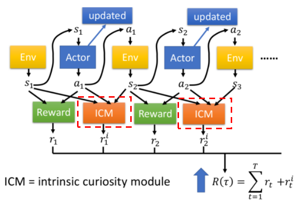
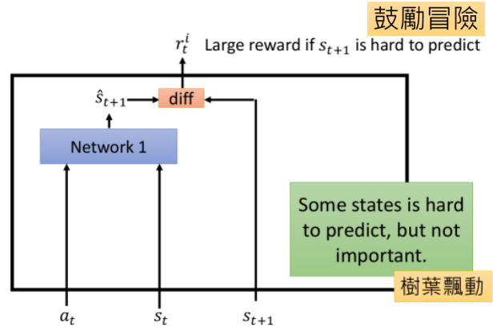
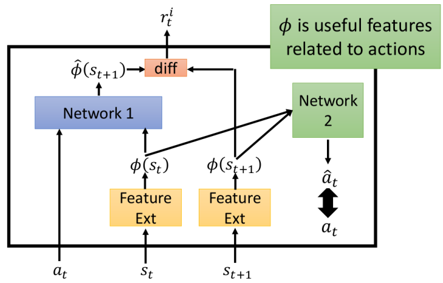
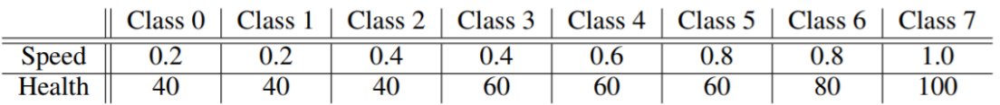
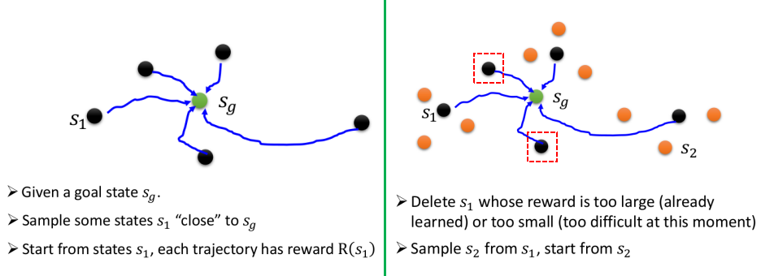
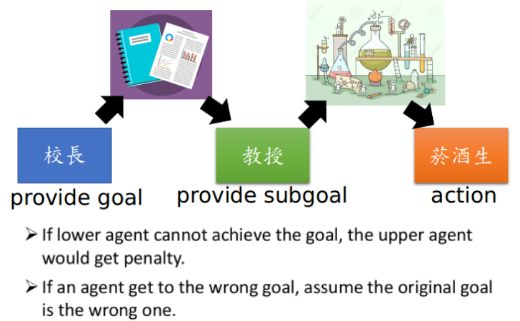
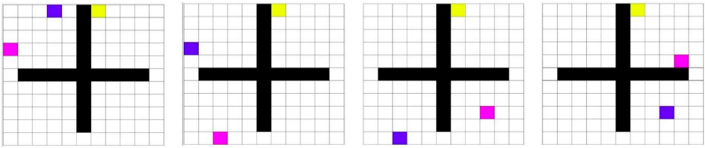

# Sparse Reward

这一节主要介绍在RL中面临Reward是非常稀疏的情况时"可以采取"的方法（未必都有效）：

- Reward Shaping
- Curriculum Learning

> Sparse Reward：是指agent在大多时候并不能从Environment获得Reward，这样的任务是非常困难的。（例如我们希望一个机械手臂将螺钉与螺母弄在一起，只有两者结合在一起的时候才会有reward，这样的话我们很难让机械手臂学会这件事情---因为在大多数时候机械手臂就是在乱走，而真的走到结合在一起的概率几乎为0）

## 1. Reward Shaping

既然本身的Reward这么稀疏，我们能不能人为地增加一些Reward来引导machine（agent）朝着我们希望它做的方向去前进！

### ① 人为新增加一些Reward的规则

[VizDoom](http://vizdoom.cs.put.edu.pl/)游戏：你就理解为生存类型的游戏，到最后活着就是赢了，死了就是输了（所有真正的Reward其实只有到最后的输赢），但我们可以增加一些规则来使得agent朝着"奋勇杀敌，努力存活"的方向设定：

- 上述"奖罚机制"是我们人为加进去的。

### ② 加入Curiosity机制

- 上述图中的ICM就是新增的"好奇心模块"：这个ICM模板也可以理解为人为增加的Reward机制
- 我们希望ICM模板我们希望起到的作用：鼓励冒险，希望agent可以采取一些行动改变state，使得新的state变得不同

**ICM模块 I：**

- 如果$s_{t+1}$我们越难"预料"，即与$\hat{s}_{t+1}=network(a_t,s_t)$的差异越大，给的奖励越大（即希望action能够改变环境状态到一些少见的环境状态上面去"瞧瞧" --- 好奇心） 
- 此处的$network 1$是预先训练好的，在整个Actor-Critic模块更新的时候，这部分是固定住的！（这也是为什么用network1来"衡量"差异性了---不然的话我们肯定觉得$a_t,s_t$后面是$s_{t+1}$是理所当然的，应该diff很小才对---这里采用的是训练好的结果，所以理论上$a_t,s_t$后面会出什么状态已经"记在"network1里面了，而与现在的$s_{t+1}$无关）
- 该模型存在的一个问题：难以被预测的状态并不一定是重要的状态！

**ICM模块 II --- 对I的改进**

- 此处加入了Feature Ext部分，我们希望该模块能够"抽离出"环境中重要的"信息"，而一些无关紧要的信息能够过滤掉（这也就能避免ICM I中存在的问题）
- 而如何让Feature Ext具备这种能力就是Network 2的工作了：我们希望从$s_{t}$和$s_{t+1}$抽离的信息中能够"知道"对应的action是$a_t$，所以就如上面右边所示。（当然Network 2也应该要预先训练好，然后在该模块运用到RL的时候就没Network 2什么事情了）

## 2. Curriculum Learning

简单的说：就是我们人为地为agent设计处理任务的优先级---从易到难（比如学数学先从乘法表开始）

比如VizDoom游戏：

- 此处假定敌人的强弱用Speed和Health来衡量（速度越快，血越多的敌人越强）
- 一开始训练的时候，让敌人弱一点，然后再慢慢地让敌人逐渐变强。（其实就相当于先让agent拿菜鸟先练级，练够了再去挑战更强的敌人；不断地下去）

这种方式带来的问题就是我们需要当老师来人为地帮machine设计合理的课程。

下面介绍一种"通用的"规划处理任务的方法：Reverse Curriculum Generation

- 从最终希望最好的状态$s_g$出发，找一些离他比较近（这样就比较容易达到$s_g$）的点（如$s_1$）进行学习；学完后再进一步从这些点出发到另一些稍微难一点的点再学习（但这一步需注意的是，我们会剔除上一步一些比较"没有价值的点"（如右图中的红色框框点））；不断进行下去

## 3. Hierarchical Reinforcement Learning

相当于有多个不同"层级"的agent，上层的有agent指定"愿景"，下层的agent去达到这个"愿景"。

- 比如上一级的agent（校长）的愿景是发多少文章，而下一级的agent（教授）给再下一级的愿景是做实验。
- 但这里有一个与"现实"不一致的地方，如果下层的agent并没有完成上级的"任务"（愿景），那么就强行把上级的"愿景"给改了！！！

一个更具体的例子：

- 黄色代表最后的目标，粉色可以理解为上层agent，紫色代表下层agent；粉色希望紫色下一次能够走到它所在的位置