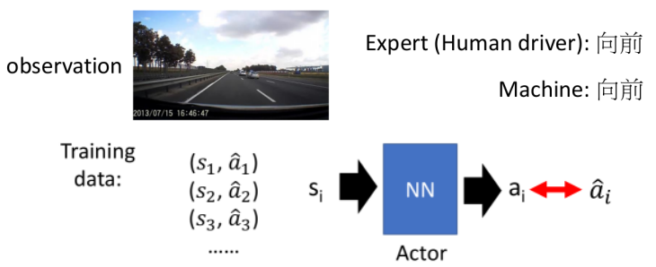
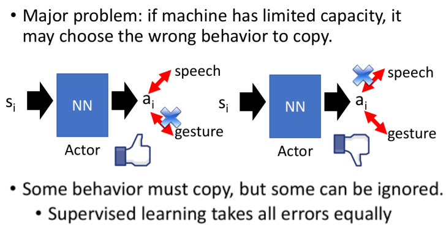
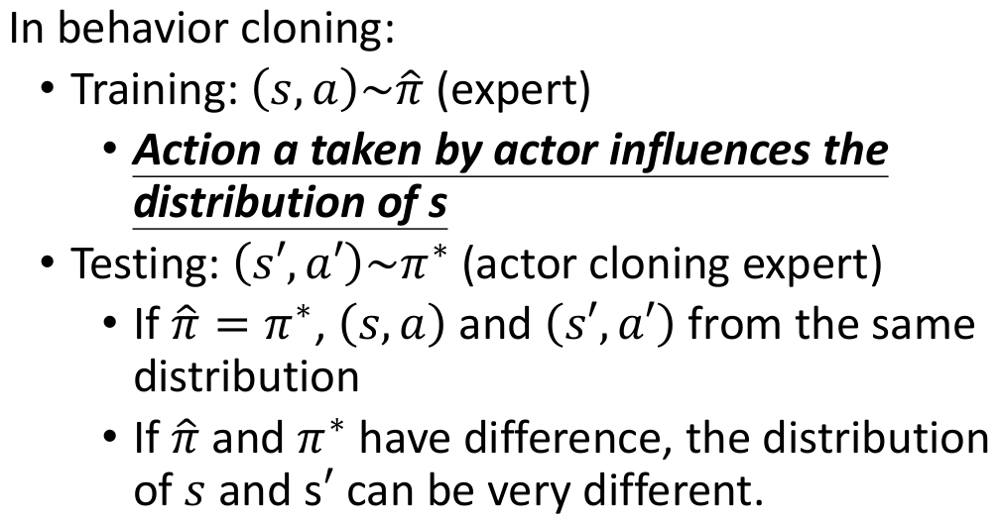
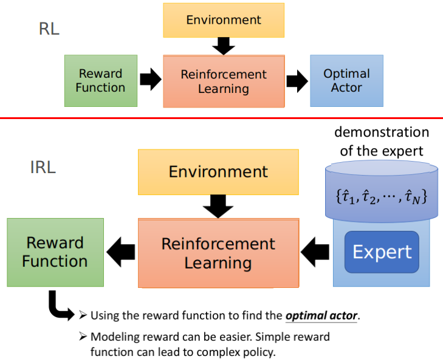
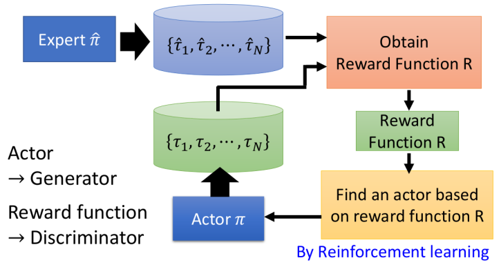
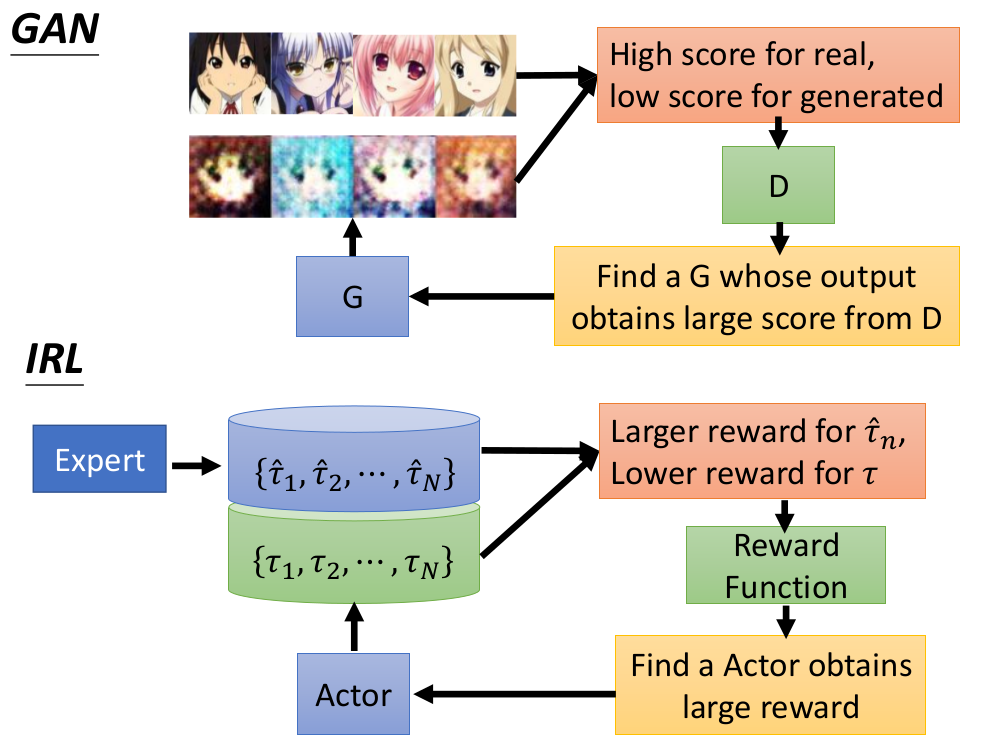

# Imitation Learning

这一节主要介绍Imitation Learning（模仿学习），同样也称为Learning by demonstration或者apprenticeship Learning。

## 1. 概述

首先我们先来说明下什么情况下可以考虑Imitation Learning：

1. 我们的agent可以与环境互动，但是我们无法显性的获得一些Reward（主要是因为有些任务我们很难定义所谓的Reward）
2. 虽然我们无法定义Reward，但是我们可以收集一系列的范例（比如专家在某个Environment的state时是怎么做的）。然后通过模仿这些范例来学

> 这种反而是现实中更常见的情况；

这类问题主要的方法有两种：

1. Behavior Cloning
2. Inverse Reinforcement Learning（Inverse optimal control）（更佳！）

## 2. Behavior Cloning

以自动驾驶为例，比如我们看到一个场景时会采取什么行动呢？可以通过"模仿"专家在这些场景会采取的行动（即采用Supervised Learning的方式进行学习）

这样的方法存在下述两个问题：

1. 有些情况在样本中没有出现过（即专家也没碰到过的场景）
2. machine只会无脑的copy，可本身能力有限，可能只copy无关的东西，反而没copy有用的东西

### ① Problem 1

> 有些情况在样本中没有出现过（即专家也没碰到过的场景）

解决的方法：dataset aggregation！

我们不干涉agent的行为，但是agent每到达新的环境状态state，都让专家去"人为"地打上标签（给出专家人为该怎么走---但并不直接让agent改变行为，用做以后学习的数据）之后再用新的数据集去训练agent，在反复进行下去

### ② Problem 2

> machine只会无脑的copy，可本身能力有限，可能只copy无关的东西，反而没copy有用的东西

- 比如上面图片的例子：学讲话，其实speech是重要的，而gesture(人做的姿势)并不是重要的。但是machine可能copy了gesture，反而忽略了speech

此外training data和testing data的不一致性也会带来问题：

1. 在supervised learning中，往往假设training data和testing data具有相同的分布；但这个假设在RL里面并不是很恰当
2. 在Behavior cloning里面存在下述问题：
   

## 3. Inverse Reinforcement Learning 

我们可以先来对比下RL与IRL的差异：

- RL：通过Reward Function+Environment来获得当前state最佳的Actor
- IRL：通过Expert的行为以及Environmetn来反推Reward Function（然后再用这个Reward Function代入RL来学习Actor）

### IRL整体框架

- 我们希望$\sum_{n=1}^NR(\tau)$能够不断逼近$\sum_{n=1}^N R(\hat{\tau}_n)$。（因为我们假设专家的行为是最好的）
- 虽然R是不断变化的，所以$\sum_{n=1}^N R(\hat{\tau}_n)$也会变化，但我们希望整体的Reward是不断增大的（假设绿色的R能够使$\sum_{n=1}^N R(\hat{\tau}_n)$很大了，但是我们会修改红色的R，使得$\sum_{n=1}^NR(\tau)>\sum_{n=1}^N R(\hat{\tau}_n)$依旧成立）
- 其实IRL和GAN从思想而言是类似的

### GAN v.s. IRL

