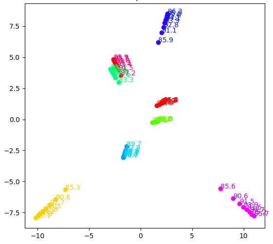

# 课后作业

**友情提示**：目前暂时只提供hw1和hw3

| hw1  | hw3                                                          |
| :--: | :----------------------------------------------------------: |
| <div align="center">  </div><br>  | <div align="center">  </div><br> |
| hw2 | hw4 |
|  |  |

## 1. 依赖库

- [pytorch](https://pytorch.org/)：个人采用的是0.4.1版本（有关BN层的话，0.4.0和0.4.1有区别，这点请注意）
- [torchvision](https://github.com/pytorch/vision)：个人采用的是0.2.1版本
- [visdom](https://github.com/facebookresearch/visdom)：可选项，主要用于可视化
- [python](https://www.python.org/)：个人用的是3.6（3.2以上应该都可以）
- [gym](https://github.com/openai/gym)：hw4用到
- [gym_ple](https://github.com/lusob/gym-ple)：hw4用到

## 2. 训练好的模型

| hw1  | [百度网盘](https://pan.baidu.com/s/17e68m2zOWPqSu43cj_R2yQ) |
| ---- | ----------------------------------------------------------- |
| hw3  | [百度网盘]()                                                |

请将下载的文件放置于`homework/pretrained`文件夹下面，该文件夹结构应该如下所示：

```shell
-pretrained
  --1_1_1
  --1_1_2
  --xxxxx
```

## 3. 使用说明

### hw1. 深度学习性质探索

1. 交互方式（Jupyter --- 更推荐）：

   ```shell
   cd jupyter
   jupyter notebook
   ```

   选择`hw1_xxxxx.ipynb`即可

2. 本地模式（主要个人用来测试）：

   ```shell
   python hw1/hw1_xxx_train.py  # 进行训练
   ```

   - 这部分建议采用类似PyCharm等IDE
   - 关于MNIST和CIFAR的默认路径采用`/home/你电脑的名字/data`，你可以自己修改成你的路径

### hw2. Sequence to Sequence

未完成～（可能需要蛮久才会补充）

### hw3. GAN之旅 

coming soon

### hw4. 强化学习之旅


## 4. 参考

1. [MLDS2018SPRING](https://github.com/victoresque/MLDS2018SPRING)（hw2你可以参考这里）
2. [reinforcement-learning-algorithms](https://github.com/TianhongDai/reinforcement-learning-algorithms)